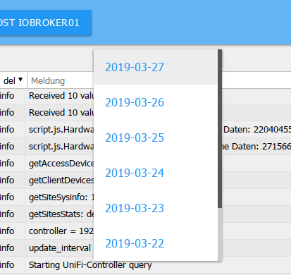

系统消息在此连续输出。最新消息在顶部。

## 标题行
标题栏包含最重要进程的图标。每个图标都有上下文帮助。只需将鼠标放在图标上一会儿。

### 1 - 更新日志
此按钮更新列表。

### 2 - 停止更新
如果单击此按钮，将停止列表的持续更新。
现在出现的不是暂停图标，而是新的未显示消息的数量。

### 3 - 删除列表
单击此图标只会删除屏幕上的列表

### 4 - 清除主机上的日志
单击此图标将永久删除主机上的整个日志。

### 5 - 下载日志
使用此按钮，您可以从目录 /opt/iobroker/logs 下载过去几天的完整每日日志：

您会看到以下屏幕：

由于日志窗口中的列表中的行经常被截断，因此在此处检查是否有更多信息很重要。

### 6 - 主机列表
只有来自此处设置的主机的消息才会显示在日志中。在多主机环境中，您可以在此处设置要记录的主机。

##页面内容

现有对象以表格形式显示在页面上。

列标题 1 和 3 包含用作过滤条件的下拉菜单，在第 4 列中可以自由输入过滤条件

### 1 - 来源
可以使用此下拉菜单根据日志记录实例过滤消息。只有那些在页面上有条目的实例才会显示在菜单中。

### 2 - 时间
此处列出了消息的时间戳。此列不可过滤。

### 3 - 显示的日志级别
此菜单可用于设置要显示的消息的严重性。但是，这只是现有列表的过滤器。
为了在实例的特定级别定义日志记录，必须在实例页面上进行设置。

错误以红色字体显示：

如果任何主机出现错误，标题 ***Log*** 也会在菜单栏上显示为红色。

### 4 - 消息
相应的消息显示在此列中，只要它适合该列。
其余的将被切断。通过鼠标悬停，您仍然可以看到整个消息。
要在论坛中发帖，请下载日志并从那里复制消息。