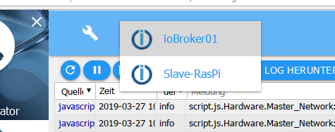

系统的消息不断地输出在这里。最新消息在顶部。

##标题行
在标题行中有最重要流程的图标。每个图标都有上下文帮助。为此，只需在图标上按住鼠标一段时间即可。

### 1 - 更新日志
此按钮更新列表。

### 2 - 停止更新
如果单击此按钮，将停止列表的不断更新。
现在显示的是未显示的新消息的数量，而不是暂停图标。

### 3 - 删除列表
单击此图标只会删除屏幕上的列表

### 4 - 清除主机上的日志
单击此图标，将永久删除主机上的整个日志。

### 5 - 下载日志
使用此按钮，您可以从目录 /opt/iobroker/logs 下载过去几天的完整每日日志：

您会看到以下屏幕：

由于日志窗口中的列表中的行经常被截断，因此检查这里是否有更多信息很重要。

### 6 - 主机列表
日志中仅显示来自此处设置的主机的消息。在多主机环境中，您可以在此处设置要记录的主机。

##页面内容

现有对象显示在页面上的表格中。

列标题 1 和 3 包含用作过滤条件的下拉菜单，在第 4 列中可以自由输入过滤条件

### 1 - 来源
使用此下拉菜单，可以根据日志记录实例过滤消息。只有在页面上有条目的那些实例才会显示在菜单中。

### 2 - 时间
此处列出了消息的时间戳。无法过滤此列。

### 3 - 显示的日志级别
此菜单可用于设置要显示的消息的严重性。但是，这只是现有列表的过滤器。
为了在某个级别为实例设置日志记录，必须在实例页面上进行设置。

错误以红色字体显示：

如果任何主机出现错误，标签 ***Log*** 也会在菜单栏中显示为红色。

### 4 - 消息
相应的消息显示在此列中，前提是它适合该列。
其余的将被切断。通过鼠标悬停，您仍然可以看到整个消息。
要在论坛上发帖，请下载日志并将消息复制到那里。