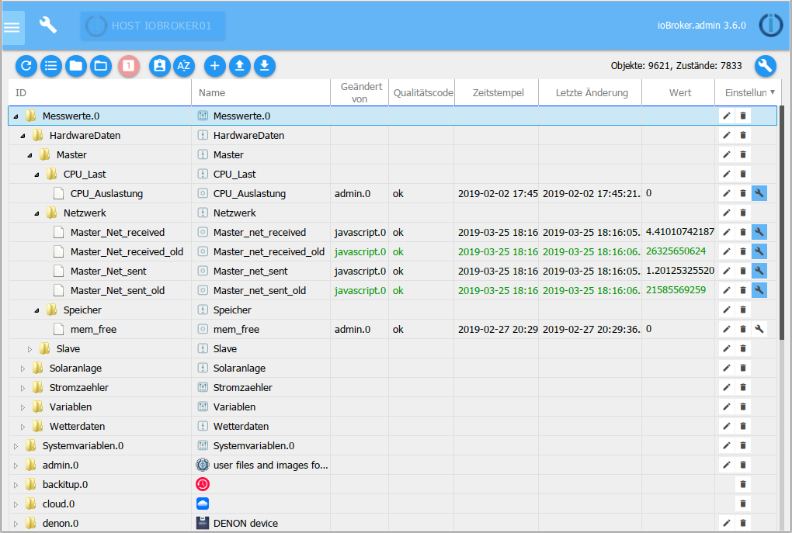
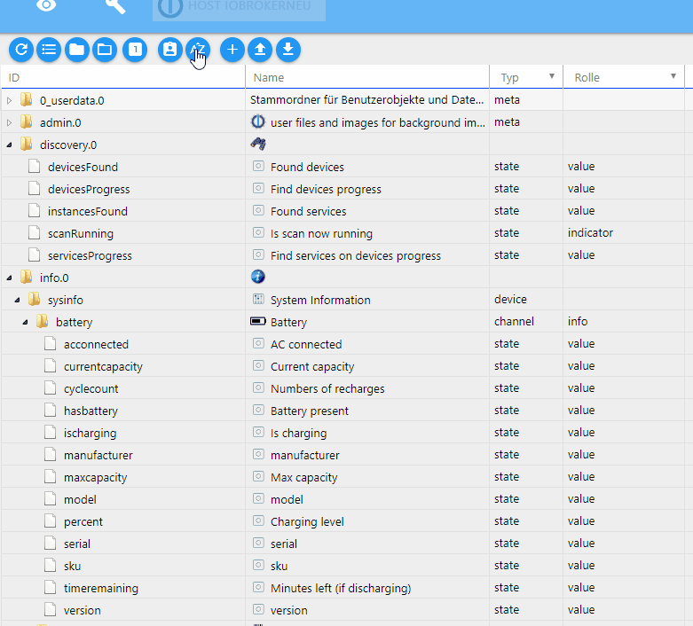
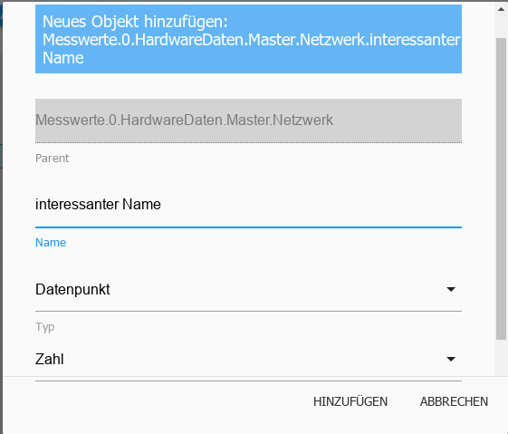
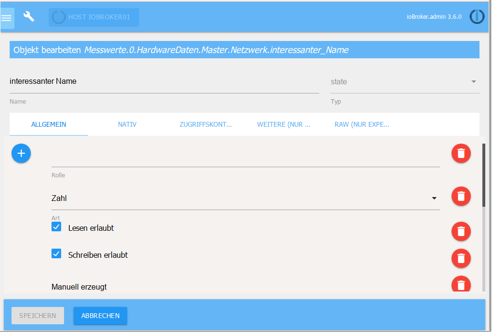
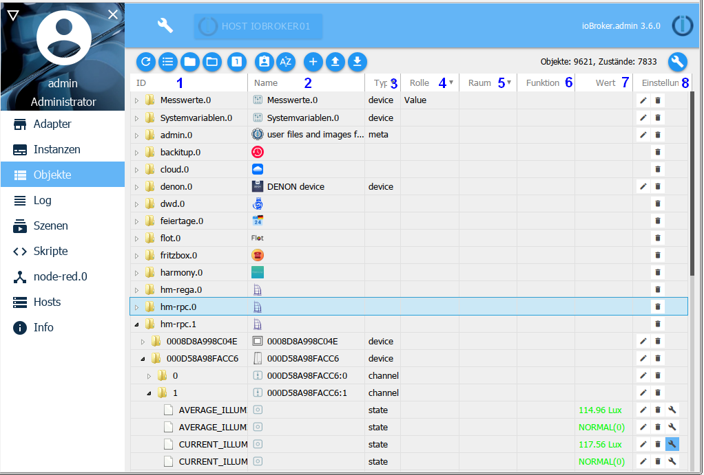
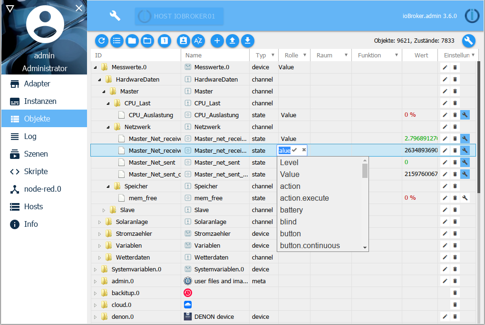
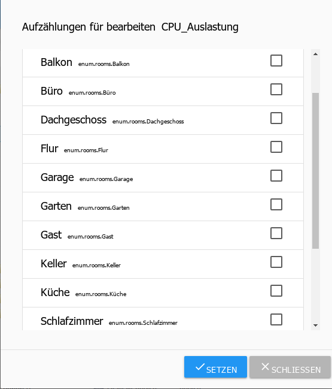
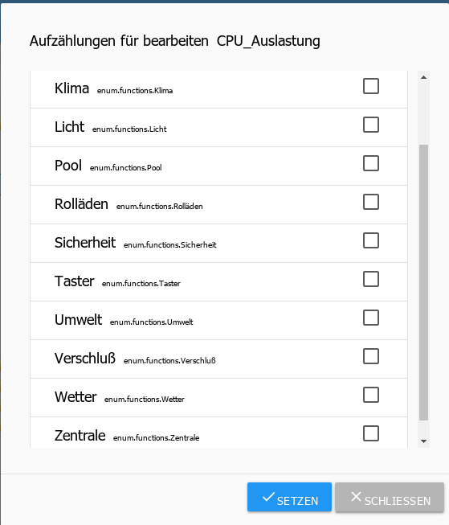
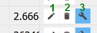

所有管理对象都位于此选项卡下。为每个实例创建一个文件夹，其中由它创建的数据点位于层次结构中。也可以在此处手动创建和删除对象。可以上传或下载整个对象结构。另一个按钮可以显示专家视图。

##标题行
在标题行中有最重要流程的图标。每个图标都有上下文帮助。为此，只需在图标上按住鼠标一段时间即可。

### 1 - 更新视图
如果刚刚创建的对象不可见，单击此图标有助于更新页面状态。

### 2 - 更改显示
此按钮更改此页面上对象的显示。

当按钮处于活动状态时，所有对象都按 ID 的字母顺序排序，并列在另一个下方。如果此按钮未激活，则对象将根据实例按字母顺序分层显示为树状结构。

在这两种情况下，自创建的命名空间都显示在顶部。

> 注意！更改视图可能需要很长时间

接下来的两个图标也会在树结构中可见。

### 3 - 关闭所有主题区域
### 4 - 扩展所有学科领域
使用这两个按钮可以打开或关闭整个树结构。
被关闭。

### 5 - 状态视图
此按钮显示有关数据点各自状态的更多信息。 （切换模式）

这里菜单栏折叠起来

> 注意：由于数据海量，在列表视图中使用此视图时可能会挂掉显示。

### 6 - 管理员模式
如果选择此图标，则会显示更多对象（切换功能）。

这些对象（及其目录）是系统对象，不应用于正常用途，因为管理员的更改/更新可能导致结构更改，从而导致个人数据丢失。

### 7 - 按字母顺序排序
这用于按 ID 或名称在文件夹内排序。

### 8 - 添加
选择此图标后，可以添加更多对象。
如果选择了一个文件夹，它将被用作对象结构中的父级。一个配置窗口打开：

现在必须在此处选择新对象的名称，从而可以根据层次结构将设备、通道或数据点用作类型。逻辑值、开关、字符串、数字、值列表、字段、对象和混合可用作数据点类型。

只要你用 ok 确认输入窗口，另一个窗口就会打开：

一些数据仍然可以在这里输入。可以向对象添加角色和图标。

其他选项卡包含对象的更多属性。每个对象都有这样的信息。

要创建一个全新的命名空间，必须注意两点：

* 不能选择任何对象。这可以通过使用

新对象选项卡打开。

* 顶部项目必须以句点和数字结尾（例如 MyNamespace.0）。

然后可以在那里创建下一个级别。

### 9 - 上传
通过这个按钮，一个完整的对象结构作为json文件上传到ioBroker服务器

### 10 - 下载
使用此按钮，所选对象结构将作为 json 文件从 ioBroker 服务器下载并可以保存。

##页面内容

现有对象显示在页面上的表格中。

该表格由以下列组成（列标题 1 和 2 下的字段以及其他列的下拉菜单用作过滤条件）。图中的表格是按照层级排列的，已经打开了一些子项（节点）：

### 1 - ID
这些是对象层次结构的顶层。这里，例如实例的名称和数据的相应结构被创建为顶级。

### 2 - 名称
该列中给出了对象的名称。此外，前面的图标显示此处涉及的层次结构级别（设备、通道或数据点）

此列中的值可以编辑。

### 3 - 类型
层次结构级别中的类型已在上一个图标的“名称”列中可见，此处再次明确提及。列标题中的下拉菜单可用于过滤这些类型，例如，仅显示所有数据点。

### 4 - 角色
该角色指定 .vis 和 material 等用户界面应如何处理此数据点。这基本上是使用术语简要描述的该对象的功能。然后您可以再次过滤。

此列中的值可以编辑。单击该字段会显示一个包含大量条目的下拉菜单，但也可以免费输入。

### 5 - 房间
如果此对象已分配给房间，则会在此处显示。
除其他外，这还用于在搜索对象时进行过滤。

此列中的值可以编辑。这样，以后仍可以将对象分配给房间。如果您单击该字段，则会打开一个弹出窗口，其中包含目前已创建的房间。

### 6 - 函数
此列包含分配了相应对象的交易。

此列中的值可以编辑。通过这种方式，对象仍可以在以后分配给交易。如果您单击该字段，则会打开一个弹出窗口，其中包含迄今为止创建的交易。

### 7 - 值
如果对象是数据点，则此处显示该数据点的当前值。

### 8 - 设置

1.) 单击铅笔图标会打开一个窗口，其中包含该对象的属性。它与上面创建新对象时出现的窗口相同。可以在此处更改对象的属性。必须极其谨慎地使用此功能，并且仅当您确切地知道您正在使用它做什么。

2.) 单击垃圾桶图标可删除此对象及其层次结构中位于其下方的所有对象。为了安全起见，会出现一个窗口，必须再次确认删除。

3.) 扳手图标仅在至少安装了一个历史实例（History、InfluxDB 或 SQL）时才会出现。可以在此处配置用于记录历史数据的数据点。
更多信息可以在历史适配器的描述中找到。

使用标题栏中的扳手，可以对满足当前过滤条件的所有数据点同时执行此操作。因此，请务必仔细检查此页面上的过滤条件是否以仅包含所需数据点的方式选择。

用于过滤此列的下拉菜单是指具有记录数据的数据点。此处提供有、无、所有以及已安装的历史记录实例。