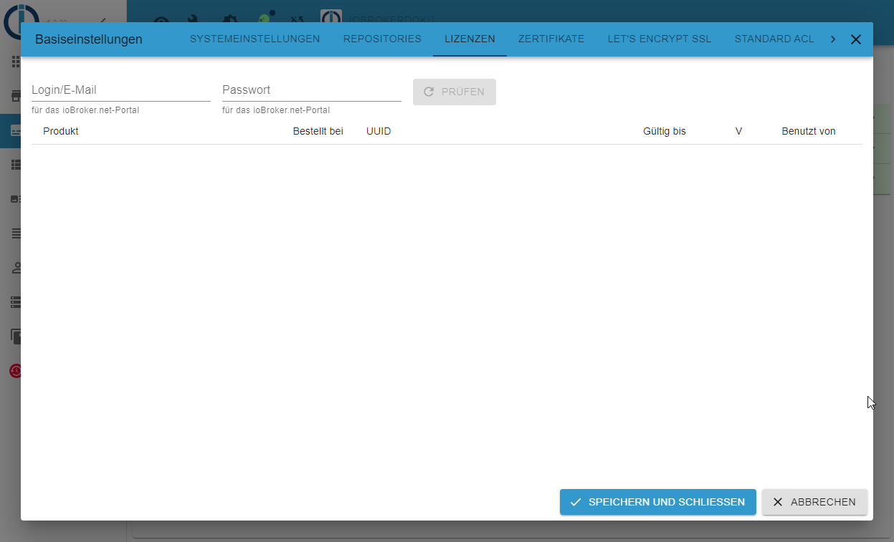

可以通过屏幕标题栏中的扳手图标从管理员中的任何菜单项访问系统设置。

＃＃ 系统设置
在主要设置中，设置了ioBroker的基本参数，ioBroker中的适配器也使用这些参数。

一些参数已经取自主机的设置。

**系统语言**

这允许您在不同的系统语言之间进行选择。可能尚未完全支持所有语言。

**温度单位**

这个值被一些适配器使用。可能是°C 或°F。

**货币**

可以在此处输入所需的货币格式，例如€。目前它不使用适配器。

**日期格式**

所做的选择显示在 admin 和 vis 中。

**浮动分隔符**

浮点值的逗号或句点

**默认历史记录**

如果安装了记录数据点的适配器，这里选择对应的适配器

如果只安装了一个历史适配器（SQL/History/InfluxDB），就会使用，如果有多个，可以选择一个。

**专业级**

待定

**默认日志级别**

待定

**一周的第一天**

待定

**本地设置**

待定

## 存储库

ioBroker 可以从不同的来源获取适配器列表。在安装过程中输入以下源：

* 稳定：http://download.iobroker.net/sources-dist.json
* 测试版：http://download.iobroker.net/sources-dist-latest.json

如果在此处输入旧安装的其他存储库，则应将其删除，因为它们不再维护。

## 许可证

## 证书

这是用于 SSL/HTTPS 通信的证书的中心位置。证书由 admin、web、simple-api、socketio 使用。默认安装标准证书。你不能用它来验证任何东西。它们仅用于 SSL 通信。因为证书是开放的，你应该使用自己的（自签名）证书，购买真正的证书，或者切换到 Let's Encrypt。与默认证书的通信是不安全的，如果有人想读取流量，可以这样做。请务必安装您自己的证书。
例如。在linux下。

证书可以指定为路径或使用拖放完全上传

通常最好使用 Web 适配器而不是直接使用管理适配器测试新证书，以免将自己锁定在系统之外。

指定路径时，必须存在 iobroker 用户的正确权限。

对于文件本身 644，对于父目录 755。

如果权限错误，则会出现如下错误消息：

``web.0 (24704) Cannot create webserver: Error: error:0909006C:PEM routines:get_name:no start line``

您可以通过以 root 用户身份登录服务器，然后切换到 iobroker 用户并列出证书文件来检查访问权限：

``su iobroker``

``ls -l /Pfad/zum/Zertifikat``

您应该在该行的开头看到 **-rw-r--r--**。

如果实际证书被链接，则必须检查链接目标的权限。

这是一条消息，例如

``ls: Zugriff auf '/Pfad/zum/Zertifikat' nicht möglich: Keine Berechtigung``

权利必须调整。

作为文件的根用户：

``chmod 644 /Pfad/zum/Zertifikat``

对于父目录：

``chmod 755 /Pfad/zum``

## 让我们加密 SSL

Let's Encrypt 是一个免费、自动化和开源的证书颁发机构，来自独立的 Internet 安全研究组 (ISRG)。

有关 Let's Encrypt 的更多信息，请参阅[这里](https://letsencrypt.org/)。

一些安装使用动态 DNS 或类似的方式通过从那里分配的地址到达他们自己的域。 ioBroker 支持 Let's Encrypt 组织自动请求和续订证书。

使用 Let's Encrypt 的免费证书的选项几乎存在于每个可以启动 Web 服务器并支持 HTTPS 的适配器中。

如果您激活使用证书的选项，但未激活自动更新，则相应的实例会尝试使用已保存的证书。

如果启用了自动更新，实例会尝试从 Let's Encrypt 请求证书并自动更新它们。

当第一次调用相应的地址时，第一次请求证书。这意味着如果您将例如“sub.domain.com”配置为地址，然后调用 https://sub.domain.com，则第一次请求证书，这可能需要一段时间才能得到答案。

颁发证书是一个复杂的过程，但是按照下面的说明，获得免费证书应该很容易。

**方法：**

必须使用输入的电子邮件地址创建一个新帐户（在系统设置中为此设置）

生成一个随机密钥作为帐户的密码。

创建帐户后，系统会在端口 80 上打开一个小网站来验证地址。

让我们加密总是使用端口 80 来检查地址。

如果端口 80 已被其他服务使用，则适用第 4 点——即为其他服务分配不同的端口！

当小型 Web 服务器启动时，系统设置中指定地址的证书请求被发送到 Let's encrypt 服务器。

Let's Encrypt 服务器发回一个质询短语以响应请求，并在一段时间后尝试在地址“http://yourdomain:80/.well-known/acme-challenge/”处读取这个质询短语。

当服务器从我们这边得到这个挑战短语时，Let's Encrypt 服务器发送证书。这些保存在系统设置中输入的目录中。

这听起来很复杂，但您只需选中几个复选框并在系统设置中输入电子邮件地址和网址。

收到的证书有效期约为 90 天。首次颁发这些证书后，将启动另一项自动延长有效期的任务。

这个话题非常复杂，可能会出现成千上万的问题。如果这不起作用，我们建议您在旅途中使用 IoT 适配器进行访问。

Let's Encrypt 仅适用于 node.js 版本 >=4.5

## 默认 ACL

在这个子页面中，可以为所有用户/组定义不同区域的访问权限

＃＃ 统计数据

因此，我们对安装（使用的适配器）和地理分布有一些概述，如果我们得到这些信息，我们将非常高兴。

您可以发送不同数量的信息。可以在左侧选择此范围。

然后右侧显示正在发送的数据。
这些数据是绝对匿名评估的。