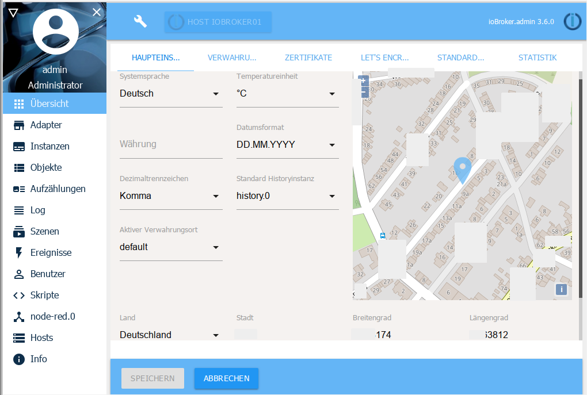
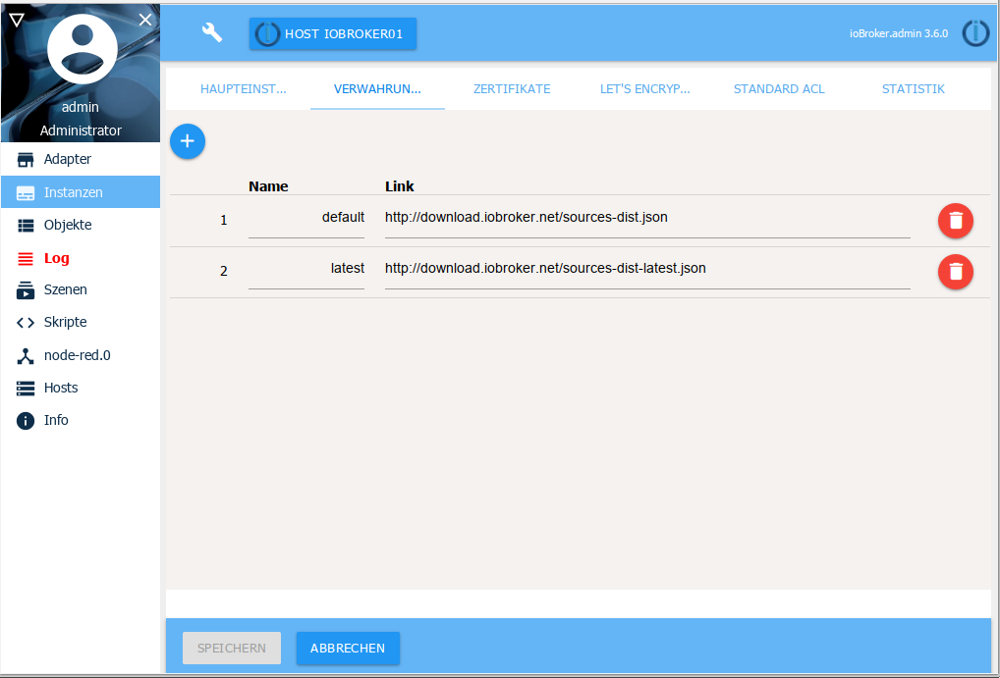
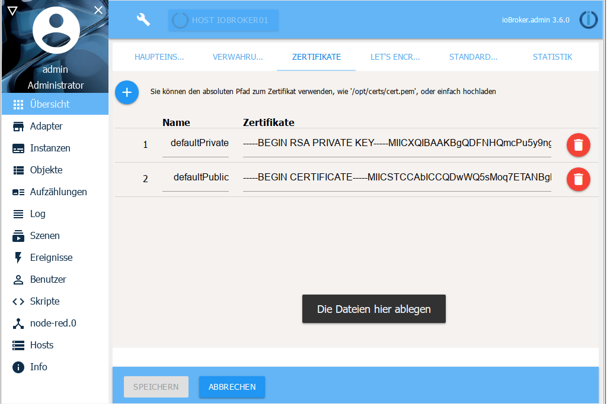
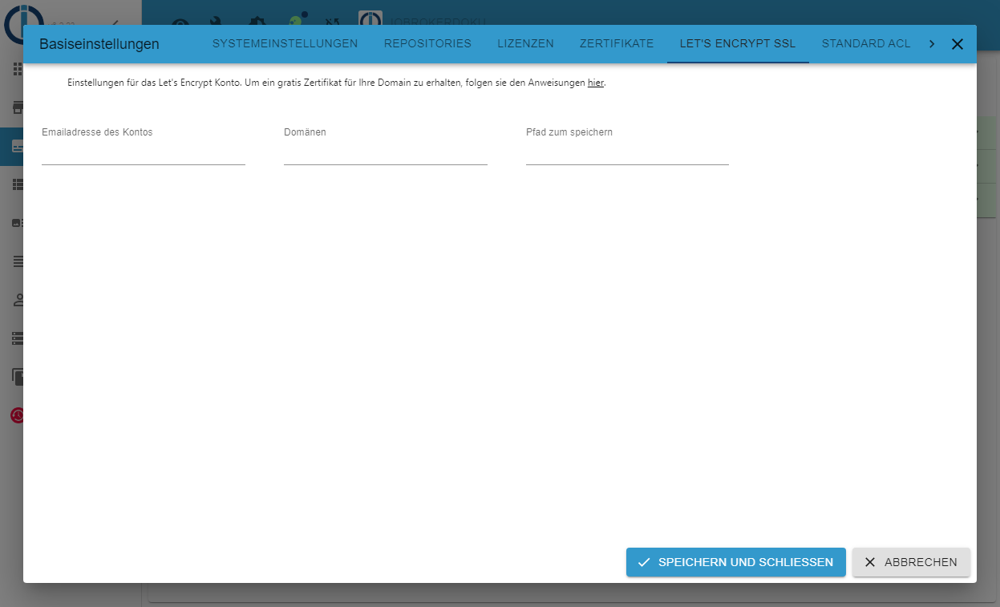
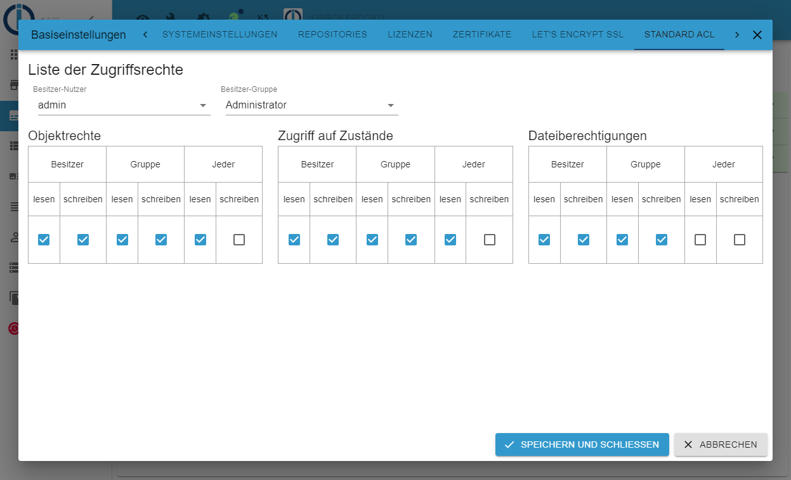
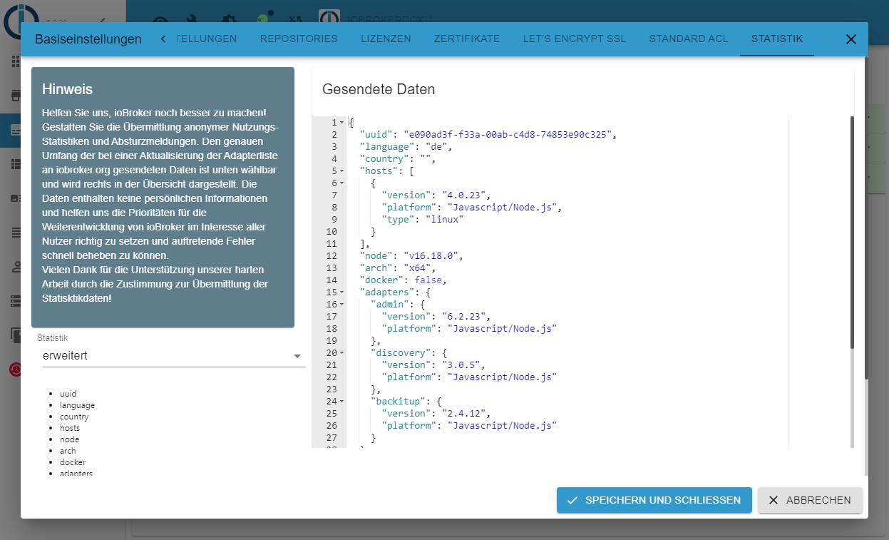

#系统设置
通过屏幕标题栏中的扳手图标，可以从管理员的每个菜单点访问系统设置。

系统设置分布在几个子页面上：

##主要设置
在主设置中，设置了ioBroker 的基本参数，ioBroker 中的适配器也使用这些参数。

一些参数已经从主机设置中获取。

** 系统语言 **

因此您可以在不同的系统语言之间进行选择。可能并非所有语言都得到完全支持。

** 温度单位 **

某些适配器使用此值。 °C 或 °F 是可能的。

**货币**

目前它不使用适配器

** 日期格式 **

选择日期在 admin 和 vis 中的显示方式。

** 小数分隔符 **

浮点值的逗号或点

** 标准历史实例 **

在这种情况下，默认情况下会记录数据并用于船队和人力车的图表。

如果仅安装了一个历史适配器（SQL / History / InfluxDB），则使用它，如果有多个可用，则可以选择一个。

** 活跃的托管 **

通过下拉菜单选择要从中安装适配器版本的所需存储库。 “存储位置”子页面上列出的存储库可在下拉菜单中找到

## 存储位置

ioBroker 可以从不同来源获取适配器列表。在安装过程中输入以下源：

* 默认（= 稳定）：http://download.iobroker.net/sources-dist.json
* 最新（= 测试版）：http://download.iobroker.net/sources-dist-latest.json

如果在此处输入来自较旧安装的其他存储库，则应将其删除，因为它们不再维护。

##证书

这是用于 SSL/HTTPS 通信的证书的中心点。这些证书由 admin、web、simple-api、socketio 使用。默认情况下安装标准证书。你不能用它验证任何东西。它们仅用于 SSL 通信。由于证书是开放的，您应该使用自己的（自签名）证书，购买真实证书或切换到 Let's Encrypt。与默认证书的通信是不安全的，如果有人想读取流量，可以这样做。请务必安装您自己的证书。
例如。在linux下。

证书可以指定为路径，也可以使用拖放完全上传

##让我们加密

Let's Encrypt 是独立互联网安全研究小组 (ISRG) 的免费、自动化和开源证书颁发机构。

有关 Let's Encrypt 的更多信息，请参阅 [这里](https://letsencrypt.org/)。

某些安装使用动态 DNS 或类似方法通过分配到那里的地址到达他们自己的域。 ioBroker 支持 Let's Encrypt 组织中证书的自动请求和更新。

使用 Let's Encrypt 免费证书的选项几乎存在于每个可以启动 Web 服务器并支持 HTTPS 的适配器中。

如果您激活了使用证书的选项，而不是自动更新，则相应的实例会尝试使用保存的证书。

如果自动更新被激活，实例会尝试从 Let's Encrypt 请求证书并自动更新它们。

首次调用相关地址时，将首次请求证书。即，如果您配置例如“sub.domain.com”作为地址，然后调用 https://sub.domain.com，则会首次请求证书，这可能需要一段时间才能得到答案。

证书的颁发是一个复杂的过程，但如果您按照下面的说明进行操作，应该很容易获得免费证书。

**方法：**

必须使用输入的电子邮件地址创建一个新帐户（在系统设置中设置）

生成一个随机密钥作为帐户的密码。

创建帐户后，系统会在端口 80 上打开一个小网站以确认地址。

Let's encrypt 总是使用端口 80 来检查地址。

如果端口 80 已被其他服务使用，则第 4 点适用 - 即为其他服务分配不同的端口！

当小型 Web 服务器启动时，系统设置中指定地址的证书请求将发送到 Let's encrypt 服务器。

Let's Encrypt 服务器发送回一个质询短语以响应请求，并在一段时间后尝试在地址“http:// yourdomain: 80 / .well-known / acme-challenge /”处读取此质询短语。

当服务器从我们这边收到这个挑战短语时，Let's Encrypt 服务器发送证书。这些保存在系统设置中输入的目录中。

这听起来很复杂，但您所要做的就是激活几个复选框并在系统设置中输入电子邮件地址和网址。

收到的证书有效期约为 90 天。首次颁发这些证书后，将启动另一项自动延长有效期的任务。

这个话题非常复杂，可能会出现数以千计的问题。如果这不起作用，建议在旅途中使用 IoT 适配器进行访问。

Let's Encrypt 仅适用于 node.js 版本> = 4.5

＃＃ 访问权

在此子页面中，可以为所有用户/组定义不同区域的访问权限

＃＃ 统计数据

因此，我们对安装（使用的适配器）和地理分布有一些概述，如果我们收到此信息，我们会非常高兴。

您可以发送不同数量的信息。可以在左侧选择此范围。

然后在右侧显示发送此数据的确切形式。
这些数据是绝对匿名评估的。