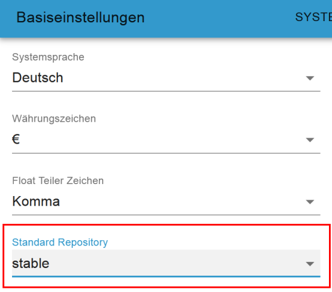
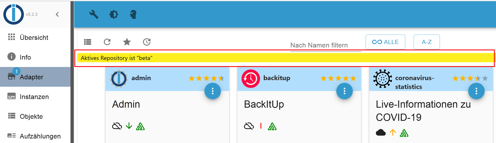
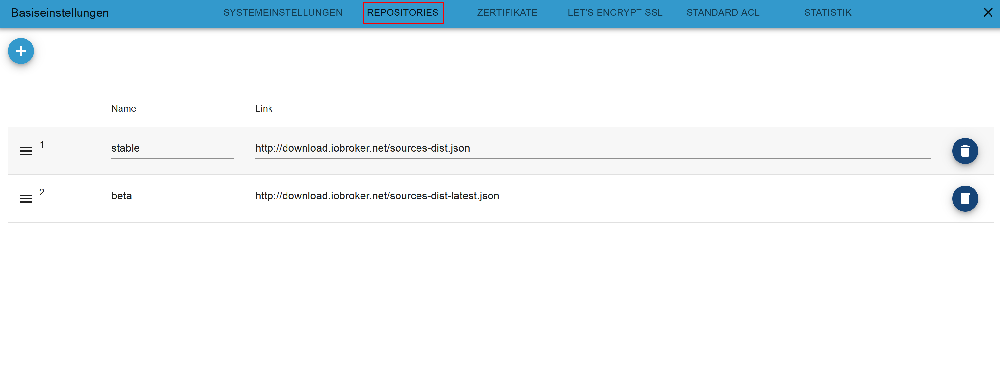
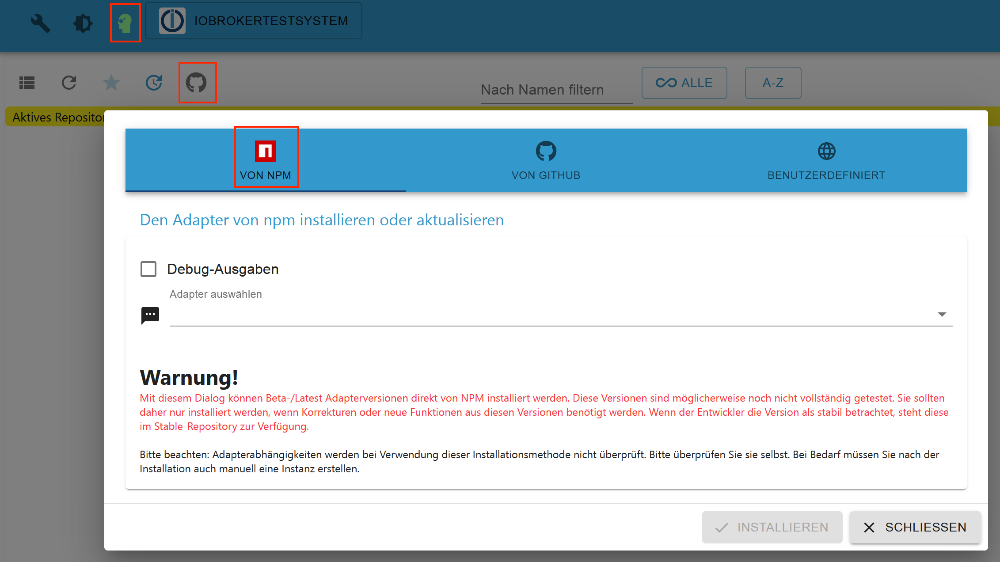

# 什么是存储库？
存储库是软件程序的中央存储库。

可以通过 ioBroker 管理界面显示和安装/更新的适配器通过中央存储库（存储库）进行管理。默认情况下，安装后配置 ioBroker，以便访问“稳定”存储库并提供存储在那里的适配器以供安装。

默认情况下，ioBroker 中有两个可用的存储库：

- **stable**：在此存储库中，适配器在已经过测试的版本中可用，因此可以在生产系统上使用
- **beta**：此存储库中提供了适配器版本，目前处于测试阶段 (!)，可能仍包含多个错误。 beta 版本库曾经被称为 latest，因为这个名字的目的不是很清楚，所以它被从 latest 重命名为 beta。

  

# 存储库的选择在ioBroker的基本设置中，可以如下设置所需的存储库。
打开ioBroker的基本设置：

选择默认存储库：

如果选择了 beta 存储库，则适配器概述中会出现相应的警告

  

# 存储库的默认路径 稳定版和 beta 版存储库的默认路径如下所示：
- 稳定 - 链接到存储库 http://download.iobroker.net/sources-dist.json
- beta - 链接到存储库 http://download.iobroker.net/sources-dist-latest.json

  

# 稳定版 vs Beta 版存储库
基本上，稳定的存储库应该始终用于 ioBroker 的高效安装。 Beta 存储库包含仍然包含错误并可能影响整个系统的版本。

 

## 如果我需要来自 beta 存储库的适配器，我应该怎么做？
过去，这意味着在 ioBroker 中将存储库从稳定版切换到测试版，安装一个适配器，然后再切换回来。后者通常被搁置一旁。

由于 Admin 5，这更加方便，无需更改存储库！

- 激活专家模式
- 在“适配器”菜单中，转到“自定义安装”（GitHub）按钮并切换到第一个选项卡“来自 NPM”。
- 在“选择适配器”字段中，现在可以输入/选择要安装的所需适配器

这样一来，您就可以安装最新的 beta 版本，而无需切换其存储库。

 

## 适配器如何进入 beta 版或稳定版存储库？
早在适配器准备好通过管理界面安装到 ioBroker 之前，开发人员就提交了包含在存储库中的请求。发生这种情况时，有经验的开发人员会查看新的适配器源代码，并向提出请求的开发人员提供有关在新适配器可以包含在存储库中之前需要处理的项目的反馈。

新适配器首先在 beta 存储库中可用，然后可以由（beta）测试人员进行广泛测试。
当测试阶段完成并修复报告的错误时，适配器的版本将在稳定存储库中可用。

在对适配器进行功能更改后，这通常仅在 beta 存储库中再次可用以进行测试，直到在测试阶段结束后为稳定存储库发布版本。

--- lastChanged：“2022 年 1 月 25 日” ---