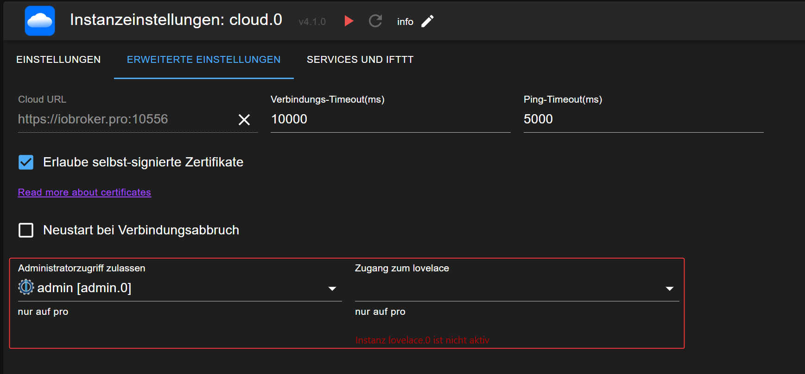
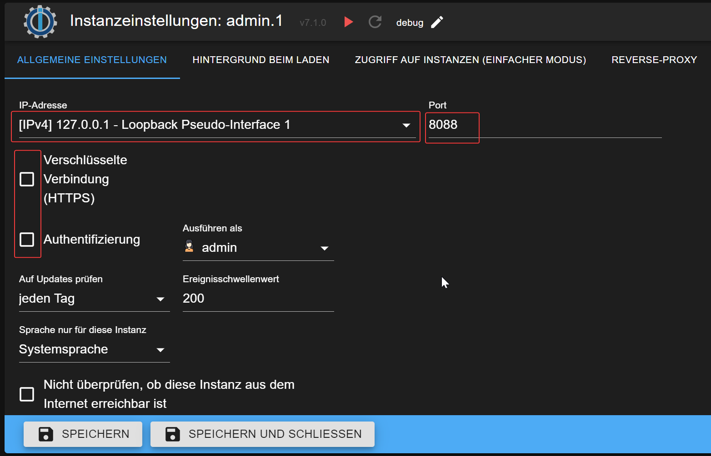

# 管理员和编辑
使用 ioBroker.pro 云，与免费的 ioBroker.net 云相比，您可以获得更多功能。

其他功能包括：

- 访问管理界面
- 能够编辑 vis-2 和 vis 项目，而不仅仅是查看它们
- 洛夫莱斯访问
- 更多资源和更少用户，从而实现更快、更可靠的性能

＃＃ 行政
要启用管理员访问权限，您需要在云设置的“扩展选项”选项卡中激活它。

所选管理实例不得启用 HTTPS 选项，也不得受密码保护。
这是云访问管理界面所必需的。

如果您需要保护您的管理界面，您可以为云创建一个没有密码保护和没有 HTTPS 的单独实例，并将该实例绑定到不同端口上的本地主机。

在这种情况下，您只能从本地机器访问管理界面，但云仍然可以访问它。

重要提示：请选择 8081 以外的端口，因为 8081 已被您的主管理实例使用。

之后，确保在云设置中选择新创建的实例。

## Vis 和 vis-2
无需特殊配置即可启用 vis 和 vis-2 编辑。只需在编辑模式下打开 vis 或 vis-2 项目即可。

## 洛夫莱斯
Lovelace 云在端口 4463 上运行。
确保您的防火墙设置允许您的手机或平板电脑通过端口 4463 访问云。
