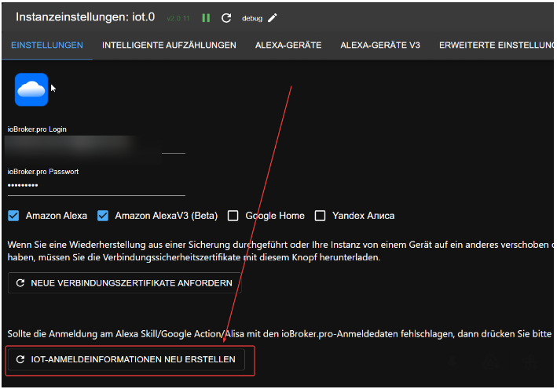

# 物联网云（与 ioBroker 和 Alexa/Google Home 集成）
来源：https://forum.iobroker.net/topic/17834/ank%C3%BCndigung-weihnachtsaktion-assisten-service-iobroker-iot-reloaded-alexa-und-services

使用 Alexa 控制您的设备比以往任何时候都更加轻松。

以下介绍如何使用云适配器与 Alexa 无缝连接，让您的家居更加智能。遗憾的是，现有解决方案有时无法满足日益增长的用户需求。

因此，我们推出了 IoT 服务，这是一款面向未来的解决方案，专为与 Alexa 和其他语音助手无缝集成而设计。

为确保物联网实例的设置和连接正常工作，只有在成功建立连接、成功链接并成功控制至少一个设备后，才能购买新的助手许可证包。

所以，如果 `Pro-Cloud-Account` 中没有任何可用内容，请不要感到惊讶。

因此，请先按照更新后的说明进行操作：

1. 如果您还没有 Pro 账户，请先在 https://iobroker.pro/intro 注册一个账户。

否则，只需使用现有的 `Pro-Account`。

新创建的账户可获得为期 7 天的 Assistant 许可证试用期，每月请求次数上限为 20,000 次。

但是，购买的 Assistant 许可证将立即生效，剩余天数不予计算。7 天试用期结束后，未购买 Assistant 许可证的用户每天可免费发送最多 20 次请求。

超过 20 次后，当日剩余时间将不再受此限制。

没有许可证的现有 Pro 帐户也可以在促销活动开始时试用助手包 7 天 - 这 7 天从在 IoT 适配器中输入登录数据创建 IoT 服务用户开始计算。

拥有现有助理或远程访问许可证的专业帐户每月也有 20,000 个请求。

2. 接下来，从常规存储库安装 `ioBroker.IoT` 适配器 - 只需筛选“IoT”即可。

在适配器配置中，请输入来自 https://iobroker.pro 的登录凭据（电子邮件地址必须小写，密码也必须小写！请勿使用应用密钥或其他类似信息！）。

“获取新的连接证书”或“重新创建 IoT 凭据”按钮仅在出现错误时才需要使用。

如果 IoT 适配器已安装，请检查是否有可用更新，并更新到至少 0.2.2 版本。

请继续在此处进行所有必要的设置并检查智能设备。

此外，建议在 ioBroker IoT 适配器中创建组，而不是在 Amazon 上创建组，因为 Amazon 上的组会导致不必要的流量，因为 Amazon 会为每个设备发送单独的控制命令！

另一个优点是，当亚马逊账户重新创建时，这些群组会被保留。

3. 现在适配器应该连接到物联网服务并变为绿色。

如果上述方法无效，且适配器显示为黄色等状态，请检查日志文件并参考以下常见问题解答。

重启实例也可能有所帮助。

大多数情况下，问题都很简单，例如登录凭据错误（注意区分大小写！）。日志中的错误信息已得到改进，现在应该能更清晰地指出问题所在。

4. 首次连接后，将自动创建一个 Alexa 帐户，密码与 ioBroker.pro 的密码相同。

ioBroker.iot 实例必须为“绿色”。

5. 可能有些情况下，包含“#”符号的密码还无法使用。

问题正在调查中，因此请不要在密码中使用`#`。

5. 然后安装新的“ioBroker.assistant”[技能](https://www.amazon.de/ioBroker-ioBroker-iot/dp/B07L66BFF9)并点击“激活”。

此时应该会显示物联网服务的登录界面。

请在此处使用您的 ProCloud 帐户的电子邮件地址和密码。

请用小写字母输入登录名：`MyEmail@gmx.de` 不正确；`myemail@gmx.de` 正确！

已经使用物联网服务（以前或通过自定义技能）的用户，在激活技能时，只需使用他们的物联网访问数据直接登录即可。

登录成功后，屏幕上会显示成功提示信息，技能也会被激活。

如果未激活，请检查您的登录信息并重试。

6. 现在亚马逊应该会提供设备搜索功能。

此过程完成后，存储在 IoT 适配器中的所有设备也应该可以在亚马逊上找到。

7. 请检查您的设备是否可以通过语音或 Alexa 应用进行控制。

这一步骤非常重要，必须至少成功完成一次切换操作才能进行下一步！

8. 现在最好去亚马逊给这项技能打五星好评（因为一切都很顺利）:)

好评（当然是真实的好评；这不是鼓励虚假评论！）以及技能排名也会对物联网服务使用的亚马逊服务的成本产生一定影响！

9. 因此，如果您已成功连接物联网适配器、激活技能并能成功控制您的设备，

现在您需要决定是否购买圣诞节促销活动中的助理套餐，或者每天 20 次请求是否足以满足您的需求。

如果您想购买该套餐，请在浏览器中访问 https://iobroker.pro 并使用您的 Pro Cloud 账号登录。

如果您没有看到菜单，请点击右上角的头像图标，然后从菜单中选择“远程访问”。

此许可证不允许远程访问管理面板和编辑器！

此外，也无法稍后升级到远程版本。这需要购买新的远程许可证。

如果您需要对 ioBroker 进行完全远程访问（包括编辑），您还可以购买远程许可证（每月 5.49 欧元，或者例如每年 44.99 欧元（= 每月 3.75 欧元）），该许可证自动包含智能助手支持（Alexa、Google Home）。

下表概述了许可证和功能：

| 功能/许可 | | 无许可 | 智能助手许可 | 远程访问许可 |
|----------------------------------------|------------------|------------------|--------------------------|-----------------------|
| | **iobroker.net** | **iobroker.pro** | **iobroker.pro** | **iobroker.pro** |
| Alexa 技能 | - | 每天 20 次请求 | 每月 20,000 次请求 | 每月 20,000 次请求 |
| Google Home | - | 每天 20 次请求 | 每月 20,000 次请求 | 每月 20,000 次请求 |
| 远程访问 vis(2)（不可编辑） | ✓ | - | - | ✓ |
| 远程访问管理员，vis(2)（可编辑） | - | - | - | ✓ |
| 服务（POST 请求） | - | ✓ | ✓ | ✓ |
| 服务（POST/GET 请求） | - | - | ✓ | ✓ |

这些请求会分配给用户使用的所有服务。这意味着，如果向 Alexa 发出 10,000 个请求，再向拥有 Assistant 许可证的 Google Home 发出 10,000 个请求，那么 20,000 个请求的限制就用完了。

远程访问需要使用 `ioBroker.cloud` 适配器。所有其他功能都需要使用 `ioBroker.iot` 适配器。

智能助手许可证 6 个月收费 15.99 欧元（每月 2.67 欧元），一年收费 23.99 欧元（每月 1.99 欧元）。

价格可能还会根据所需基础设施的具体运营成本而有所变动！

## 故障排除
如果 Alexa 技能中 ioBroker.pro 的密码不正确，请检查：

- `ioBroker.iot` 适配器已安装，实例状态为“绿色”。
登录名必须用小写字母输入。
密码中不包含“#”字符。
如果以上方法均无效，请按此按钮：

  

- 防火墙未阻止以下通信（输出）端口：443、8443 和 8883。

之后，ioBroker.iot 应该会自动重启，然后再次尝试激活 ioBroker.iot 技能。