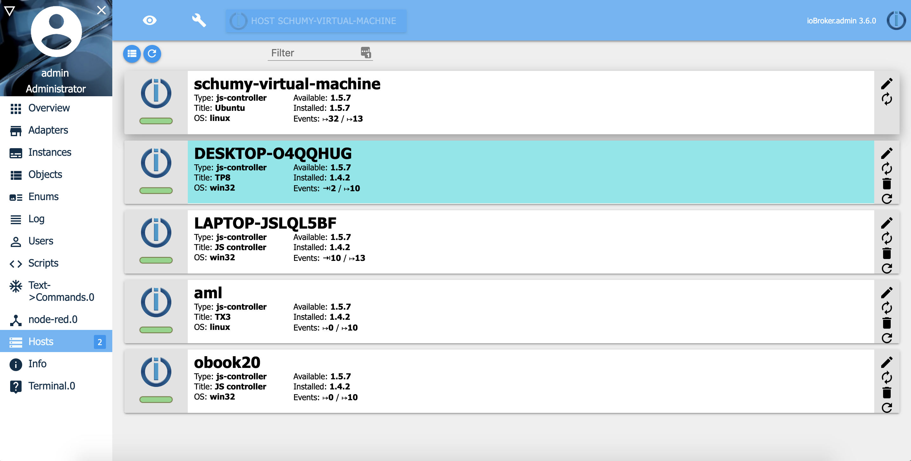
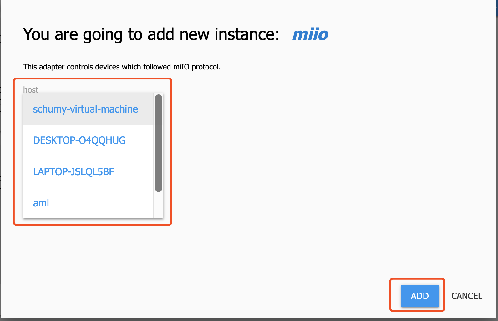
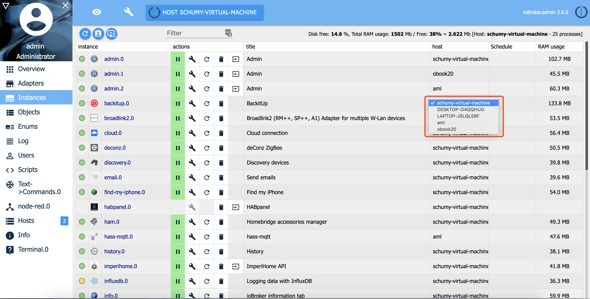

# 多主机模式

ioBroker可以同时处理几个运行在不同机器上的ioBroker服务。在这样的系统架构下，可以将工作量分摊到几个主机上，可以共享使用单板系统的系统硬件资源（比如树莓派的GPIO资源）。



## 配置方式

!> 组成多主机系统的每一个主机必须有一个**唯一不重复**的hostname。

多主机系统中，有一台主机是主系统，其他主机是从系统。无论是主系统还是从系统，首先都要在每一台主机上安装ioBroker。

!> **从系统**主机在配置后，**从系统**主机ioBroker数据将被**清除**。如果不是全新安装，请备份必要的数据。

### js-controller版本高于（包含）v1.1.3

在主系统主机上，安装完成ioBroker系统后，需要执行如下命令：

```bash
iobroker multihost enable

Miltihost activated.
Authentication activated.
Enter secret phrase for connection: # 输入从系统主机发起连接时需要输入的密码
Repeat secret phrase for connection: # 确认密码
Please restart ioBroker: "iobroker restart"


Miltihost:      enabled
Authentication: enabled
Objects:        file on 127.0.0.1
States:         file on 127.0.0.1

iobroker restart # 重启系统
```

在从系统主机上，安装完成ioBroker系统后，需要执行如下命令：

```bash
iobroker multihost browse # 扫描局域网内主系统主机，必须扫描到主机

1 |         192.168.1.9 |  host |         192.168.1.9 | "authentication required"

iobroker multihost connect

Please select host [1]: 1 # 选择主系统主机
Enter secret phrase for connection: ******* # 输入主系统enable时设置的密码
Config ok. Please restart ioBroker: "iobroker restart"

iobroker restart # 重启系统
```

至此，ioBroker多主机模式配置完成。

如果通过上述命令没有配置成功，请参考下面手动配置的方式。

### js_controller版本低于v1.1.3

在主系统主机上，安装完成ioBroker系统后，需要执行如下命令：

```bash
iobroker setup custom

Type of objects DB [file, couch, redis], default [file]: ENTER
Host of objects DB(file), default[127.0.0.1]: <0.0.0.0> # 这里需要修改
Port of objects DB(file), default[9001]: ENTER # 直接按回车确认
Type of states DB [file, redis], default [file]: ENTER # 直接按回车确认
Host of states DB (file), default[0.0.0.0]: ENTER # 直接按回车确认
Port of states DB (file), default[9000]: ENTER # 直接按回车确认
Host name of this machine [hostname]: ENTER # 直接按回车确认

iobroker restart # 重启ioBroker
```

在从系统主机上，安装完成ioBroker系统后，需要执行如下命令：

```bash
iobroker setup custom

Type of objects DB [file, couch, redis], default [file]: ENTER # 直接按回车确认
Host of objects DB(file), default[127.0.0.1]: <IP ADRESSE> # 主系统主机的IP地址
Port of objects DB(file), default[9001]: ENTER # 直接按回车确认
Type of states DB [file, redis], default [file]: ENTER # 直接按回车确认
Host of states DB (file), default[<IP ADRESSE>]: ENTER # 直接按回车确认
Port of states DB (file), default[9000]: ENTER # 直接按回车确认
Host name of this machine [hostname]: ENTER # 直接按回车确认

iobroker restart # 重启ioBroker
```

至此，ioBroker多主机模式配置完成。

## 安装适配器实例

如果是新安装的系统，在安装适配器时，仅需要在下拉菜单中指定需要安装的主机hostname，然后确认安装适配器即可。



如果是之前已经在使用的系统，在已经安装好的实例列表中按需改变运行实例的主机hostname即可。



## 删除主机

仅可以删除**从系统**主机。

首先要将从系统主机的ioBroker系统停止。

然后在管理员-对象页面上，打开*专家模式*，找到`system.host`开头的从系统主机的对象，
点击删除图标并确定删除全部对象，完成主机的删除操作。


