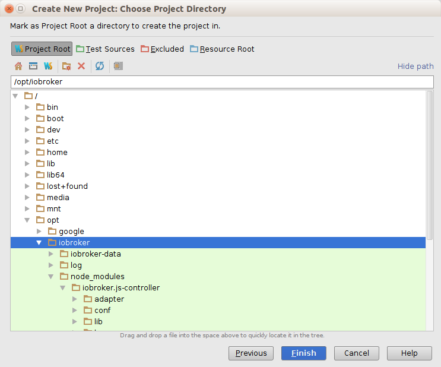
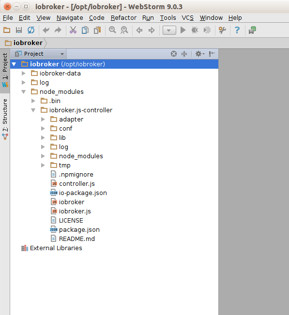
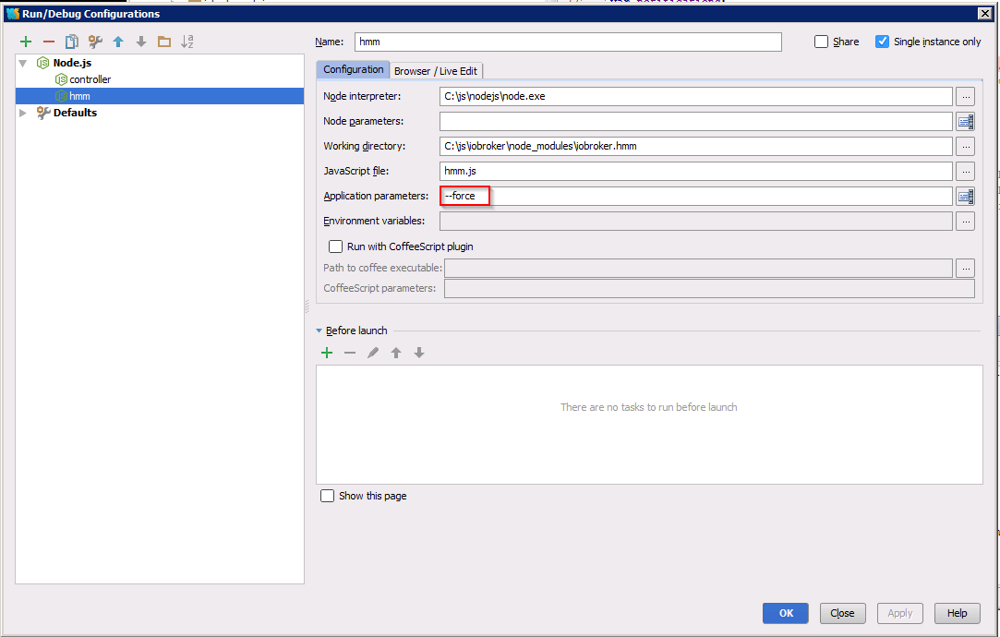
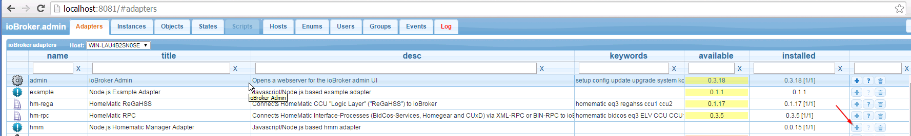
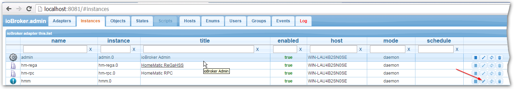
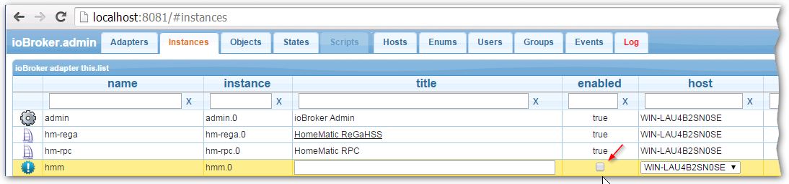
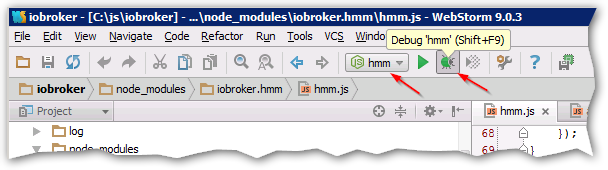

# WebStorm
在此页面上，我们将展示如何安装和设置 ioBroker 开发环境。
WebStorm 用于主要开发，也许 Nodeclipse 是替代 IDE。
此文档就像一本“烹饪书”，但没有关于 Javascript、NodeJS、HTML5 等的解释。

请随意扩展以下信息。

## 在 Ubuntu 14.04 上下载并安装 WebStorm
转到 [杰特布雷恩斯](https://www.jetbrains.com/webstorm/download/) 的网页并下载适用于您的操作系统的 WebStorm。我们将重点介绍 Ubuntu 14.04。
转到下载目录并使用“mv WebStorm-9.0.3.tar.gz /opt/”将文件移动到 /opt 目录。解压/解压它“tar xvzf WebStorm-9.0.3.tar.gz”。打开“WebStorm-139.1112/bin”并输入“./webstorm.sh”。也许您必须安装 Java JDK...

### 安装 Java JDK
**Windows 上不需要此步骤**

```
sudo apt-add-repository ppa:webupd8team/java
sudo apt-get update
sudo apt-get install oracle-java8-installer
```

### 安装 NodeJS
1. `sudo apt-get install nodejs`（不要执行```sudo apt-get install node``因为 node 不是 nodejs）
2. 使用 ```sudo ln -s /usr/bin/nodejs /usr/bin/node``` 创建别名“node”

## 下载最新的 ioBroker 源并导入到 WebStorm 项目中
1. 打开终端并转到 /opt 目录。
2. 使用“mkdir iobroker”创建一个新目录，然后执行“cd iobroker”
3.使用“npm install iobroker”安装iobroker
4. 使用“cd node_modules/iobroker.js-controller/”进行测试，然后输入“chmod +x iobroker”，然后输入“node controller.js”
5. 使用“http://localhost:8081”打开浏览器，您应该会看到 ioBroker 欢迎屏幕。

  

6. 进入终端窗口，输入“ctrl + c”中断ioBroker

## 配置 WebStorm 来运行和调试 ioBroker
1. 使用 `./webstorm.sh` 打开 WebStorm
2. 单击“文件->从现有文件新建项目...”
3. 选择以下...

  

4. 选择您的 ioBroker 目录...（右键单击目录以设置项目根目录）

   

5. 您的新 WebStorm 项目应如下所示...

  

### 创建“运行配置”ioBroker
1. 转到运行->“编辑配置...”


2. 选择“+”并添加 NodeJS 配置，如下图所示...


## 如何从 WebStorm 启动 ioBroker
1. 启动 ioBroker 并选择...

    

2. 您可能会问自己如何停止 ioBroker？在 WebStorm 中打开终端并输入...

    

## 如何调试 ioBroker 适配器
在本章中，我们将了解如何调试 ioBroker 适配器（如“iobroker.hmm”）。
首先像前面提到的那样启动 ioBroker，请不要使用“调试模式”。ioBroker 仅使用“运行模式”。
从命令行安装适配器（如 ioBroker.hmm），如下所示

配置 WebStorm“调试设置”...


转到 ioBroker 网页 http://localhost:8081 并安装 iobroker.hmm 适配器：

安装适配器后，我们必须禁用适配器实例...


...下一个

...最后你应该看到这个结果：

现在回到 WebStorm，让我们打开 hmm.js 文件并设置一个断点，如下所示：

开始调试 iobroker.hmm 适配器：

当你在第一个断点处停止时，你可以通过以下方式控制下一步：1）恢复程序 2）跳过：