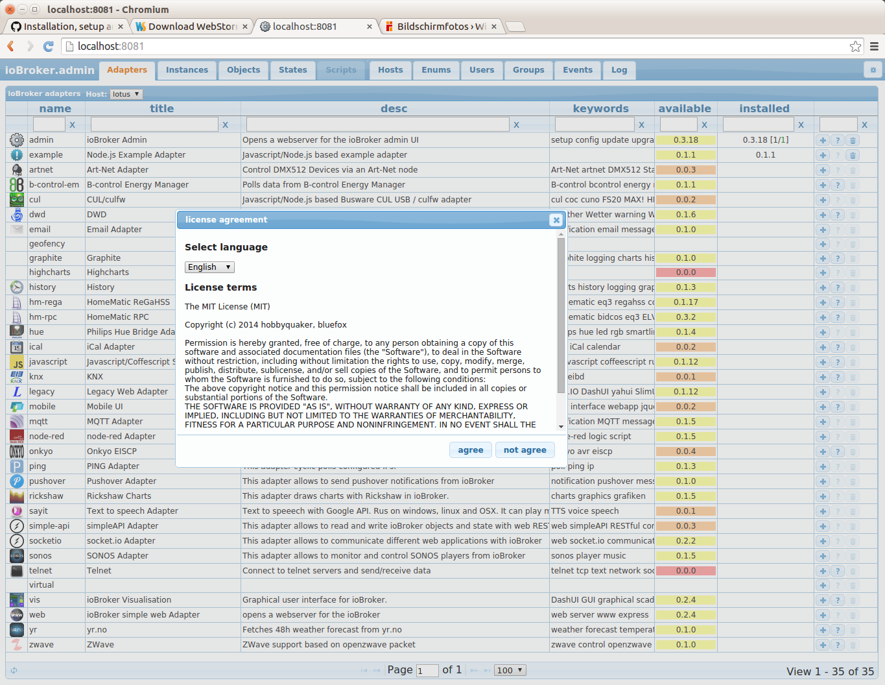
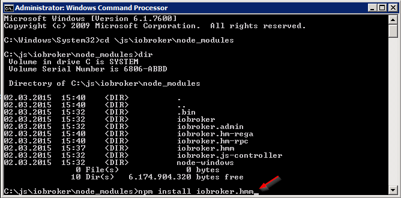

# 网络风暴
在此页面上，我们将展示如何安装和设置 ioBroker 开发环境。
WebStorm 用于主要开发，也许 Nodeclipse 是一个替代 IDE。
该文档就像一本“烹饪书”，但没有关于 Javascript、NodeJS、HTML5 等的解释。

随意扩展以下信息。

## 在 Ubuntu 14.04 上下载并安装 WebStorm
从 [喷气大脑](https://www.jetbrains.com/webstorm/download/) 转到网页并为您的操作系统下载 WebStorm。我们将专注于 Ubuntu 14.04。
转到下载目录并将文件移动到带有“mv WebStorm-9.0.3.tar.gz /opt/”的/opt目录。解压/解压它“tar xvzf WebStorm-9.0.3.tar.gz”。打开“WebStorm-139.1112/bin”并输入“./webstorm.sh”。也许你必须安装Java JDK...

### 安装Java JDK
**此步骤在 Windows 上不需要**

```
sudo apt-add-repository ppa:webupd8team/java
sudo apt-get update
sudo apt-get install oracle-java8-installer
```

### 安装 NodeJS
1. `sudo apt-get install nodejs`（不要做```sudo apt-get install node``` 因为node不是nodejs）
2.在```sudo ln -s /usr/bin/nodejs /usr/bin/node```的帮助下创建一个别名“节点”

## 下载最新的 ioBroker 源并导入 WebStorm 项目
1. 打开终端并进入 /opt 目录。
2.用“mkdir iobroker”新建目录，然后执行“cd iobroker”
3.使用“npm install iobroker”安装iobroker
4. 使用“cd node_modules/iobroker.js-controller/”测试它并输入“chmod +x iobroker”，然后输入“node controller.js”
5. 使用“http://localhost:8081”打开您的浏览器，您应该会看到 ioBroker 欢迎屏幕。

  

6. 进入终端窗口并输入`ctrl + c` 来中断ioBroker

## 配置 WebStorm 以运行和调试 ioBroker
1. 使用`./webstorm.sh`打开WebStorm
2.点击`File->"New Project from existing files...`
3. 选择以下...

  

4.选择你的ioBroker目录...（鼠标右键点击目录设置项目根目录）

   

5. 您的新 WebStorm- 项目应如下所示...

  

### 创建“运行配置”ioBroker
1.转到运行->“编辑配置...”


2. 选择“+”并添加如下图所示的 NodeJS 配置...


## 如何从 WebStorm 启动 ioBroker
1. 选择...启动 ioBroker

    

2. 您可能会问自己如何停止 ioBroker？在 WebStorm 中打开终端并输入 ...

    

## 如何调试 ioBroker 适配器
在本章中，我们将看到如何调试像“iobroker.hmm”这样的 ioBroker 适配器。
首先启动ioBroker，如前所述，请不要使用“调试模式”。仅用于 ioBroker 的“运行模式”。
从命令行安装像 ioBroker.hmm 这样的适配器

配置 WebStorm “调试设置” ...


转到 ioBroker 网页 http://localhost:8081 并安装 iobroker.hmm 适配器：

安装适配器后，我们必须禁用适配器实例...


...下一个

...最后你应该看到这个结果：

现在回到 WebStorm，让我们打开 hmm.js 文件并设置一个像这样的断点：

开始调试 iobroker.hmm 适配器：

当您在第一个断点处停止时，您可以通过 1) 恢复程序 2) 跳过来控制后续步骤：