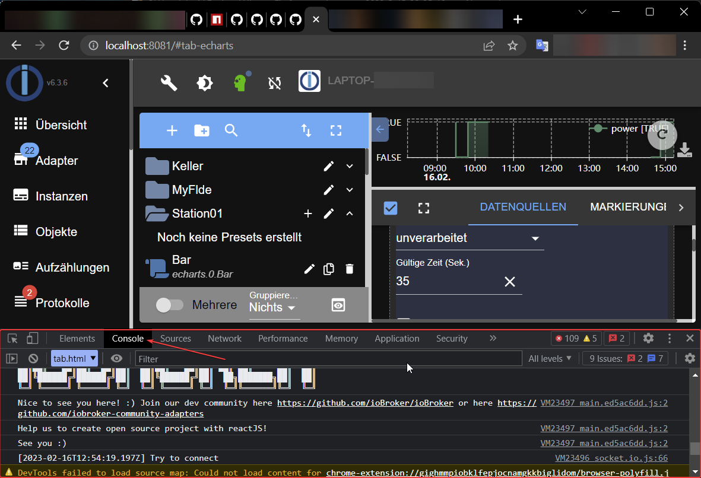
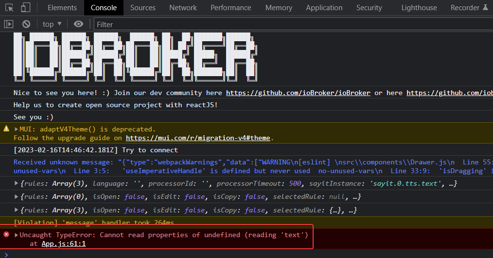

## 图形界面报错
ioBroker 有许多用 JavaScript 编写的图形界面。

目前许多界面都是使用 ReactJS 开发的。
如果此类界面中发生错误，或者响应冻结或站点行为异常，那么您可以而且应该报告错误。

为此，您必须打开浏览器控制台并在那里找到错误消息。
每个浏览器的浏览器控制台都不同，但大多数浏览器在开发人员视图中都有控制台，并且开发人员视图通常可以通过 F12（Chrome、Firefox、Edge）访问。

请务必**首先打开浏览器控制台，然后重新加载页面 (F5)*，然后执行导致错误的操作。

Chrome 中的浏览器控制台如下所示：

如果仅在页面加载后打开控制台，则错误消息如下所示：

像这样，如果在页面加载之前打开控制台：

您可能会注意到，文件名和行号显示在发生错误的位置。

利用此信息（以及适配器版本号），我们可以重现或修复错误。