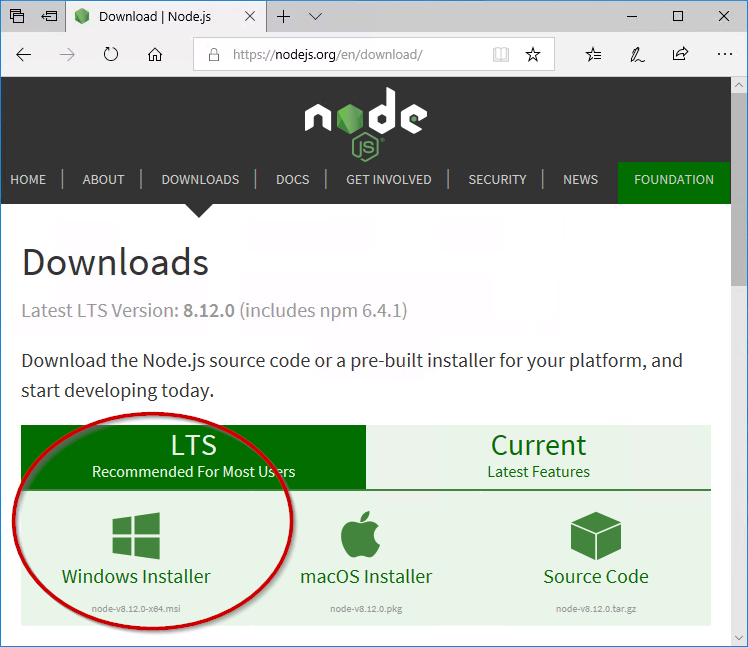

# 安装 Node.js 和 npm
?> ***这是一个占位符***。<br><br>帮助 ioBroker 并扩展本文。请注意[ioBroker 风格指南](community/styleguidedoc)，以便更容易地采用更改。

ioBroker 和适配器主要是用 JavaScript 编程语言编写的。由于计算机无法直接执行 Javascript，因此需要 Node.js 运行时环境来执行此操作。

以下信息是 [Node.js 基金会](https://nodejs.org/en/download/package-manager/) 安装说明的非官方翻译。

＃＃ 内容
* [Arch Linux](#arch)
* [基于 Debian 和 Ubuntu 的 Linux 发行版](#)
* [企业 Linux 和 Fedora](#debian)
* [FreeBSD](#)
* [Gentoo](#)
* [NetBSD](#)
* [非虚拟机](#)
* [OpenBSD](#)
* [openSUSE 和 SLE](#)
* [苹果系统]（＃）
* [SmartOS 和 illumos](#)
* [无效Linux](#)
* [溶液](#)
* [Windows](#windows)

<h2 id="arch">ArchLinux</h2>

社区存储库中提供了现成的 Node.js 和 npm 包。

```
pacman -S nodejs npm
```

<h2 id="debian">基于 Debian 和 Ubuntu 的 Linux 发行版</h2>

这还包括 **Linux Mint、Linux Mint Debian 版 (LMDE)、elementaryOS、Windows 上的 bash** 等等。

Node.js 通过 NodeSource Debian 和 Ubuntu Binary Repository（以前 Chris Lea 的 Launchpad PPA）提供。
可以在 GitHub 上的 [节点源/发行版](https://github.com/nodesource/distributions) 下找到有关 reposity 的帮助和脚本。

**注意：** 如果你想在 Ubuntu Precise 或 Debian Wheezy 上安装 Node.js，建议阅读使用[Node.js >= 6.x 在旧发行版上](https://github.com/nodesource/distributions/blob/master/OLDER_DISTROS.md)的文章。

```
curl -sL https://deb.nodesource.com/setup_8.x | sudo -E bash -
sudo apt-get install -y nodejs
```

对于 Node.js 10，使用以下命令：

```
curl -sL https://deb.nodesource.com/setup_10.x | sudo -E bash -
sudo apt-get install -y nodejs
```

***可选：*** 安装构建工具

要使用 npm 编译和安装本机扩展，还应安装构建工具。

```
sudo apt-get install -y build-essential
```

**可用架构：**

* **i386**（32 位）
* **amd64**（64 位）
* **armhf**（ARM 32 位硬浮点、ARMv7 和更新版本：arm-linux-gnueabihf）

支持的 Ubuntu 版本：

* **Ubuntu 14.04 LTS** (Trusty Tahr)
* **Ubuntu 16.04 LTS** (Xenial Xerus)

支持的 Debian 版本：

* **Debian 8**（jessie，旧稳定版）
* **Debian 9 / 稳定的**（拉伸）
* **Debian 9 测试**（作为下一个稳定版本发布）
* **Debian 不稳定**（sid 永远不会被发布，又名滚动）

Debian Sid (unstable)、Jessie (testing) 和 Wheezy (wheezy-backports) 的官方 repo 中也提供了一个 Node.js 包作为“nodejs”。它只安装一个 nodejs 二进制文件。

nodejs-legacy 包安装了一个节点符号链接，许多模块需要它来正确构建和运行。发行版官方存储库中可用的 Node.js 模块不需要它。

支持的 Linux Mint 版本：

* **Linux Mint 17“Qiana”**（通过 Ubuntu 14.04 LTS）
* **Linux Mint 17.1“丽贝卡”**（通过 Ubuntu 14.04 LTS）
* **Linux Mint 17.2“Rafaela”**（通过 Ubuntu 14.04 LTS）
* **Linux Mint Debian 版 (LMDE) 2 “Betsy”**（通过 Debian 8）

支持的基本操作系统版本：

* **基本操作系统 Luna**（通过 Ubuntu 12.04 LTS）
* **基本操作系统 Freya**（通过 Ubuntu 14.04 LTS）
* **基本操作系统 Loki**（通过 Ubuntu 16.04 LTS）
* **基本操作系统 Juno**（通过 Ubuntu 18.04 LTS）

支持的 Trisquel 版本：

* **Trisquel 7 “Belenos”**（通过 Ubuntu 14.04 LTS）

支持的 BOSS 版本：

* **BOSS 5.0 “Anokha”**（通过 Debian 7）

企业 Linux 和 Fedora

包括 Red Hat® Enterprise Linux® / RHEL、CentOS 和 Fedora。

Node.js 可从 NodeSource Enterprise Linux 和 Fedora 二进制发行版存储库中获得。可以在 GitHub 的 nodesource/distributions 上找到对此存储库及其脚本的支持。

请注意，EL 5（RHEL5 和 CentOS 5）的 Node.js 包取决于可用的 EPEL 存储库。如果未安装，安装脚本将检查并提供说明。

在 RHEL、CentOS 或 Fedora 上，对于 Node.js v8 LTS：

```
curl --silent --location https://rpm.nodesource.com/setup_8.x | sudo bash -
```

或者对于 Node.js 10：

```
curl --silent --location https://rpm.nodesource.com/setup_10.x | sudo bash -
```

然后安装：

```
sudo yum -y install nodejs
```

可选：安装构建工具

要从 npm 编译和安装本机插件，您可能还需要安装构建工具：

```
sudo yum install gcc-c++ make
# or: sudo yum groupinstall 'Development Tools'
```

可用架构：

* **i386**（32 位，不适用于 EL7）
* **x86_64**（64 位）

支持的 Red Hat® Enterprise Linux® 版本：

* **RHEL 5**（32 位和 64 位）
* **RHEL 6**（32 位和 64 位）
* **RHEL 7**（64 位）

支持的 CentOS 版本：

* **CentOS 5**（32 位和 64 位）
* **CentOS 6**（32 位和 64 位）
* **CentOS 7**（64 位）

支持的 CloudLinux 版本：

* **CloudLinux 6**（32 位和 64 位）

支持的 Fedora 版本：

* **Fedora 21**（二十一）（32 位和 64 位）
* **Fedora 20** (Heisenbug)（32 位和 64 位）
* **Fedora 19**（薛定谔的猫）（32 位和 64 位）

已知支持的其他发行版：

* **Oracle Linux**（非常接近 RHEL）
* **Amazon Linux**（在 2016.03 测试）

备择方案

Fedora 18 及更高版本中提供了官方的 Fedora Node.js 和 npm 包。安装：

```
sudo dnf install nodejs
```

急于获取最新更新？从更新测试中获取它们。

Enterprise Linux（RHEL 和 CentOS）用户可以使用 EPEL 存储库中的 Node.js 和 npm 包。

为您的版本安装适当的 epel-release RPM（在 EPEL 存储库主页上找到），然后运行：

```
sudo yum install nodejs npm --enablerepo=epel
```

急于获取最新更新？从 epel-testing 中获取它们。

可用架构：

* **i686**（32 位，不适用于 EL7）
* **x86_64**（64 位）
* **armv6hl**（仅限树莓派、Pidora）
* **armv7hl**（32 位 ARM 硬浮点，ARMv7 及更高版本，仅限 Fedora）

支持的 Red Hat® Enterprise Linux® 版本：

* **RHEL 6** (i686/x86_64)
* **RHEL 7** (aarch64/x86_64)

EPEL 不再支持 RHEL 6，但您可以使用 Red Hat Software Collections。

此外，与上述 RHEL 版本对应的 CentOS 和 Scientific Linux 版本也被包括 nodejs 在内的所有 EPEL 包正式支持。由于之前向 epel-devel 邮件列表报告的严重不兼容性，EPEL 未正式支持 Amazon Linux，但是您可能会发现 nodejs 至少仍然可以工作。

支持的 Fedora 版本：

* **Fedora Rawhide** (i686/x86_64/armv7hl/aarch64/ppc64/ppc64le/s390x)
* **Fedora 27** (i686/x86_64/armv7hl/aarch64/ppc64/ppc64le/s390x)
* **Fedora 26** (i686/x86_64/armv7hl/aarch64/ppc64/ppc64le)

自由BSD

Node.js 的最新版本可通过 www/node 端口获得。

通过 pkg 安装二进制包：

```
pkg install node
```

或者使用端口自己编译它：

```
cd /usr/ports/www/node && make install
```

琴图

Node.js 在 portage 树中可用。

```
emerge nodejs
```

NetBSD

Node.js 在 pkgsrc 树中可用：

```
cd /usr/pkgsrc/lang/nodejs && make install
```

或者使用 pkgin 安装二进制包（如果适用于您的平台）：

```
pkgin -y install nodejs
```

非易失性

Node Version Manager 是一个 bash 脚本，用于管理多个已发布的 Node.js 版本。它允许您执行安装、卸载、切换版本等操作。要安装 nvm，请使用此安装脚本。

在 Unix / OS X 系统上，从源代码构建的 Node.js 可以使用 nvm 通过安装到 nvm 期望的位置来安装：

```
$ env VERSION=`python tools/getnodeversion.py` make install DESTDIR=`nvm_version_path v$VERSION` PREFIX=""
```

在此之后，您可以使用 nvm 在已发布版本和从源代码构建的版本之间切换。例如，如果 Node.js 的版本是 v8.0.0-pre：

```
$ nvm use 8
```

正式版本发布后，您将需要卸载从源代码构建的版本：

```
$ nvm uninstall 8
```

OpenBSD

Node.js 可通过端口系统获得。

```
/usr/ports/lang/node
```

在 OpenBSD 上使用 pkg_add：

```
pkg_add node
```

openSUSE 和 SLE

Node.js 在以下包下的主存储库中可用：

* **openSUSE Leap 42.2：** nodejs4
* **openSUSE Leap 42.3:** nodejs4, nodejs6
* **openSUSE Tumbleweed:** nodejs4, nodejs6, nodejs8
* **SUSE Linux Enterprise Server (SLES) 12：** nodejs4、nodejs6

    （安装前必须添加“Web 和脚本模块”。）

例如，要在 openSUSE Leap 42.2 上安装 Node.js 4.x，请以 root 身份运行以下命令：

```
zypper install nodejs4
```

苹果系统

只需直接从 nodejs.org 网站下载 macOS 安装程序。

如果你想用 bash 下载包：

```
curl "https://nodejs.org/dist/latest/node-${VERSION:-$(wget -qO- https://nodejs.org/dist/latest/ | sed -nE 's|.*>node-(.*)\.pkg</a>.*|\1|p')}.pkg" > "$HOME/Downloads/node-latest.pkg" && sudo installer -store -pkg "$HOME/Downloads/node-latest.pkg" -target "/"
```

备择方案

使用自制软件：

冲泡安装节点

使用 MacPorts：

```
port install nodejs<major version>
```

＃例子
端口安装nodejs7

使用 pkgsrc：

安装二进制包：

```
pkgin -y install nodejs
```

或者从 pkgsrc 手动构建：

```
cd pkgsrc/lang/nodejs && bmake install
```

SmartOS 和照明

SmartOS 映像预装了 pkgsrc。在其他 illumos 发行版上，首先安装 pkgsrc，然后您可以正常安装二进制包：

```
pkgin -y install nodejs
```

或者从 pkgsrc 手动构建：

```
cd pkgsrc/lang/nodejs && bmake install
```

虚空Linux

Void Linux 在主存储库中提供了稳定的 node.js。

```
xbps-install -Sy nodejs
```

溶胶

Solus 在其主存储库中提供 node.js。

```
sudo eopkg install nodejs
```

<h2 id="windows">视窗</h2>

?> 建议从要安装它的机器上下载 Node.js。 Node.js 下载网站会自动考虑 Windows 是 32 位还是 64 位变体。

1. 从网站

[https://nodejs.org/en/download](https://nodejs.org/en/download/)下载当前 8.x LTS 版本的 Node.js。

 *从 Node.js 下载*

1. 双击启动下载的 Node.js 安装程序。

?> 该程序通常位于 `Downloads` 文件夹中，并遵循 `node-<Version>.msi` 命名方案。

1. 如果显示该应用不是来自 Microsoft Store 的已验证应用的消息，

   选择`Trotzdem installieren`。

1. 使用默认设置安装 Node.js。不要更改安装路径。

   确认出现的任何安全提示。

 *Node.js 安装*