# Proxmox

## Proxmox 安装
Proxmox Virtual Environment（简称Proxmox VE）是一个基于Debian的虚拟化平台。 Proxmox 的虚拟化技术基于 QEMU/KVM。

Proxmox 在其自己的 Web 界面中“打包”QEMU/KVM，从而使管理变得非常容易（并且还支持 Linux Containers - LXC）。这使得 Proxmox 一方面对初学者友好，但另一方面非常强大，它也可以在专业环境中使用。

本节展示了免费版（非订阅）中 Proxmox 的安装和基本配置示例。

为了清楚起见，可以打开图像描述和附加信息。

＃＃＃ 要求

要求

- 64 位 CPU
- CPU 和主板必须支持 Intel VT/AMD-V 进行虚拟化并在 bios 中激活。
- 1 GB RAM（仅适用于 Proxmox） - 根据要操作的虚拟机数量，这里当然需要更多 RAM。因此，建议至少 8 GB，最好是 16 GB 的 RAM。

</详情>

### 创建 ISO 映像/可启动 U 盘
首先，您需要一个 ISO 映像，可以从 [Proxmox 下载页面](https://www.proxmox.com/de/downloads/category/iso-images-pve) 下载。

Proxmox ISO

</详情>

安装时，必须使用此 ISO 映像创建可引导的 U 盘。这应该至少有 2 GB 的内存。有几种方法可以创建可启动棒，请参阅[准备安装介质](https://pve.proxmox.com/wiki/Prepare_Installation_Media#_instructions_for_windows)

＃＃＃ 安装
系统必须在 UEFI/BIOS 中进行配置，以便可以从 USB 设备启动。插入 U 盘后，过一会儿会出现 Proxmox 安装菜单（如果没有，您也可以手动指定 U 盘作为启动介质（在大多数主板上，您可以使用 F8 或 F11 来执行此操作）。

**Install Proxmox VE** 现在只需在安装菜单中选择。

安装菜单

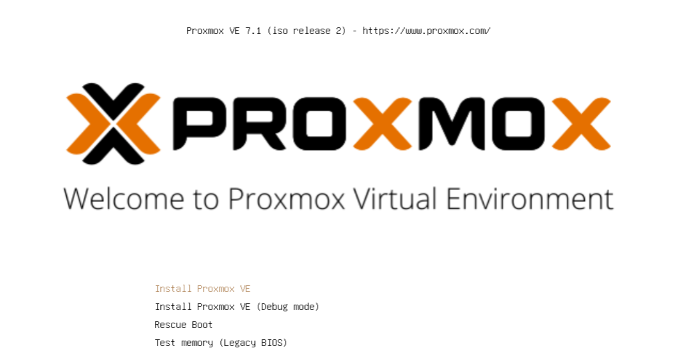

</详情>

下一步是同意使用条款 (EULA)。

猫头鹰

</详情>

下一步是选择要安装 Proxmox 的硬盘。如果服务器上安装了多个硬盘，请务必选择正确的硬盘！

硬盘的选择

</详情>

使用**按钮选项**，您还可以为安装硬盘指定其他参数：

高级硬盘选项

</详情>

Proxmox 使用 [逻辑卷管理器](https://de.wikipedia.org/wiki/Logical_Volume_Manager) (LVM)。借助此时的扩展选项，可以详细配置 LVM 等。
安装程序创建名为 pve 的卷组 (VG) 和名为 root 的附加逻辑卷 (LV)（此处安装 Proxmox 本身）、数据（存储 VM 的虚拟磁盘的存储）和交换（此处存储交换文件）。

使用高级设置，可以在此处指定某些参数：

- 文件系统：在这里您可以选择文件系统。这里的默认值为 ext4，在大多数情况下这是一个不错的选择。如果主机系统上有多个可用硬盘（以及大量 RAM），则具有适当 RAID 级别的 zfs 选项在这里很有意义。但是，在这种情况下，您应该从根本上处理 ZFS。
- hdsize：指定应用于 Proxmox 的总硬盘大小。这里你通常选择完整的硬盘大小，除非你以后想添加更多的分区。
- swapsize：确定交换卷的大小。这里的标准是与内置内存大小相同，但最小为 4 GB，最大为 8 GB。
- maxroot：指定根卷（Proxmox 本身）的最大大小。 **这里要提一下，在基础安装中，后面需要的模板和ISO镜像也存放在这里。**
- minfree：LVM 卷组 pve 上剩余的可用空间。如果磁盘大于 128 GB，则默认保留 16 GB（LVM 总是需要一些可用空间来创建快照）。
- maxvz：指定数据量的最大大小。

</详情>

通常，您可以将所有选项保留为默认设置（即此处未指定任何内容）。这些已经为大多数安装进行了优化设置。

为 Proxmox 选择硬盘后，会查询本地化选项（国家、时间和相关的键盘布局）：

本土化

</详情>

然后输入 root 用户的密码。此处还要求提供电子邮件地址。这用于在收到重要系统消息时向此处指定的地址发送电子邮件。但是，这不一定是真实的电子邮件地址（然后，作为管理员，您将不再通过电子邮件收到重要系统事件的通知）。

密码和邮箱

</详情>

安装程序的下一步处理网络设置。必须在此处输入静态 IP 地址（无 DHCP）。这包括 IP 地址本身（以 CIDR 表示法）、网关 IP（通常是路由器的 IP 地址）和要使用的 DNS 服务器（在私有环境中通常也是路由器的 IP 地址）。 Proxmox 通常会自动检测网络。

网络

</详情>

最后显示安装摘要：

概括

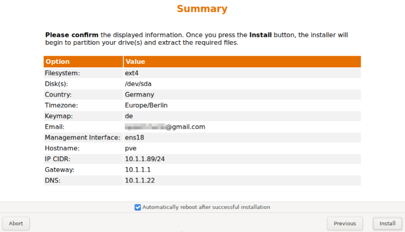

</详情>

通过检查设置并单击安装来安装系统。

安装

</详情>

稍等片刻后，安装完成，必须重新启动系统（事先移除带有 ISO 映像的 U 盘）。

然后你会看到终端。此处已显示有关现在如何访问系统的说明：

安慰

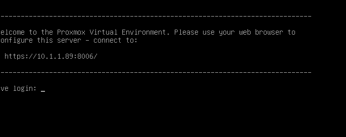

</详情>

现在它在浏览器中继续（例如 https://10.1.1.89:8006）。但是，首先会显示警告。这是因为在安装过程中生成了自签名证书，浏览器当然不知道。此时您可以放心地忽略此消息 - 无论如何，连接都是通过 HTTPS 加密的。消息本身取决于浏览器。在此示例中，单击 **Advanced** 然后单击 **Continue to 10.1.1.89(unsafe)**

隐私错误

</详情>

然后使用 root 用户和安装期间选择的密码进行登录。您可以将语言切换为德语**先**，否则Proxmox界面将显示为英文，您不必再次输入您的用户名和密码。

登记

</详情>

登录后，您将立即收到一条消息，提示您没有对此服务器的有效订阅。此消息首先通过单击确定来确认。

订阅

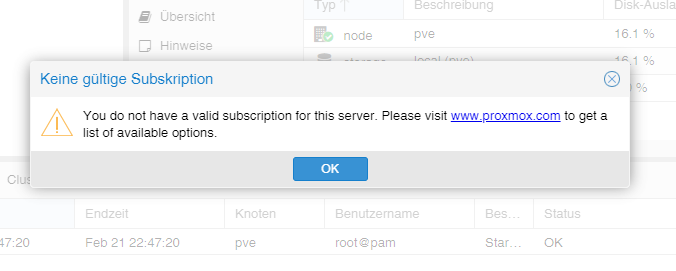

</详情>

现在必须调整 Proxmox 包源以便接收更新。

包源

</详情>

为此，将 **Non-Subscription-Repository** 添加到包源中。这可以在 `Updates > Repositories` 下的 Proxmox 实例菜单中完成。可以使用 Add 按钮添加非订阅存储库：

非订阅

</详情>

现在应该停用 **Enterprise Repository**。为此，只需在存储库视图中选择 pve-enterprise 存储库，然后单击 **Deactivate** 按钮。

存储库的配置如下所示：

企业资料库

</详情>

＃＃＃ 更新
更改软件包来源后，应进行第一次系统更新。最好的方法是通过 Web 界面：

更新

</详情>

只需选择所需的 Proxmox 节点（例如“pve”），然后单击更新下的**更新**。这是所谓的任务查看器打开的地方，当系统上执行任何活动时，它总是显示。现在可以再次关闭任务查看器。顺便说一句，当显示任务查看器时，您不必等到任务完成（“TASK OK”），但始终可以直接再次关闭此对话框 - 任务本身继续在后台运行。
如果更新现在可用，则可以通过单击**升级**来导入它们。

Web 控制台将在此处打开，您可以监控进度。

网络控制台

</详情>

当然也可以通过命令行（例如通过 SSH）更新 Proxmox 服务器：

~~~ apt update && apt dist-upgrade ~~~

这里唯一重要的是您使用 **apt dist-upgrade**（在“普通”Debian/Ubuntu 机器上，您倾向于使用 apt upgrade）。但是，“dist-upgrade”对于 Proxmox 很重要，因为运行 Proxmox 所需的依赖关系在这里得到了更好的解决。

在这方面，Proxmox 现在已经完成了基本配置。如果您想更广泛地处理 Proxmox，值得一看 [Proxmox Wiki](https://pve.proxmox.com/wiki/Main_Page) 或前往[官方论坛](https://forum.proxmox.com/)。

---

## Proxmox - 创建一个虚拟 Qemu/KVM 机器 (VM) + ioBroker 安装之后
本示例指南展示了如何创建一个 [虚拟机](https://pve.proxmox.com/wiki/Qemu/KVM_Virtual_Machines) (debian11)，然后在其中安装 ioBroker。

当然可以使用 Ubuntu 代替 Debian，但请确保使用 Ubuntu Server **LTS 版本**。

为了清楚起见，可以打开图像描述和附加信息。

### 1 - 下载 ISO 映像
首先，需要一个[ISO 映像](https://www.debian.org/distrib/)(64-bit PC Netinst-ISO)，它必须在基本安装中加载到根目录（本地）（如果没有创建其他驱动器）。

为此，请转到本地 > ISO 映像。那里有两个选择。

- 之前存储在计算机上的 ISO，可以通过 **Upload** 按钮加载到 Proxmox 主机上。
- **从 URL 下载** 可以通过 URL 将 ISO 直接上传到主机。为此，复制 64 位 PC Netinst-ISO 的链接地址（鼠标右键），插入 URL 并单击 **Query URL** 以检索它。最后点击 **Download**，即可直接下载 ISO。

下载 ISO

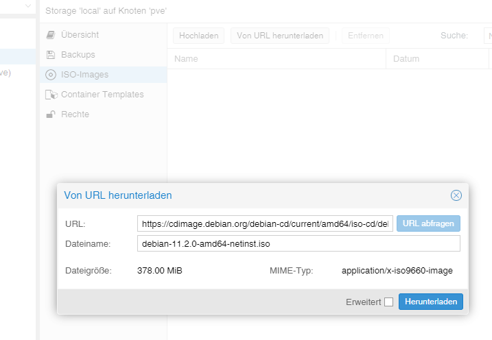

</详情>

### 2 - 创建虚拟机
单击蓝色的 **Create VM** 按钮打开一个窗口，必须在其中进行以下设置。

- 常规：分配主机名和密码，ID 已给出（以 100 开头），可以更改，但不能稍后更改。
- 操作系统：存储选择（本地）和 ISO 映像（debian-11-netinst.iso）
- 系统：一切都保持在默认设置，**检查 Qemu 代理**
- 磁盘：存储 local-lvm，磁盘大小 10GB（10-20GB 应该足够了，以后可以更改，但这里不再赘述）。
- CPU：取决于电脑的强大程度（也可以随时调整，为此必须重新启动VM）
- 内存：以 MiB 为单位的 RAM 大小（也可以随时调整，为此必须重新启动 VM）
- 网络：vmbr0，其他一切保持默认
- 确认：在这里您可以再次看到摘要（检查 **Start after creation**）然后单击 **Finish** 以创建 VM。

系列图像 创建虚拟机

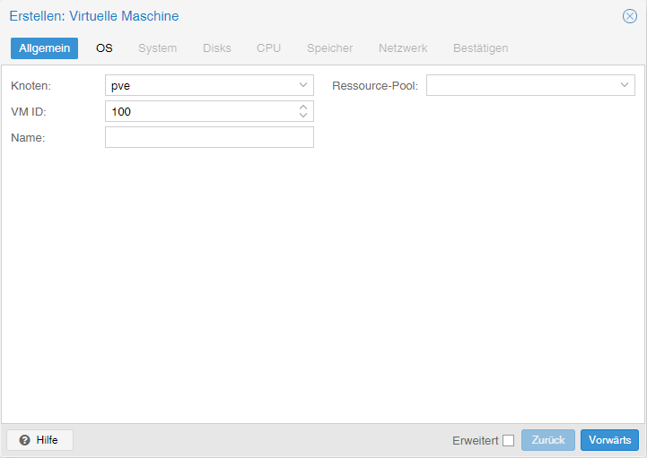

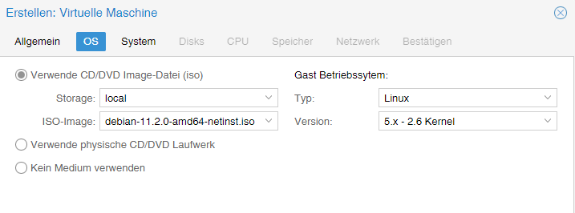

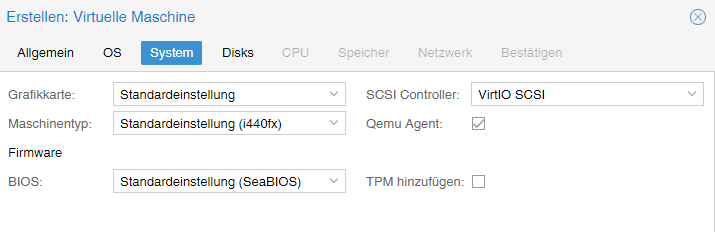

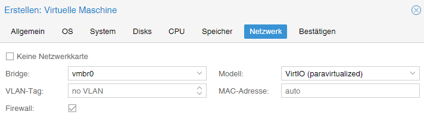

</详情>

### 3 - Debian 安装
启动 VM 后，转到 VM 控制台并启动 **Install**。

安慰

</详情>

您将被引导完成安装，并且必须在此过程中进行一些设置。要使用它，您需要制表键、空格键和箭头键。由于范围的原因，可以找到一系列图像的各种镜头。

**危险！ - 不能分配 root 密码。**

图像系列 Debian 安装

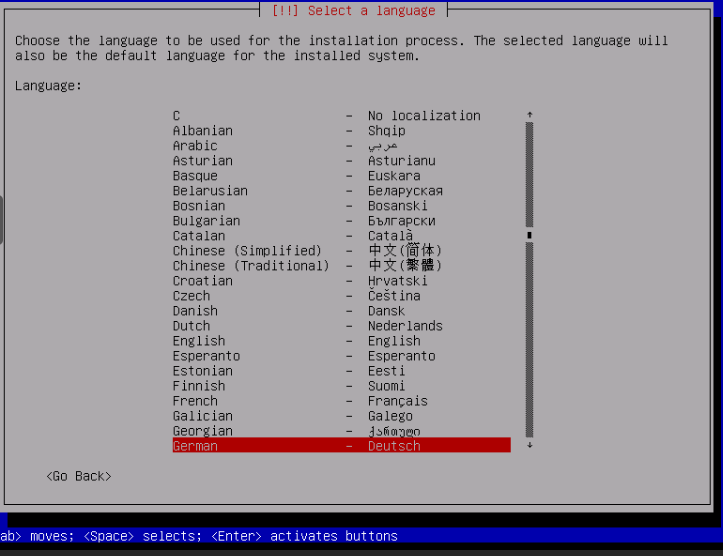

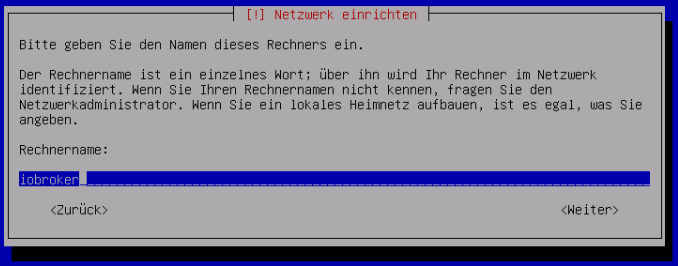

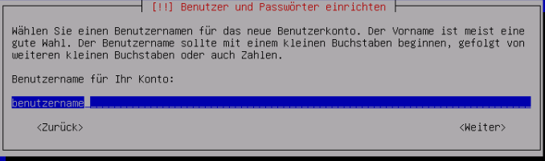

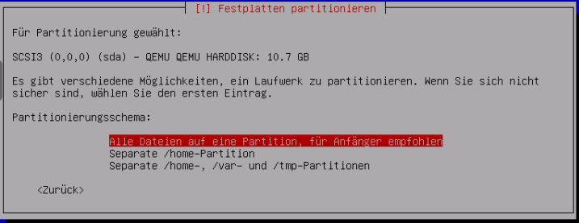

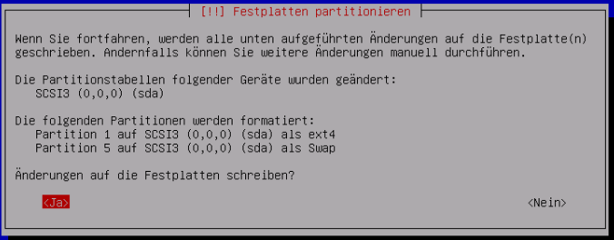

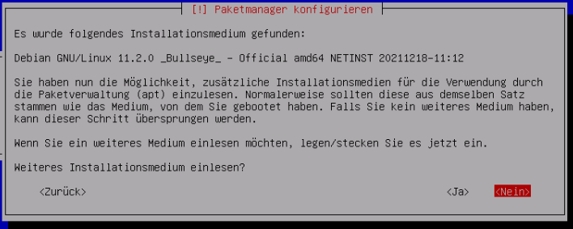

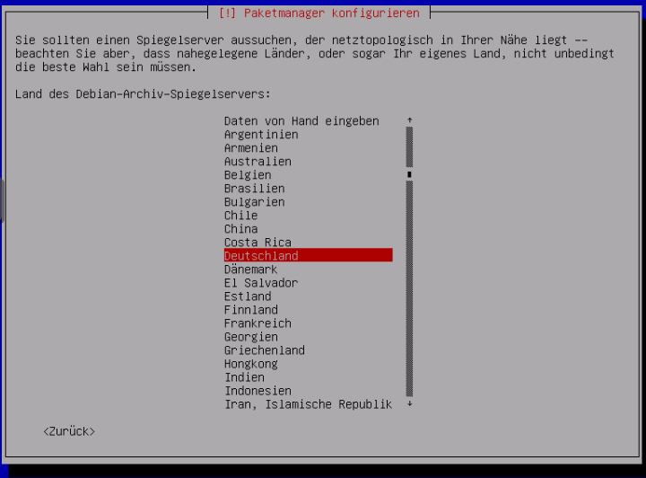

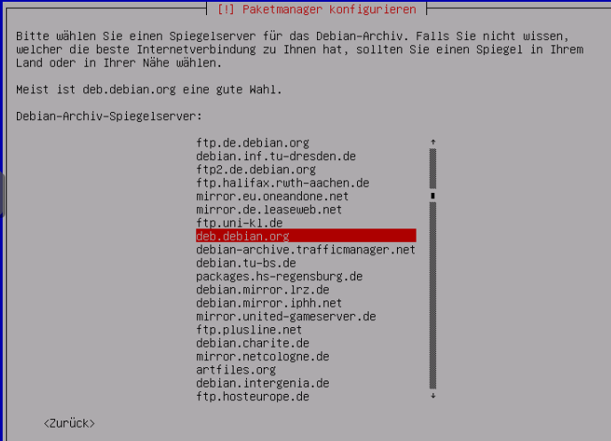

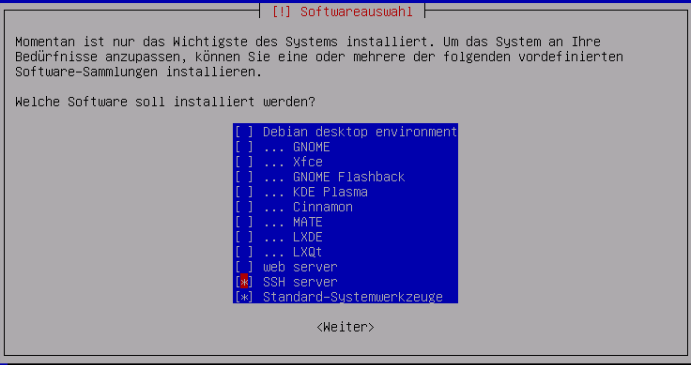

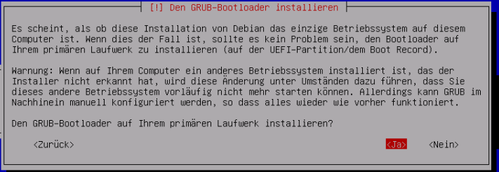

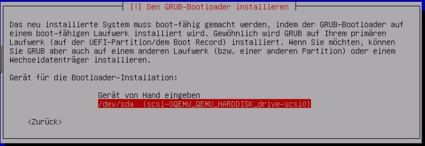

</详情>

### 4 - 设置虚拟机
重新启动 VM 后，使用安装时分配的“用户名”和“密码”登录。然后用命令

~~~ ip地址~~~

找到了IP地址。这是通过 ssh 远程连接到 VM 所必需的，如下一步所示。

ip地址

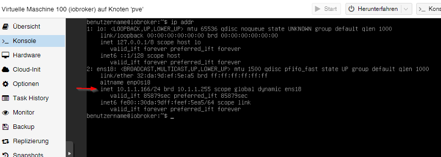

</详情>

现在可以通过 ssh（例如 putty）访问 VM。在这里您也可以使用“用户名”和“密码”再次登录。
然后可以将网络地址从**dhcp**更改为**static**。 （推荐用于服务器操作）

~~~ sudo nano /etc/network/interfaces ~~~

网络/接口

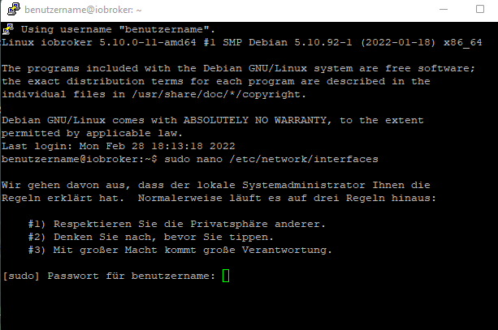

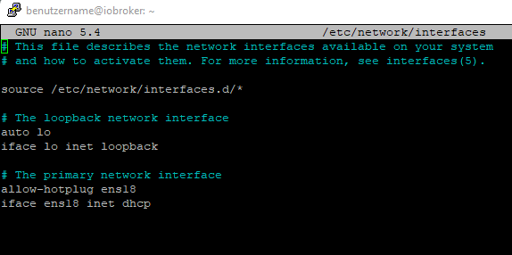

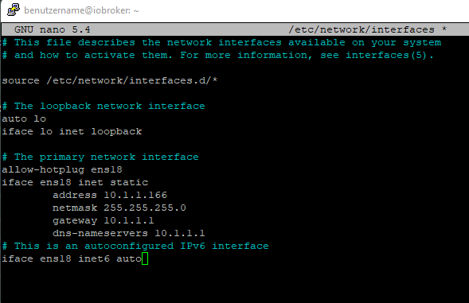

</详情>

使用组合键 CTRL + o 保存编辑器中的更改，然后 ENTER，CTRL + x 退出编辑器。

对 IP 的更改仅在 VM 重新启动后才会生效。然而，在此之前，它会检查 Qemu 来宾代理是否处于活动状态，使用

~~~ sudo systemctl status qemu-guest-agent ~~~

来宾代理

</详情>

**危险！ - 对于 Ubuntu 安装，必须安装并启动 Qemu Guest Agent..**

为此的命令：

~~~ sudo apt-get install qemu-guest-agent sudo systemctl start qemu-guest-agent ~~~

此外，为了能够安装 iobroker，必须在之后安装 **curl**。
~~~ sudo apt install curl ~~~

重新安装卷曲

</详情>

要通过 VM 中的设备 (USB)，请选择 VM > Hardware > Add > USB Devices > Vendor/Device ID。此处列出了所有连接的设备。

USB 设备

</详情>

为了使 VM 在计算机 (Proxmox) 重新启动后自动启动，必须在 VM 选项中激活它。

引导选项

</详情>

这样就完成了 VM 的安装和设置。现在可以重新启动 VM，然后可以安装 ioBroker。

---

## Proxmox - 之后创建 Linux 容器 (LXC) + ioBroker 安装
本示例指南展示了如何创建 [LXC 容器](https://pve.proxmox.com/wiki/Linux_Container) (debian11)，然后在其中安装 ioBroker。

为了清楚起见，可以打开图像描述和附加信息。

### 1 - 下载容器模板
首先，需要一个模板，该模板必须加载到基本安装中的根目录（本地）中（如果没有创建其他驱动器）。

为此，请转到本地 > 容器模板。单击**模板**会打开一个选择列表。在这里您选择 debian-11-standard(bullseye) 并单击下载。

下载模板

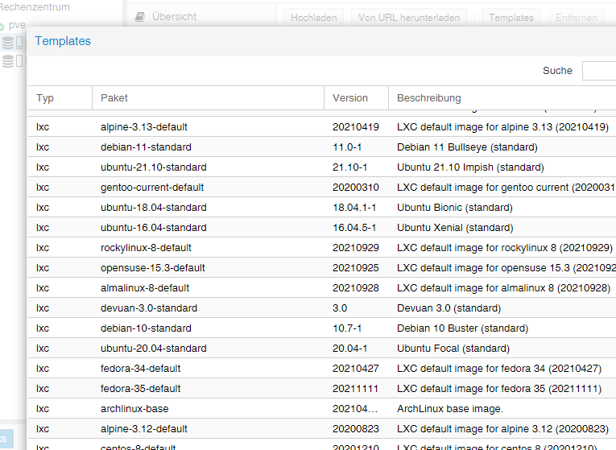

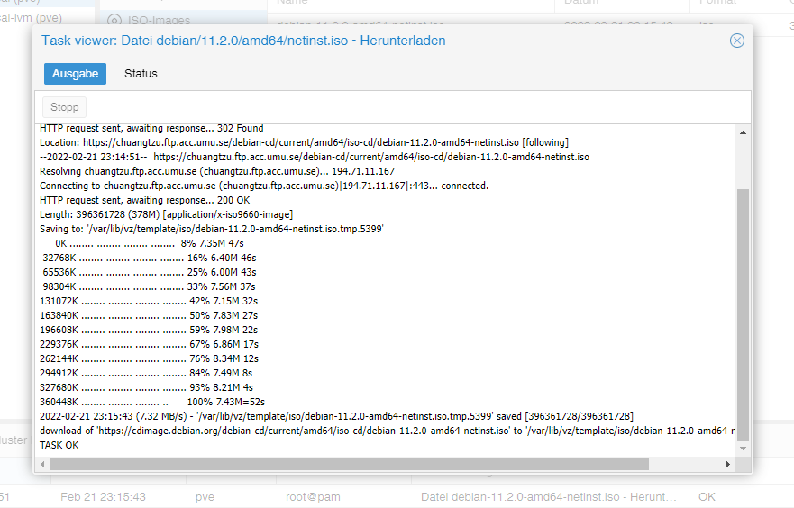

</详情>

### 2 - 创建 LXC
单击蓝色按钮 **Create CT** 打开一个窗口，现在必须在其中进行以下设置。

- 常规：分配主机名和密码，ID 已给出（以 100 开头），但可以更改。
- 模板：存储选择（本地）和模板（debian-11-standard）
- Disks：磁盘大小的分配（不要太大方，可以随时放大）
- CPU：取决于电脑的强大程度（也可以随时调整）
- 内存：Ram/Swap 分配（可随时调整，甚至在运行期间）
- 网络：静态 IP/CIDR 分配、网关，如果没有设置 IPv6，则设置为 SLAAC
- DNS：通常什么都没有改变（使用来自主机的值）
- 确认：摘要（勾选**创建后开始**）然后点击**完成**创建容器。

图像系列 创建 CT

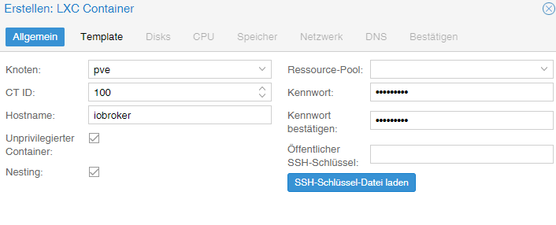

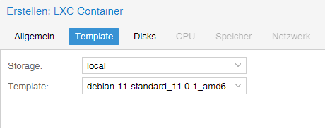

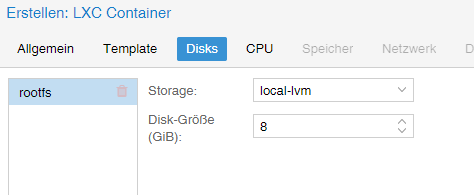

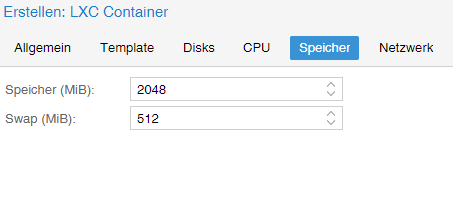

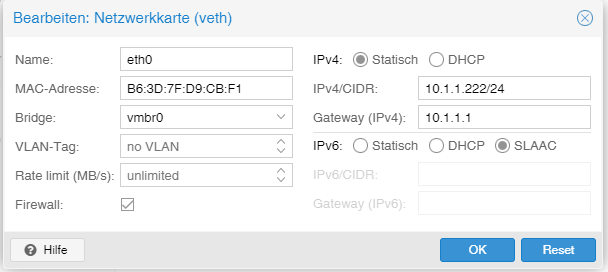

</详情>

### 3 - 设置 LXC
现在容器已经启动，进入 LXC 的控制台

安慰

</详情>

在这里，您首先使用先前分配的密码以 root 身份登录，该密码是在创建 LXC 时分配的，然后首先更新它。

~~~ apt更新&& apt升级~~~

升级

</详情>

直接指出时区还是要设置的。

~~~ dpkg-重新配置tzdata ~~~

时区

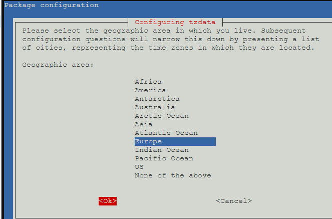

</详情>

现在将安装 **sudo** 和 **curl**。与下一步一样，需要 Sudo 才能正确创建将来用于在控制台上工作的用户。 Curl 是最后一步调用 ioBroker 安装脚本所必需的。

~~~ apt install sudo curl ~~~

重新安装

</详情>

现在创建未来用户。在这种情况下替换“用户名”。为用户分配密码。其余的可以用 ENTER 确认。

~~~ 添加用户名~~~

创建用户

</详情>

最后一步，在安装ioBroker之前，注销一次

~~~退出~~~

然后使用新用户登录。现在可以安装 iobroker。

注销并以用户身份登录

</详情>

为了让 LXC 在重新启动计算机 (Proxmox) 后自动启动，必须在容器选项中激活它。

引导选项

</详情>

---

## 安装 ioBroker
安装 ioBroker 所需的只是一个命令。

~~~ curl -sLf https://iobroker.net/install.sh |砰~~~~

安装步骤分为 4 个步骤，完全自动运行。

- 安装先决条件 (1/4)
- 创建 ioBroker 用户和目录 (2/4)
- 安装 ioBroker (3/4)
- 完成安装 (4/4)

安装人员

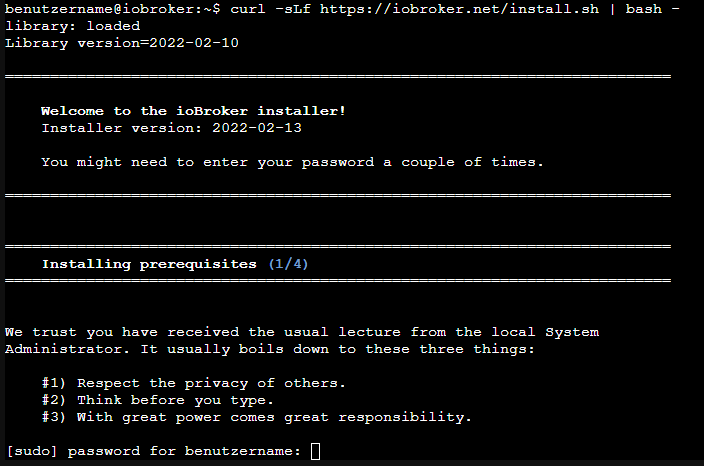

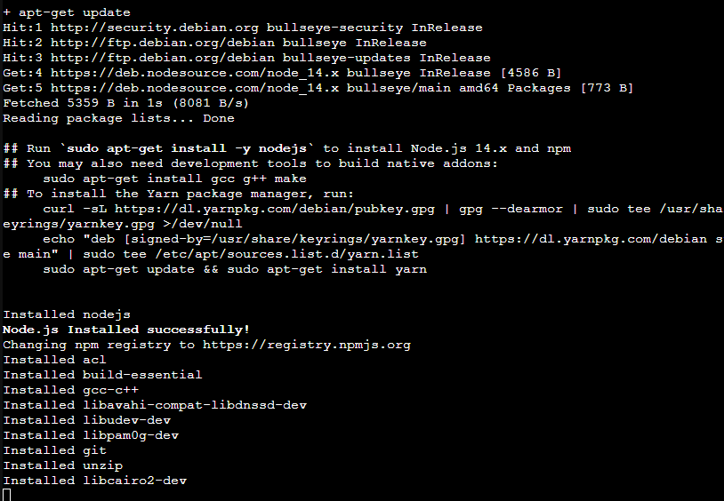

</详情>

最后出现如下提示，即表示安装成功。

~~~ ioBroker 安装成功在浏览器中打开http://10.1.1.222:8081 开始配置！ ~~~

同时，这也意味着现在可以通过地址在浏览器中调用 ioBroker。如果一切正常，您将看到 ioBroker 设置。现在只有几个步骤，您将在助手的指导下完成。

系列图像 ioBroker 助手

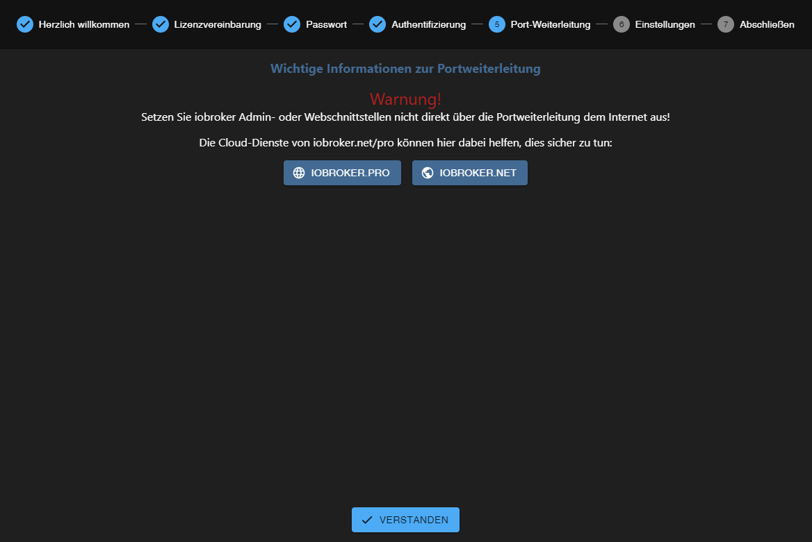

</详情>

然后，您可以搜索设备和服务。可以自动创建所需的适配器/实例。

图像系列设备/服务搜索

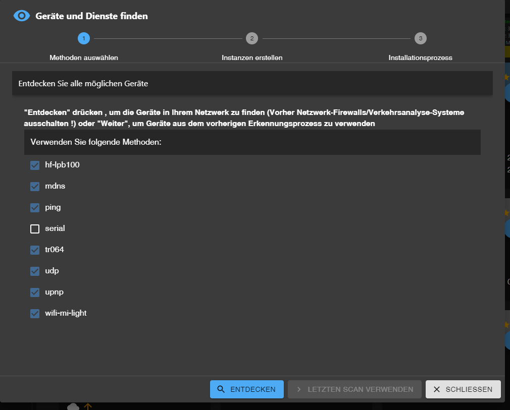

</详情>

这样就完成了 ioBroker 的安装。根据应用和需求，可以随时安装额外的适配器。

---

## Proxmox - LXC (Linux Containers) -> 通过 USB 设备
本指南的这一部分逐步解释了如何通过 Proxmox 中的 USB 设备（USB 直通）到 LXC（Linux 容器）。

使用虚拟机，可以直接通过 Proxmox Web 界面传递 USB 设备。使用 Linux 容器，目前需要手动编辑 lxc 的配置文件。

说明描述了如何集成 **Texas Instruments Inc. CC2531** Zigbee 棒，但相同的步骤可以类似地用于其他 Zigbee 棒（ConBee、CC2652P 等）或除 USB 网络设备外的其他 USB 设备（蓝牙/WLAN）可以使用。

* Proxmox 7.1 版用于这部分说明。

### 1.) 收集有关 USB 设备的信息

建立到 Proxmox 的 SSH 连接：

~~~ ssh root@ip地址~~~

**如果 USB 设备已经连接到 Proxmox 主机，请暂时拔下设备。**

以下命令列出 Proxmox 主机上所有当前连接的 USB 设备：

~~~ lsusb ~~~

现在将要集成的USB设备插入Proxmox主机，再次执行lsusb命令

在屏幕截图中，您可以看到 USB 总线编号：**001** 和设备编号：**003** 的新设备已列出。

使用以下命令需要此信息，例如从设备输出**主要设备号**：

~~~ ls -l /dev/bus/usb/001/003 ~~~

在命令中使用 USB 总线号和设备号的输出非常重要！

***ls -l /dev/bus/usb/usb-bus-number/device-number***

此示例中的 USB 设备的主要设备编号为 **189**，在文本文件中记下您的设备的值，并带有注释：#1

接下来我们输出USB设备的唯一ID，并在文本文件中用注释记下输出值：#2

~~~ ls /dev/serial/by-id/ ~~~

作为最后一步，输出 ttyACM 的主要设备号并用注释注明：#3：

~~~ ls -l /dev/ttyACM* ~~~

>*如果没有输出，用“ls -l /dev/serial/by-id/”检查USB设备是否被系统集成为ttyUSB，如果是则替换下面所有引用**ttyACM的命令。 ..* * 从 **ttyUSB...** 获取，如果没有输出，则它不是 USB CDC 类设备（串行通信），因此可以忽略从 ttyACM 包含的所有点。*

所以我们在lxc的配置文件中记下了集成所需的来自USB设备的**三个**值。

</详情>

### 2.) 编辑 LXC 配置文件

更改到 Proxmox 主机上的 LXC 配置目录：

~~~ cd /etc/pve/lxc ~~~

配置文件的 ID 号与创建 lxc 时分配的 ID 号相同！

在编辑配置文件之前，应制作备份副本：

~~~ cp 201.conf 201.conf.backup ~~~

现在使用 vi 或 nano 编辑配置文件：

~~~ 纳米 201.conf ~~~

将以下内容添加到配置文件的末尾：

~~~ lxc.cgroup2.devices.allow: c 189:* rwm lxc.mount.entry: usb-Texas_Instruments_TI_CC2531_USB_CDC___0X00124B0012023529-if00 dev/serial/by-id/usb-Texas_Instruments_TI_CC2531_USB_CDC___2B00124B0120=2

lxc.cgroup2.devices.allow: c 166:* rwm lxc.mount.entry: /dev/ttyACM0 dev/ttyACM0 none bind,optional,create=file ~~~

用您笔记中的注释条目替换标记的值！

* 第一行是主设备号 **189** 注意：#1
* 在第二行中，来自 Note:#2 的唯一 id (usb-Texas_Instruments_TI_CC2531_USB_CDC___0X00124B0012023529-if00) 是单独给出的，并带有绝对路径，请注意完整的文本写在一行中，没有换行符。
* 在第三行中，给出了来自注：#3 的 ttyACM 的主要设备号 **166**。

保存配置文件（在 nano 编辑器中使用组合键：CTRL + o & CTRL + x 退出编辑器）

 

**危险！ - 如果您的容器有活动快照：**

那么 lxc.cgroup 代码不属于配置文件的末尾，而是在快照的第一个条目之前。

</详情>

**危险！ - Proxmox 7.0 版之前的安装：**

将条目替换为

~~~ lxc.cgroup2 ~~~

通过

~~~ lxc.cgroup ~~~

</详情>

  最后，发出以下命令来设置 ttyACM0 所需的权限：

~~~ chmod o+rw /dev/ttyACM* ~~~

要将调整应用于 lxc，请使用 **pct stop id / pct start id** 从容器执行冷启动：

~~~ pct 停止 201 ~~~

~~~ pct 开始 201 ~~~

 

**提示最好在外部存储工作配置文件的副本，因为例如B. 集成的 Proxmox 备份服务不会备份您的配置内容！**

 

</详情>

### 3.) 检查 LXC USB 直通和 Zigbee 实例配置

建立与 LXC 的 SSH 连接：

~~~ ssh 用户@ip 地址~~~

使用命令：

~~~ lsusb ~~~

&

~~~ ls -l /dev ~~~

检查配置文件的调整是否成功。

* 如屏幕截图所示，容器现在可以访问 USB 设备。

* 重要的是 ttyACM0 在屏幕截图中具有相同的权限，即 **crw-rw-rw- 1 nobody nogroup**

>***如果不检查配置文件中的所有值是否都按照描述设置，权限还是不匹配则跳转到第5点***

* 截图还显示cc2531的设备号从3变成了4，这是因为在此期间棒子被拔了又插了。但是，由于在配置文件中指定了唯一 ID 而不是总线/设备编号，因此 USB 直通继续工作。

如果如上所述，将 Zigbee 棒传递到容器，则必须在 iobroker 中的 Zigbee 适配器设置中的 COM 端口名称下输入

~~~ /dev/ttyACM0 ~~~

指定以便适配器寻址正确的设备。

</详情>

### 4.) 永久权限的UDEV规则调整ttyACM0

在第 3 步结束时使用命令

~~~ chmod o+rw /dev/ttyACM* ~~~

为 ttyACM0 设置了相应的权限，但是这些权限更改会在 Proxmox 主机重新启动时重置。需要在 Proxmox 主机上设置 udev 规则才能永久调整。

使用 lsusb 我们再次列出当前连接的 USB 设备：

~~~ lsusb ~~~

这次我们记下ID后面的数值，所以本例中**0451:16a8**

* 第一个值：***0451*** 代表 **idVendor**，第二个值：***16a8*** 代表**idProduct**。

现在使用 vi 或 nano 在 /etc/udev/rules.d 下创建 udev 规则：

~~~ 纳米 /etc/udev/rules.d/50-myusb.rules ~~~

并添加了以下内容：

~~~ SUBSYSTEMS=="usb", ATTRS{idVendor}=="0451", ATTRS{idProduct}=="16a8", GROUP="users", MODE="0666" ~~~

最后，运行以下命令激活 udev 规则：

~~~ udevadm control –reload ~~~

</详情>

### 5.) 故障排除

**错误：** lxc 中的 ttyACM0 权限不匹配或在短时间内丢失 (ConBee II)。

~~~ ls -l /dev/ttyACM0 c--------- 0 没有人 nogroup 166, 0 Feb 7 14:29 ttyACM0 ~~~

 

**解决方案：** 使用 mknod 为容器创建持久绑定。

为此，在路径 **"/var/lib/lxc/CONTAINERID"** 中创建 **devices** 文件夹，并使用 mknod 在此文件夹中创建绑定：

~~~ mkdir /var/lib/lxc/201/devices ~~~

~~~ cd /var/lib/lxc/201/devices ~~~

~~~ mknod -m 666 ttyACM0 c 166 0 ~~~

+ *mknod 在路径中创建一个名为 ttyACM0 的文件（只要文件存在，设备就绑定到 lxc）*

***主要设备号和ttyACM..根据需要调整***

那么lxc配置文件中的条目必须调整：

~~~ lxc.mount.entry: /dev/ttyACM0 dev/ttyACM0 none bind,optional,create=file ~~~

替换为：

~~~ lxc.mount.entry: /var/lib/lxc/CONTAINERID/devices/ttyACM0 dev/ttyACM0 none bind,optional,create=file ~~~

</详情>