# Proxmox


## Proxmox 安装
Proxmox虚拟环境（简称Proxmox VE）是一个基于Debian的虚拟化平台。该虚拟化平台基于QEMU/KVM。

Proxmox 将 QEMU/KVM“打包”到其自身的 Web 界面中，简化了管理，并且还支持 Linux 容器 (LXC)。这使得 Proxmox 对初学者友好，同时又足够强大，能够满足专业用途。

本节将通过示例演示如何在免费（非订阅）版本中安装和基本配置 Proxmox。

为了更清晰地说明，可以扩展图像描述和附加信息。

_注：_本指南中的一些图片来自旧版本的Proxmox或Debian。但是，操作步骤和点击路径是一致的，可以直接应用于当前版本（例如Proxmox VE 9和Debian 13）。

＃＃＃ 要求
<details><summary>要求</summary>

- 64 位 CPU
- CPU 和主板支持 Intel VT/AMD-V 虚拟化技术（在

（启用 BIOS）。

- 1 GB 内存（仅限 Proxmox）——根据要运行的虚拟机数量，自然需要更多内存。因此，建议至少 8 GB 内存，最好是 16 GB 内存。

</details>

### 创建 ISO 镜像/可启动 U 盘
首先，你需要一个 ISO 镜像，可以从 [Proxmox 下载页面](https://www.proxmox.com/de/downloads/category/iso-images-pve) 下载。

<details><summary>Proxmox Iso</summary>

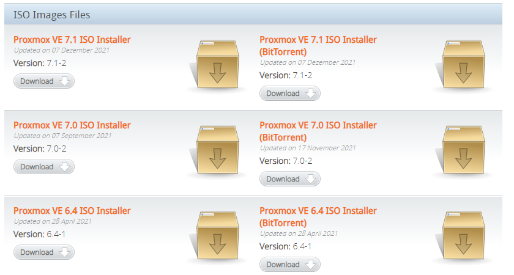

</details>

要进行安装，请使用此 ISO 镜像创建启动 U 盘。

此 U 盘至少需要 2 GB 的存储空间。创建启动 U 盘的方法有多种；请参阅[准备安装介质][]。

＃＃＃ 安装
系统已在 UEFI/BIOS 中配置为从 USB 设备启动。插入 U 盘后，Proxmox 安装菜单会在短时间内出现。或者，也可以手动将 U 盘指定为启动设备（在大多数主板上，可通过 F8 或 F11 键实现）。

在安装菜单中，只需选择**安装 Proxmox VE**。

<details><summary>安装菜单</summary>

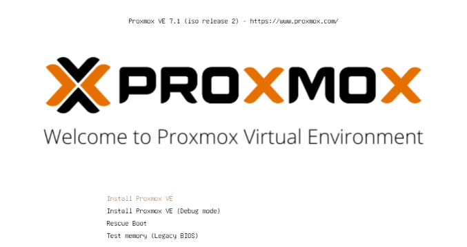

</details>

下一步是同意使用条款（最终用户许可协议）。

<details><summary>最终用户许可协议</summary>


</details>

接下来，您需要选择要安装 Proxmox 的硬盘驱动器。如果服务器上安装了多个硬盘驱动器，请务必选择正确的驱动器！

<details><summary>硬盘选择</summary>

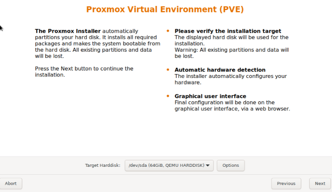

</details>

“选项”按钮允许您指定安装硬盘的更多参数：

<details><summary>高级选项 硬盘</summary>

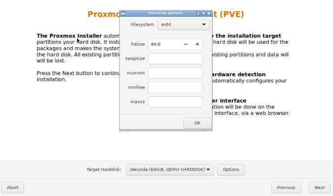

</details>

Proxmox 使用 LVM（逻辑卷管理）接口。此处提供的高级选项允许对 LVM 进行详细配置。

安装程序会创建一个名为 pve 的卷组 (VG) 和多个逻辑卷 (LV)，分别命名为 root（Proxmox 本身的安装位置）、data（虚拟机虚拟磁盘的存储位置）和 swap（交换文件的存储位置）。

<details><summary>高级设置允许您在此处指定某些参数：</summary>

- 文件系统：您可以在此处选择文件系统。默认设置为 ext4，在大多数情况下都是不错的选择。如果主机系统上有多个硬盘（并且内存充足），则可以使用 ZFS 并配置合适的 RAID 级别。不过，在这种情况下，您应该对 ZFS 有一定的了解。
- hdsize：指定 Proxmox 要使用的硬盘总大小。通常情况下，您应该在此处选择整个硬盘的大小，除非您计划以后添加更多分区。
- swapsize：确定交换卷的大小。默认值与已安装内存的大小相同，但最小值为 4 GB，最大值为 8 GB。
- maxroot：指定根卷（Proxmox 本身）的最大大小。**需要注意的是，在基本安装中，后续所需的模板和 ISO 镜像也会存储在此处。**
- minfree：LVM 卷组 pve 上剩余的可用存储空间。如果硬盘大于 128 GB，则默认保留 16 GB 的可用空间（LVM 始终需要一些可用空间来创建快照）。
- maxvz：设置数据卷的最大大小。

</details>

通常情况下，您可以将所有选项保留为默认设置（即，此处不做任何指定）。这些设置已针对大多数安装环境进行了优化配置。

选择 Proxmox 的硬盘驱动器后，系统会要求输入本地化选项（国家/地区、时间和相应的键盘布局）：

<details><summary>本土化</summary>

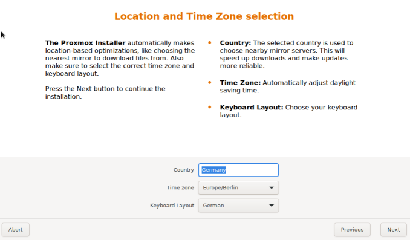

</details>

接下来，系统会要求您输入root用户的密码。您还需要提供一个电子邮件地址，用于接收重要的系统消息。有效的电子邮件地址并非必需（但如果您不提供，您将无法收到系统事件的电子邮件通知）。

<details><summary>密码和电子邮件</summary>

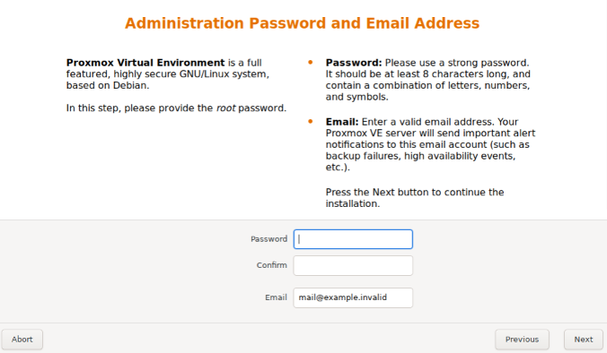

</details>

安装程序的下一步是设置网络。您可以选择合适的接口。主机名可以自由选择，但必须指定 DNS 域名。

例如，对于 Fritz!Box 用户，主机名应为 `hostname.fritz.box`。

对于 IP 地址，最好指定静态 IP 地址（而非 DHCP）。这包括 IP 地址本身（采用 CIDR 表示法）、网关 IP 地址（通常是路由器的 IP 地址）以及要使用的 DNS 服务器（在家庭环境中，通常也是路由器的 IP 地址）。Proxmox 通常会自动检测网络。

<details><summary>网络</summary>

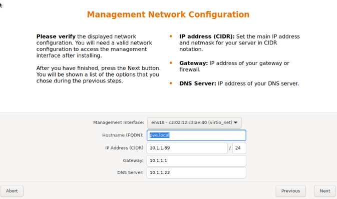

</details>

最后，显示安装摘要：

<details><summary>概括</summary>

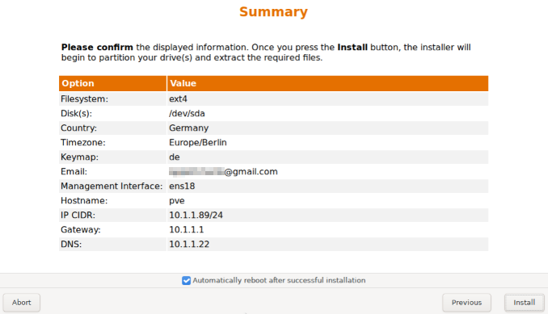

</details>

检查设置并点击“安装”即可安装系统。

<details><summary>安装</summary>

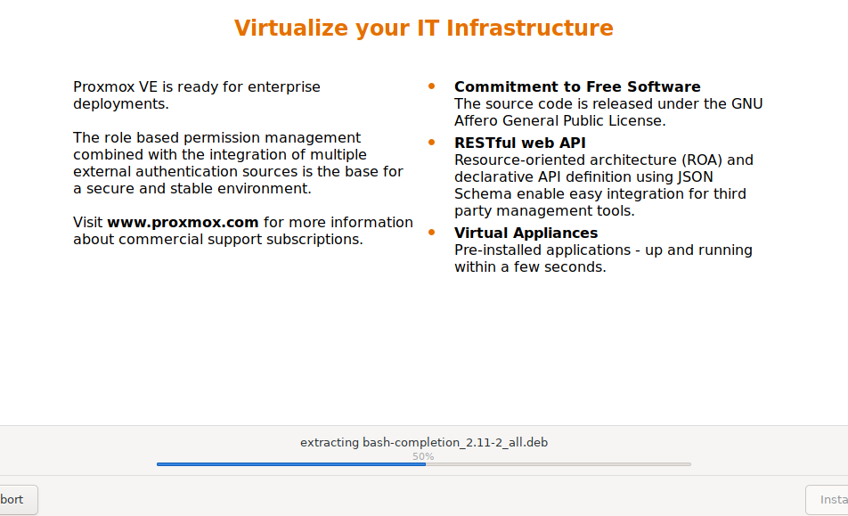

</details>

稍等片刻，安装完成，系统重新启动（请事先移除包含 ISO 镜像的 U 盘）。

接下来，您将看到终端。这里显示了如何访问系统的说明：

<details><summary>安慰</summary>

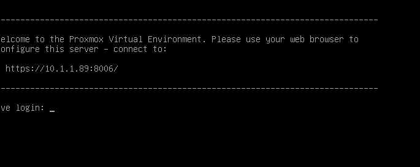

</details>

现在，请在浏览器中继续访问（例如，https://10.1.1.89:8006）。首先，会显示一条警告信息。这是因为安装过程中生成了一个自签名证书，浏览器无法识别。此时您可以忽略此信息——连接已通过 HTTPS 加密。警告信息的具体内容会因浏览器而异。在本例中，请点击“高级”，然后点击“继续访问 10.1.1.89（不安全）”。

<details><summary>数据保护错误</summary>

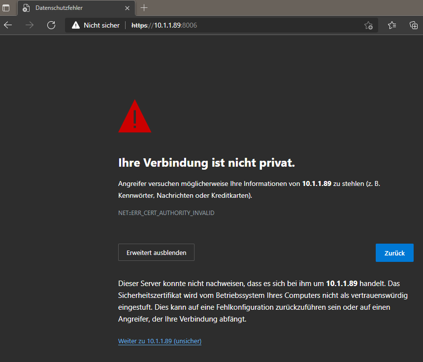

</details>

登录时使用用户名 root 和安装过程中设置的密码。语言可以**先**更改为德语，这样就无需重新输入用户名和密码。

<details><summary>登记</summary>

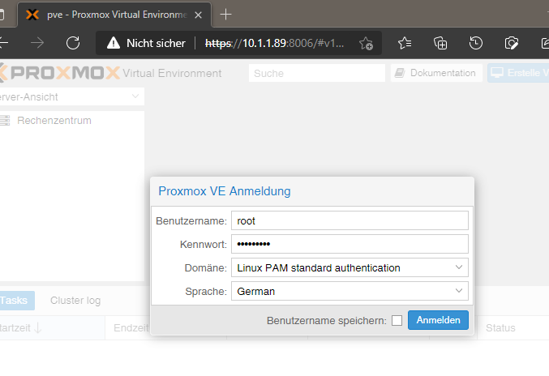

</details>

登录后，您会立即看到一条消息，提示您没有此服务器的有效订阅。请点击“确定”按钮确认此消息。

<details><summary>订阅</summary>

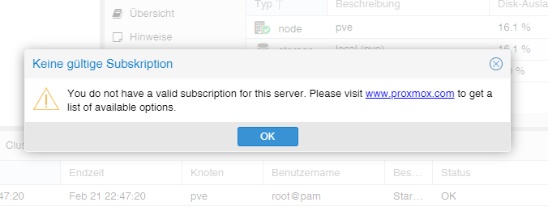

</details>

Proxmox软件包源正在调整以接收更新。

<details><summary>软件包源</summary>

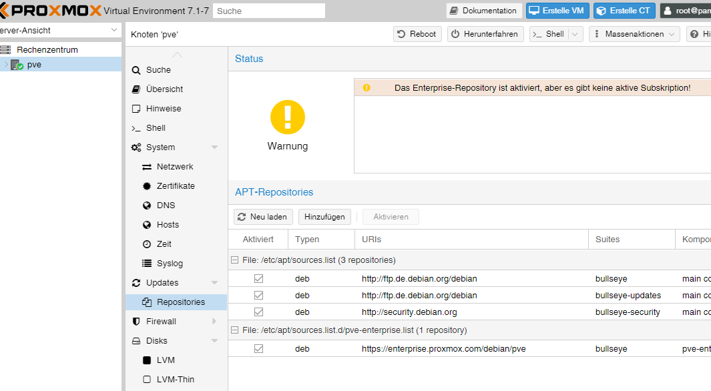

</details>

为此，需要将**非订阅存储库**添加到软件包源中。此操作可在 Proxmox 实例菜单的 `Updates > Repositories` 下完成。可以使用“添加”按钮添加非订阅存储库。

<details><summary>非订阅用户</summary>

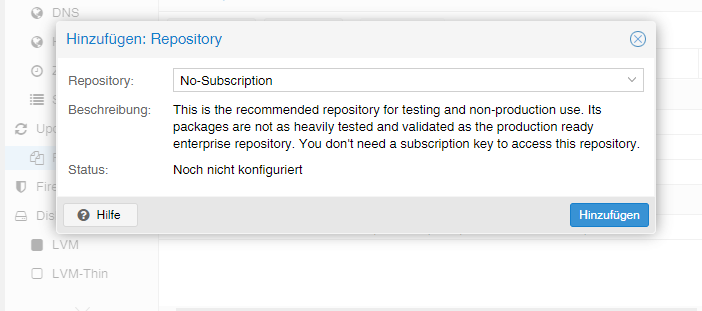

</details>

现在应该停用**企业存储库**。为此，只需在存储库视图中选择 pve-enterprise 存储库，然后单击**停用**按钮即可。

那么，存储库配置如下所示：

<details><summary>企业存储库</summary>

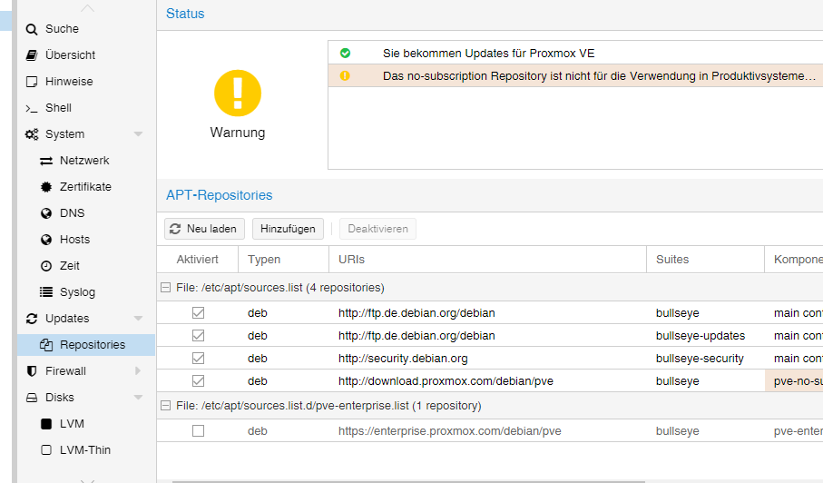

</details>

### 更新
软件包源更改后，应执行初始系统更新。最佳方法是通过 Web 界面执行此操作：

<details><summary>更新</summary>

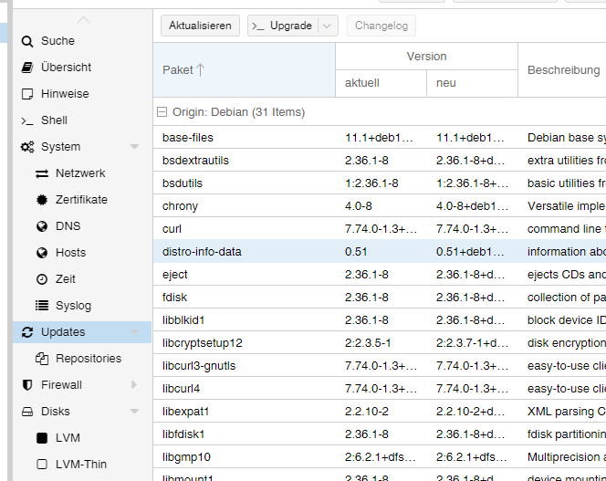

</details>

只需选择所需的 Proxmox 节点（例如，“pve”），然后在“更新”下方点击“更新”。这将打开任务查看器，当检测到系统活动时，任务查看器会显示。您可以立即关闭此对话框，因为任务会在后台继续运行。无需等待任务完成（“任务完成”）。

如果有可用更新，您可以点击“升级”进行安装。

然后会打开网页控制台，方便您监控进度。

<details><summary>Web控制台</summary>

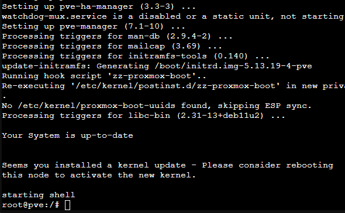

</details>

当然也可以通过命令行（例如通过 SSH）更新 Proxmox 服务器：

```bash
apt-get update && apt-get dist-upgrade
```

或者，更近期的例子：

```bash
apt update && apt full-upgrade
```

这里唯一重要的是使用 **apt-get dist-upgrade** 或 **apt full-upgrade**（在“普通”的 Debian/Ubuntu 系统上，通常使用 apt upgrade）。但是，对于 Proxmox 来说，“dist-upgrade”或“full-upgrade”尤为重要，因为它能更好地解决 Proxmox 运行所需的依赖项。

因此，Proxmox 的基本配置现已完成。如果您想深入了解 Proxmox，建议参阅 [Proxmox Wiki](https://pve.proxmox.com/wiki/Main_Page) 或 [官方论坛]](https://forum.proxmox.com/)。

---

## Proxmox - 创建虚拟 Qemu/KVM 机器 (VM) + 后续 ioBroker 安装
本指南展示了如何创建 [VM][]（截至 2026 年的 Debian 稳定版 = Debian 13 'Trixie'），然后在其中安装 ioBroker。

除了 Debian 之外，还可以使用 Ubuntu，但请确保使用 **LTS 版本**。

为了更清晰地展示图片说明和附加信息，我们提供了可展开的章节。

### 1 - 下载 ISO 镜像
首先需要一个 ISO 镜像（[64-Bit-PC Netinst-ISO][ISO-Image]），该镜像在基本安装过程中加载到根目录（本地）。

为此，请转到“本地 > ISO 镜像”部分。那里有两个选项：

- **上传**按钮允许您将先前存储在计算机上的 ISO 文件上传到 Proxmox 主机。
使用“从 URL 下载”功能，可以直接通过 URL 将 ISO 文件下载到主机。具体操作方法是：复制 64 位 PC Netinst ISO 文件的链接地址（右键单击），粘贴 URL，然后单击“获取 URL”。最后单击“下载”按钮即可开始从主机下载文件。

<details><summary>下载 ISO</summary>

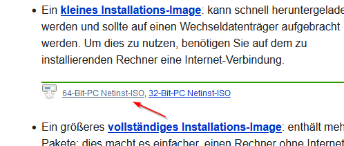

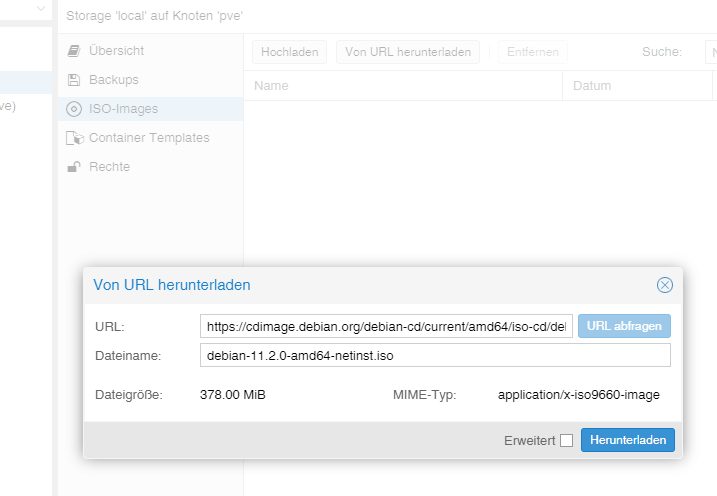

</details>

### 2 - 创建虚拟机
点击蓝色“创建虚拟机”按钮将打开一个窗口，用于进行以下设置：

- 常规：主机名和密码已分配，ID 已预定义（从 100 开始），可以更改，但之后不能更改。
- 操作系统：存储选择（本地）和 ISO 镜像（debian-13-netinst.iso）
- 系统：所有设置保持默认，**勾选 Qemu Agent 复选框**
- 磁盘：存储本地-lvm，磁盘大小 10GB（10-20GB 应该足够了，后续可能会有所更改，但此处不再赘述）。
- CPU：取决于计算机性能（也可随时调整，但需要重启虚拟机）
- 内存：RAM 大小，单位为 MiB（可随时调整，但需重启虚拟机）
网络：vmbr0，其他一切保持不变
- 确认：您将再次看到摘要（选中**创建后开始**），然后单击**完成**创建虚拟机。

<details><summary>镜像系列 创建虚拟机</summary>

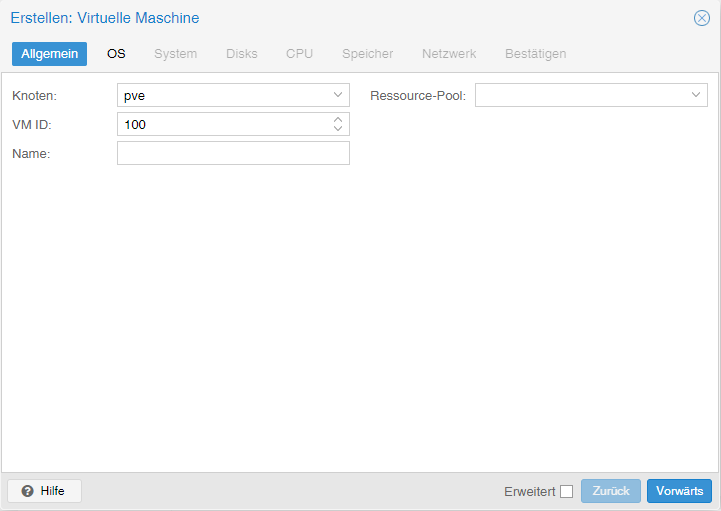

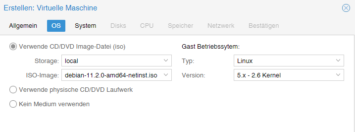

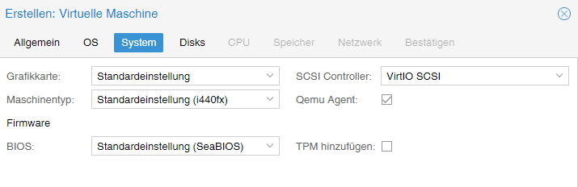

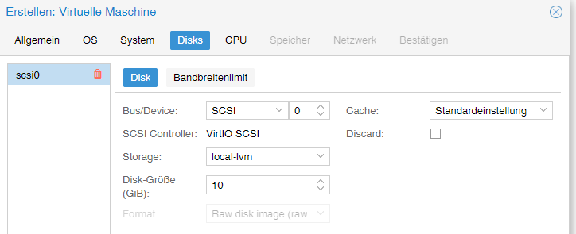

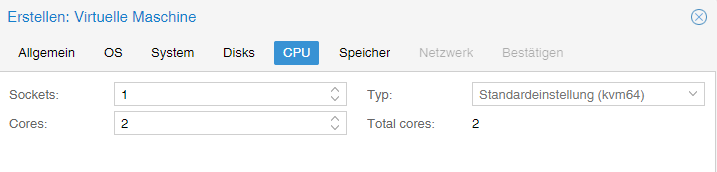

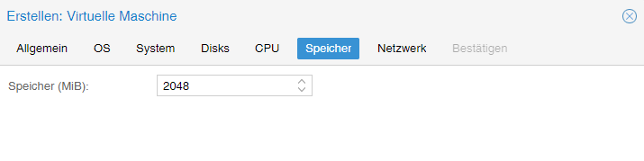

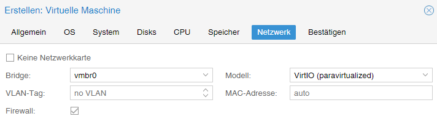

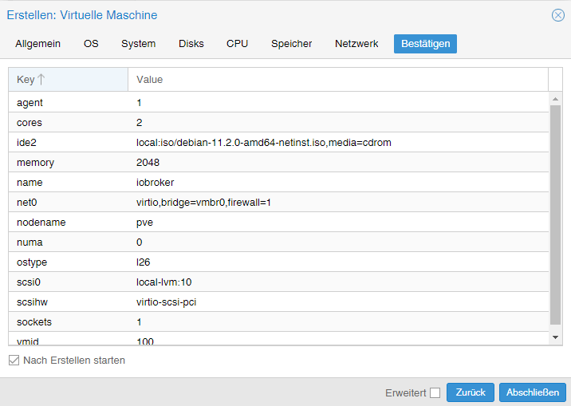

</details>

### 3 - Debian 安装
虚拟机启动后，进入虚拟机控制台并开始**安装**。

<details><summary>安慰</summary>

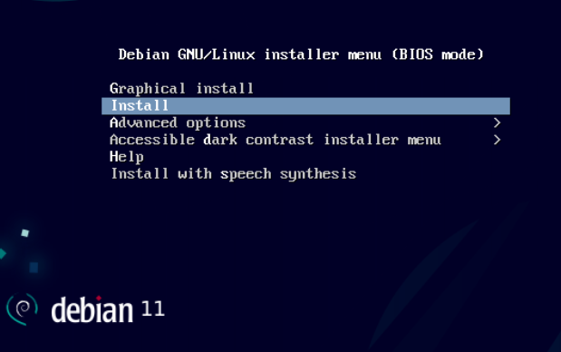

</details>

安装过程将引导您完成整个流程，需要您配置一些设置。您需要使用 Tab 键、空格键和方向键进行导航。由于程序较为复杂，各种设置均在随附的图片系列中进行说明。

<span style="color:red">警告！请勿设置root密码。</span>

<span style="color:red">**注意！- 请勿选择 ioBroker 作为用户名，因为该用户名已被系统内部使用。**</span>

用户名只能由小写字母和数字 0-9 组成，且必须以字母开头。允许使用连字符，但不能作为第一个字符。

<details><summary>Debian 安装镜像系列</summary>

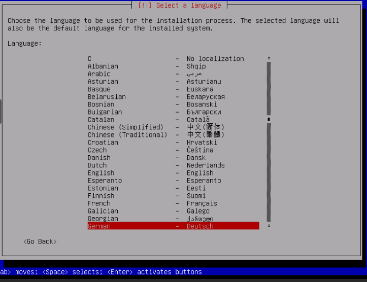

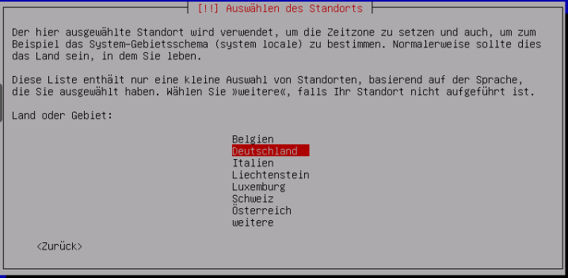

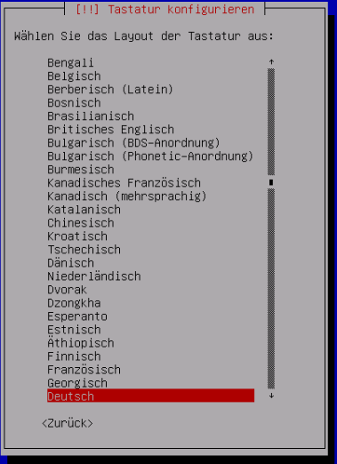

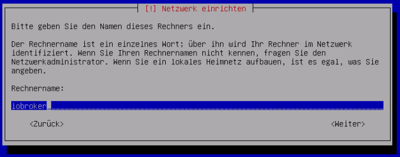

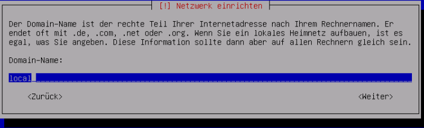

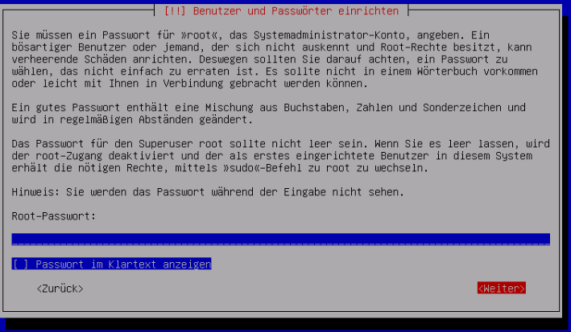

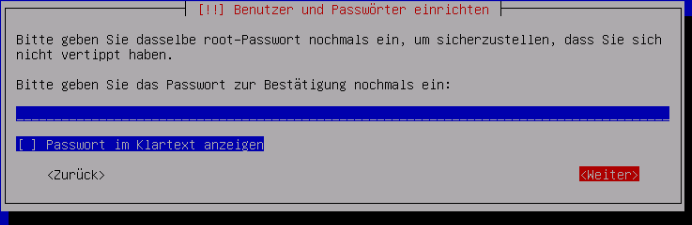

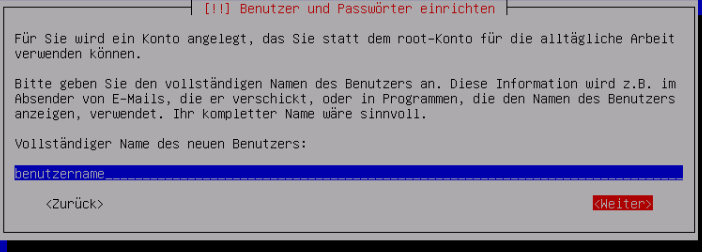

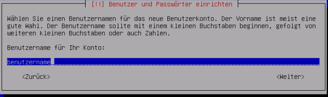

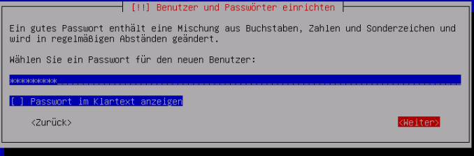

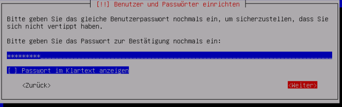

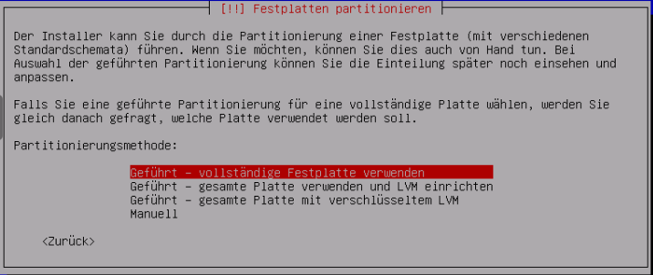

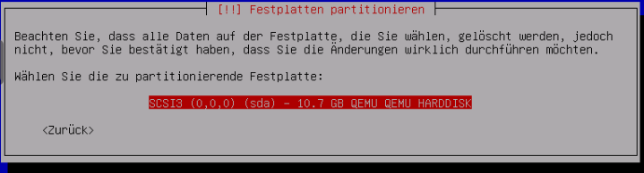

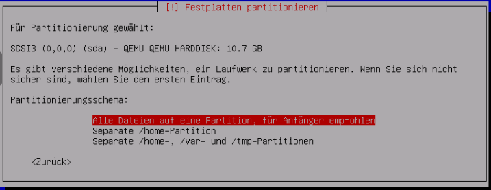

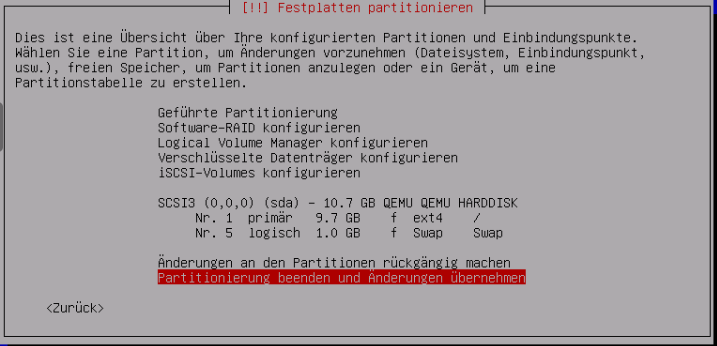

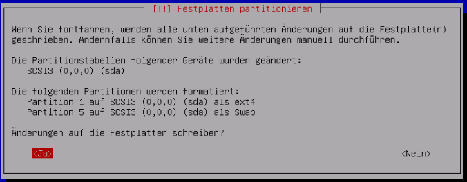

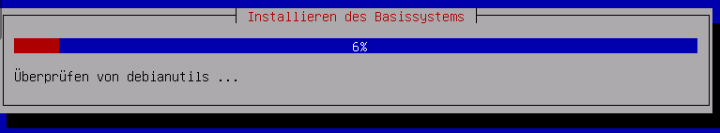

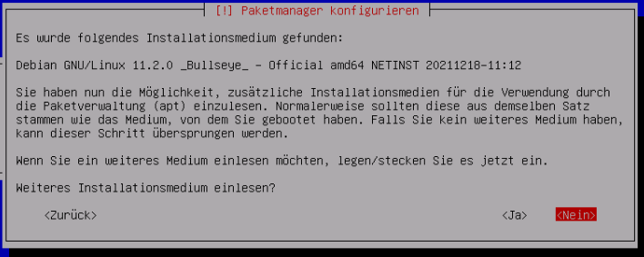

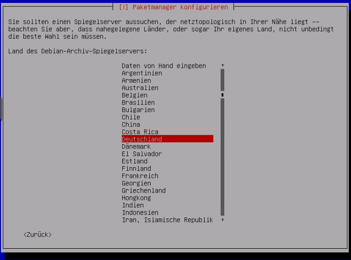

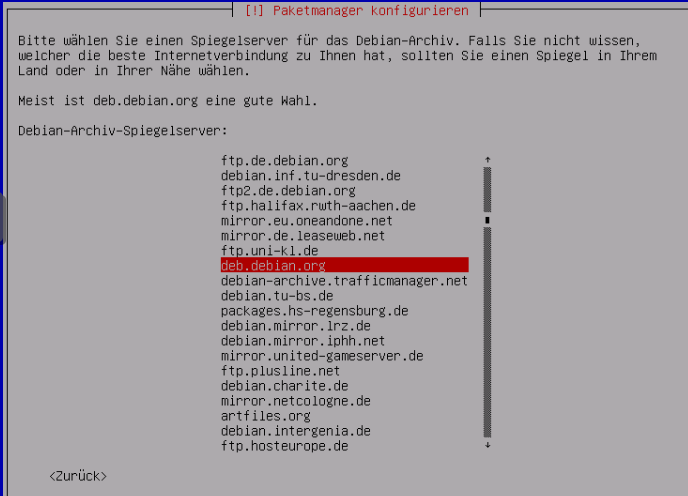

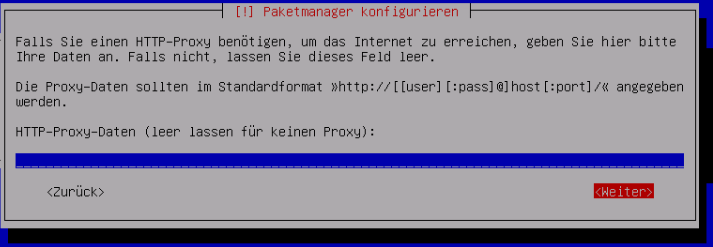

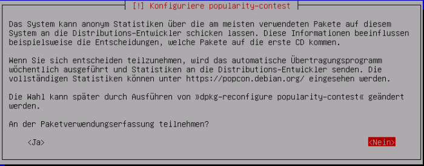

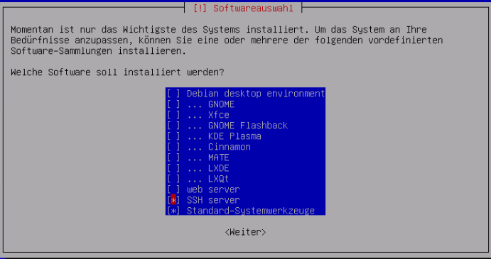

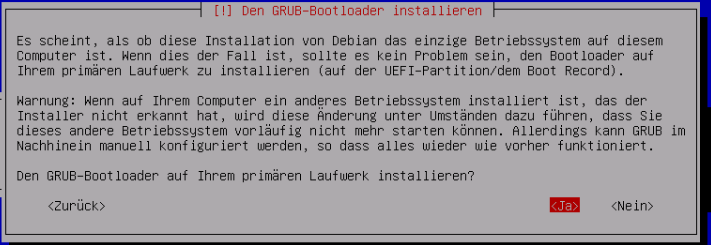

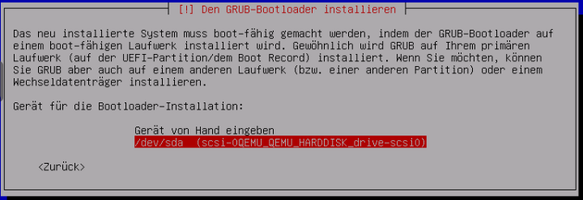

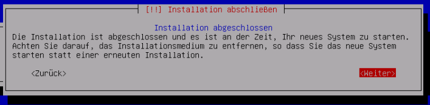

</details>

### 4 - 设置虚拟机
重启虚拟机，然后使用安装过程中分配的用户名和密码登录。然后，使用以下命令……

```bash
ip addr
```

已找到 IP 地址。下一步需要使用此地址通过 SSH 远程连接到虚拟机。

<details><summary>IP地址</summary>

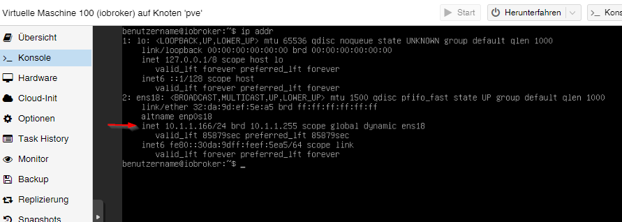

</details>

现在您可以通过 SSH（例如 PuTTY）访问虚拟机。使用您的用户名和密码再次登录。

然后您可以将网络地址从 **DHCP** 更改为 **静态**（建议服务器运行使用静态地址）。

```bash
sudo nano /etc/network/interfaces
```

<details><summary>网络/接口</summary>

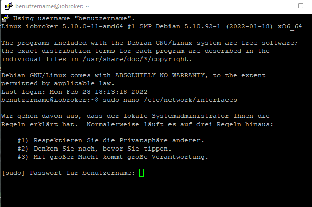

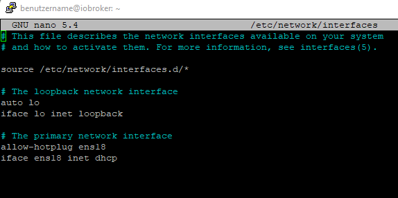

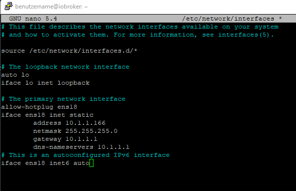

</details>

使用组合键 CTRL + o，然后按 ENTER 键保存编辑器中的更改；使用组合键 CTRL + x 退出编辑器。

IP 地址的更改只有在虚拟机重启后才会生效。但在此之前，系统会检查 Qemu 客户机代理是否处于活动状态，方法是……

```bash
sudo systemctl status qemu-guest-agent
```

<details><summary>宾客代理</summary>

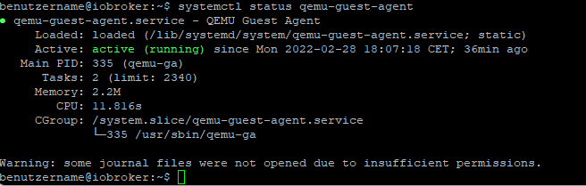

</details>

<span style="color:orange">**注意！ - 在 Ubuntu 系统上，必须安装并启动 Qemu Guest Agent。**</span>

执行此操作的命令：

```bash
sudo apt-get install qemu-guest-agent
sudo systemctl start qemu-guest-agent
```

此外，安装 ioBroker 时必须单独安装 **curl** 工具。

```bash
sudo apt install curl
```

<details><summary>安装 curl 之后</summary>

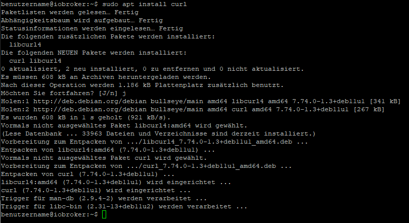

</details>

要在虚拟机中直通 USB 设备，请选择虚拟机 > 硬件 > 添加 > USB 设备 > 制造商/设备 ID。所有已连接的设备都将在此处列出。

<details><summary>USB设备</summary>

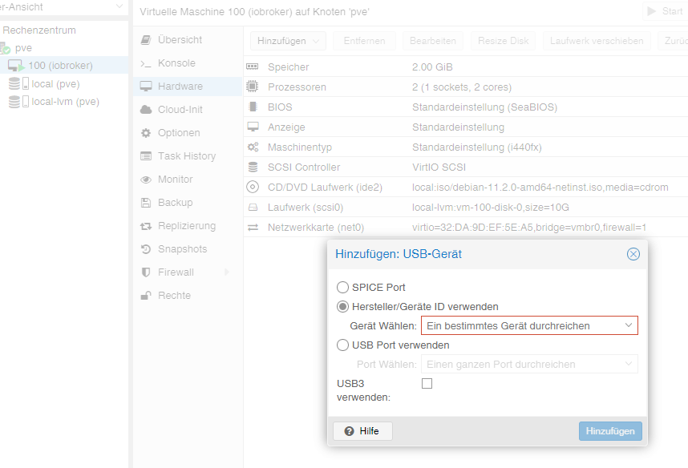

</details>

为确保虚拟机在 Proxmox 主机重启后自动启动，此功能在虚拟机的选项中启用。

<details><summary>启动选项</summary>

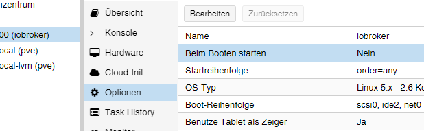

</details>

虚拟机的安装和设置现已完成。现在可以重启虚拟机，之后再安装ioBroker。

---

## Proxmox - 创建 Linux 容器 (LXC) + 后续 ioBroker 安装
本示例指南展示了如何创建 [LXC 容器][] (Debian 13)，然后在其中安装 ioBroker。

为了更清晰地说明，可以展开图像描述和补充信息。

### 替代方案：通过辅助脚本自动安装
Proxmox 平台有一些常用的辅助脚本。这些脚本最初由 tteck 创建，在他去世后，由 [helper-scripts.com][] 社区积极维护。它们允许你通过一条命令全自动地设置 ioBroker 容器。

【警告】**重要安全提示：**直接在 Proxmox 控制台中盲目复制并执行来自互联网的脚本（例如，通过 `curl | bash`）会带来严重的安全风险！执行脚本前，务必仔细阅读并理解其源代码，以了解脚本将对系统执行的操作。任何不了解语法或不信任该项目的用户都应避免使用此方法，而应选择手动安装，以避免损害 Proxmox 服务器的完整性和安全性。

了解风险并已检查过脚本的人可以直接在 [helper-scripts.com][] 上找到命令和文档。

### 1 - 下载容器模板
首先需要一个模板，该模板会在基本安装中加载到根目录（本地）（前提是尚未创建其他驱动器）。

为此，请转到“本地”>“容器模板”。单击“**模板**”将打开一个选择列表。选择 `debian-13-standard` (Trixie) 并单击“下载”。

<details><summary>下载模板</summary>

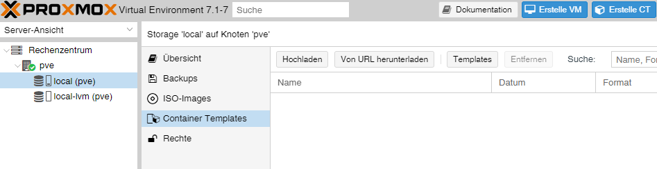

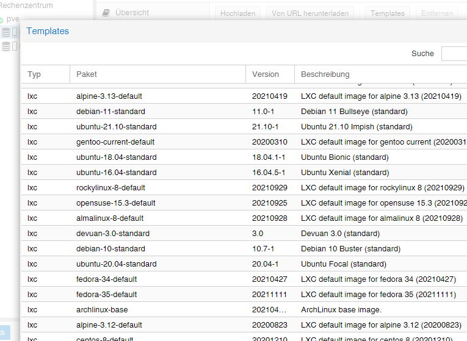

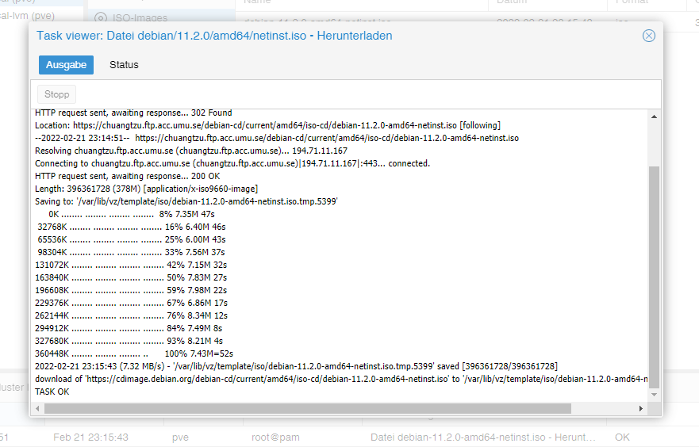

</details>

### 2 - 创建 LXC
点击蓝色“创建 CT”按钮将打开一个窗口，用于进行以下设置：

- 常规：主机名和密码已分配；ID 是预定义的（从 100 开始），但可以更改。
- 模板：存储选择（本地）和模板（Debian 13 标准）
- 磁盘：分配磁盘大小（不要分配得太大，以后可以随时增加）
- CPU：取决于计算机性能（也可随时调整）
- 内存：RAM/交换空间分配（可随时调整，即使在运行过程中也可以调整）
- 网络：静态 IP/CIDR 分配、网关；如果没有配置 IPv6，则此设置将设为 SLAAC。
- DNS：通常不会做任何更改（使用主机提供的值）
- 确认：摘要（选中**创建后开始**），然后单击**完成**即可创建容器。

<details><summary>图像系列创建CT</summary>

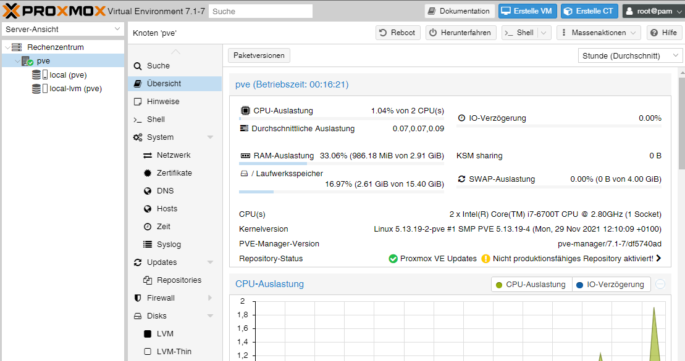

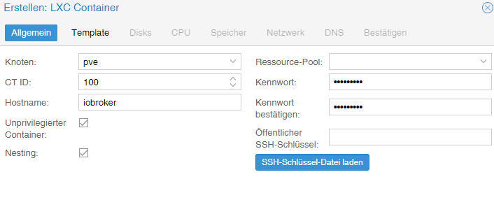

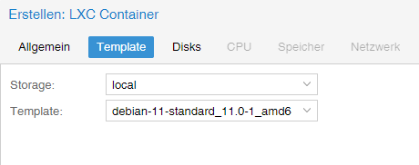

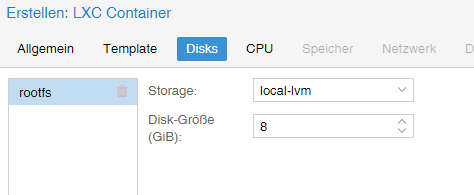

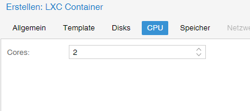

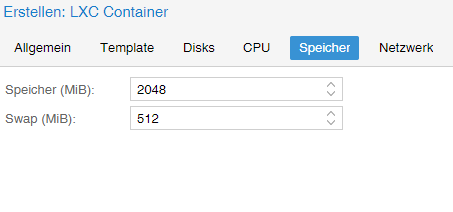

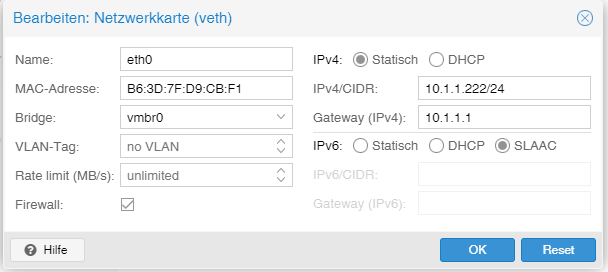

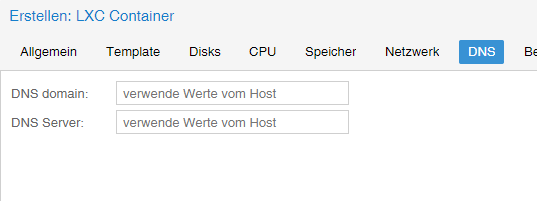

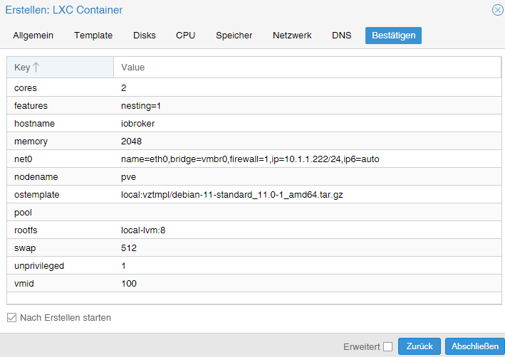

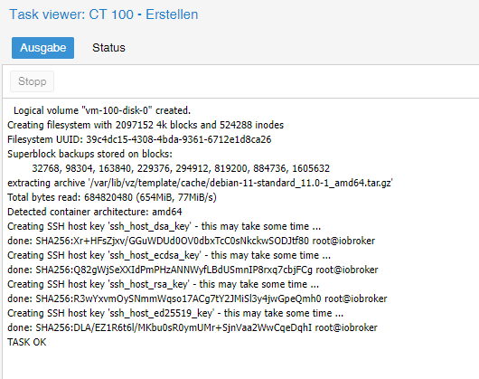

</details>

### 3 - 设置 LXC
容器启动后，请转到 LXC 控制台。

<details><summary>安慰</summary>

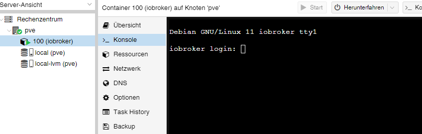

</details>

首先，使用之前分配的密码（在创建 LXC 文件时给出的密码）以 root 用户身份登录，并将其更新。

```bash
apt update && apt upgrade
```

<details><summary>升级</summary>

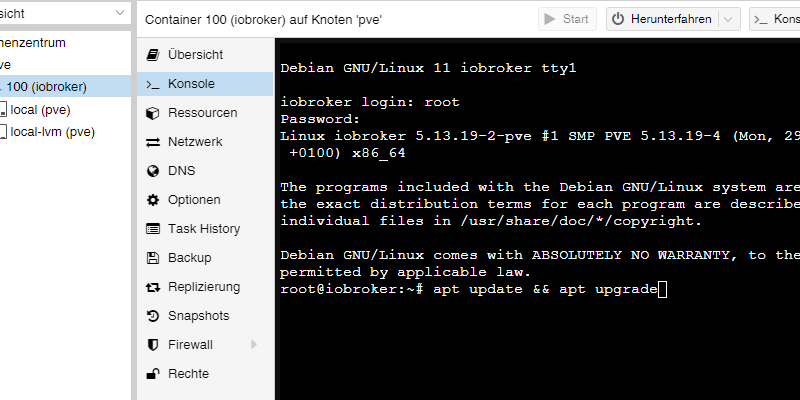

</details>

然后，文本直接提示用户设置时区。

```bash
dpkg-reconfigure tzdata
```

<details><summary>时区</summary>

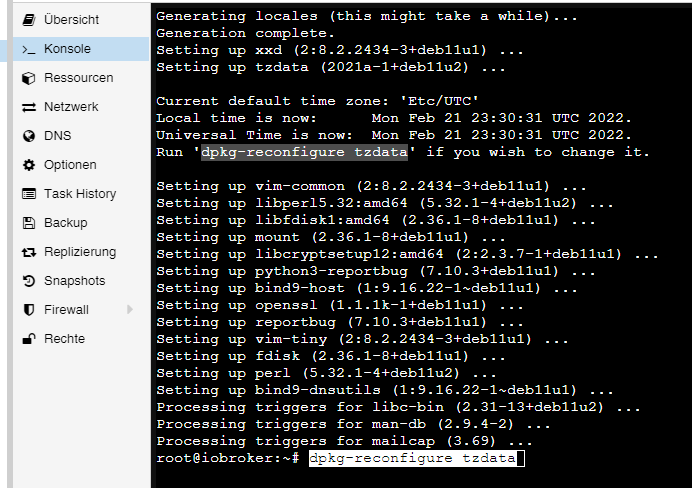

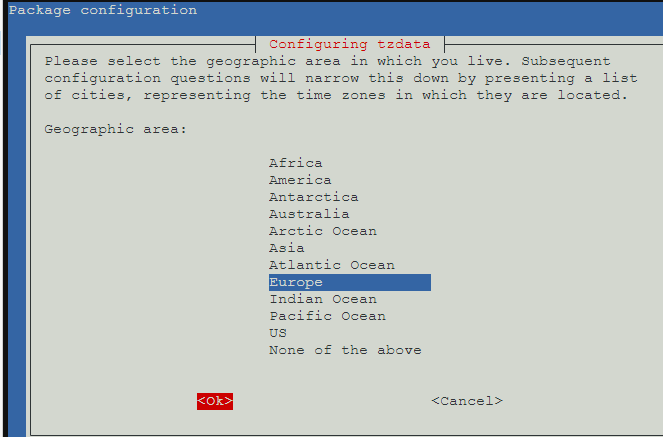

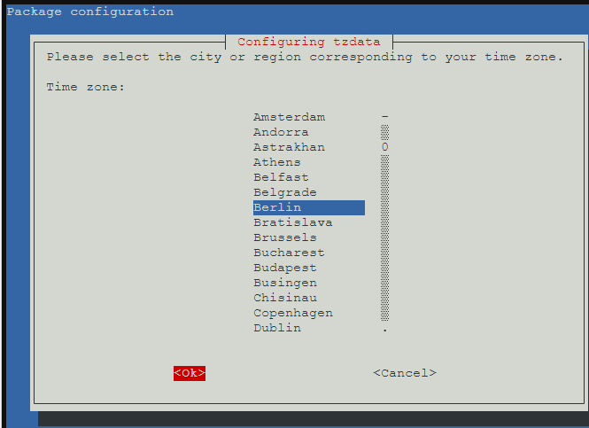

</details>

现在，我们将安装 **sudo** 和 **curl**。如下一步所述，需要使用 sudo 正确创建用户，该用户将用于后续的控制台操作。最后一步需要使用 curl 运行 ioBroker 安装脚本。

```bash
apt install sudo curl
```

<details><summary>重新安装</summary>

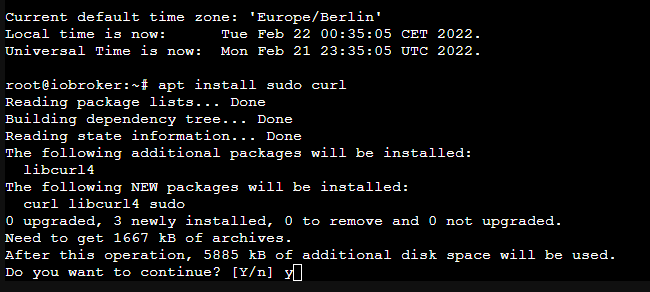

</details>

现在创建新用户。请将此处的“username”替换为“username”。为该用户设置密码。其余操作可通过按回车键确认。

通知：

请勿选择 **iobroker** 作为用户名，因为该用户名已被系统内部使用。

```bash
adduser benutzername
```

然后将该用户分配到 sudo 组。

```bash
usermod -aG sudo benutzername
```

如果后续创建了用户，则通过以下方式将其分配到相关组：

```bash
usermod -aG adm,dialout,sudo,audio,video,plugdev,users,iobroker benutzername
```

<details><summary>创建用户</summary>

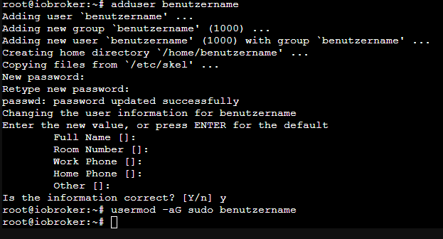

</details>

在安装 ioBroker 之前，最后一步是注销一次。

```bash
exit
```

然后使用新用户登录。之后，即可安装ioBroker。

<details><summary>注销并使用用户名登录</summary>

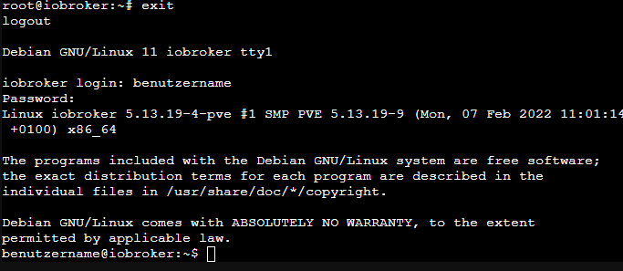

</details>

为确保 LXC 在 Proxmox 主机重启后自动启动，此功能在容器的选项中启用。

<details><summary>启动选项</summary>

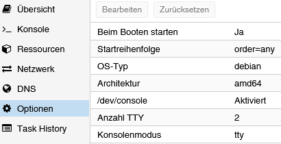

</details>

### 可选：修复有关未启动服务的警告/错误消息
运行 `iob diag` 命令时，您可能会在输出中看到类似以下的错误信息。

其中一些错误仅在非特权容器中出现，而另一些错误在特权容器中也会出现。

```
....
*** FAILED SERVICES ***

  UNIT                                 LOAD   ACTIVE SUB    DESCRIPTION
* run-rpc_pipefs.mount                 loaded failed failed RPC Pipe File System
* sys-kernel-config.mount              loaded failed failed Kernel Configuration File System
* systemd-networkd-wait-online.service loaded failed failed Wait for Network to be Configured
...
```

如果要在安装 iobroker 之前清理容器，可以按如下方式获取“失败的服务”：

```bash
systemctl list-units --failed
```

以下是一些故障排除步骤：

#### 服务 run-rpc_pipefs.mount 失败
```bash
sudo systemctl mask run-rpc_pipefs.mount
sudo systemctl mask var-lib-nfs-rpc_pipefs.mount
```

#### 服务 sys-kernel-config.mount 失败
将以下行添加到目录 `/etc/pve/lxc` 中的容器配置文件中：

```
lxc.cap.drop: "sys_rawio audit_read"
```

#### 服务 systemd-networkd-wait-online.service 失败
将 `ifupdown` 服务替换为 `ifupdown2`：

```bash
sudo systemctl disable --now systemd-networkd-wait-online.service
sudo systemctl disable --now systemd-networkd.service
sudo systemctl disable --now ifupdown-wait-online
sudo apt-get update
sudo apt-get upgrade
sudo apt-get install ifupdown2
```

---

## 安装 ioBroker
安装ioBroker只需要一条命令。

```bash
curl -sLf https://iobroker.net/install.sh | bash -
```

安装过程分为 4 个步骤，全部自动化。

- 安装先决条件 (1/4)
- 创建 ioBroker 用户和目录 (2/4)
- 安装 ioBroker (3/4)
- 安装完成 (4/4)

<details><summary>安装程序</summary>

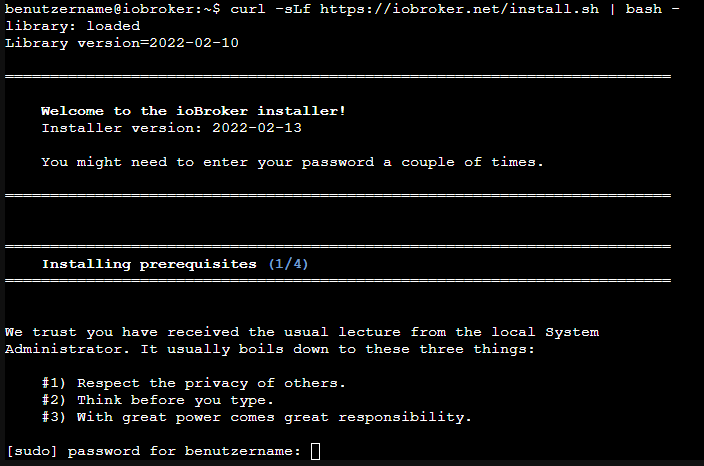

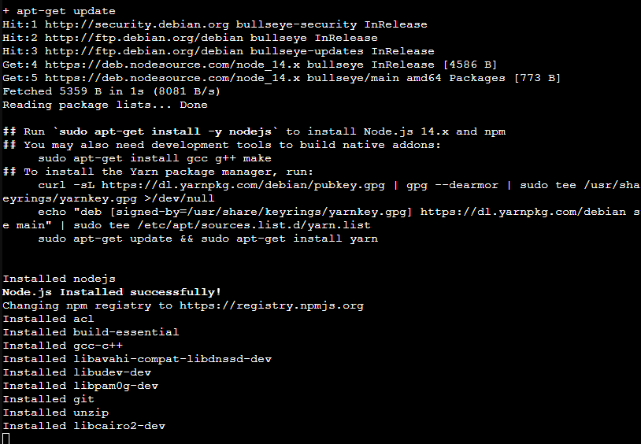

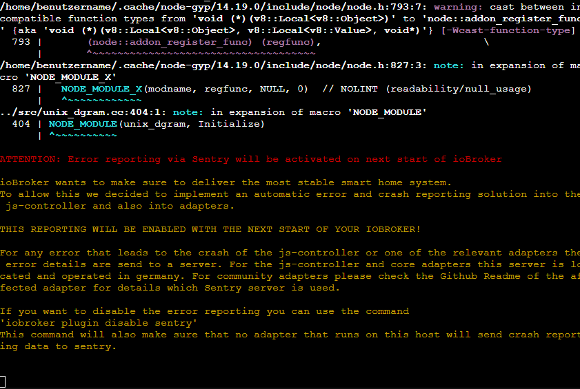

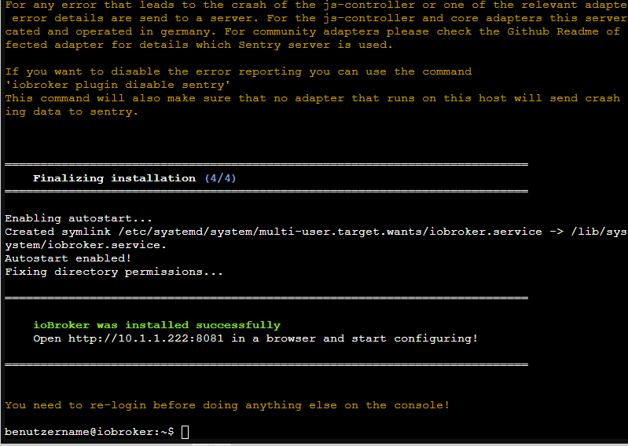

</details>

安装成功完成后，最后会出现以下内容。

```
ioBroker was installed successfully
Open http://10.1.1.222:8081 in a browser and start configuring!
```

这也意味着您现在可以通过浏览器中的地址访问 ioBroker。如果一切正常，您将看到 ioBroker 的设置界面。接下来只需几个步骤，向导将引导您完成设置。

<details><summary>图片系列 ioBroker 助手</summary>


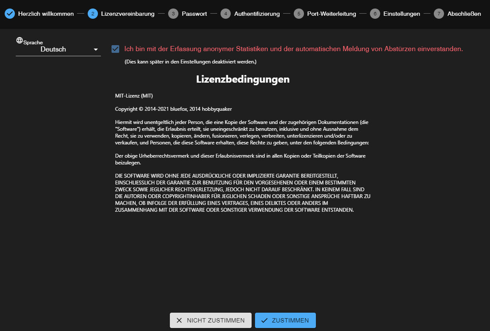

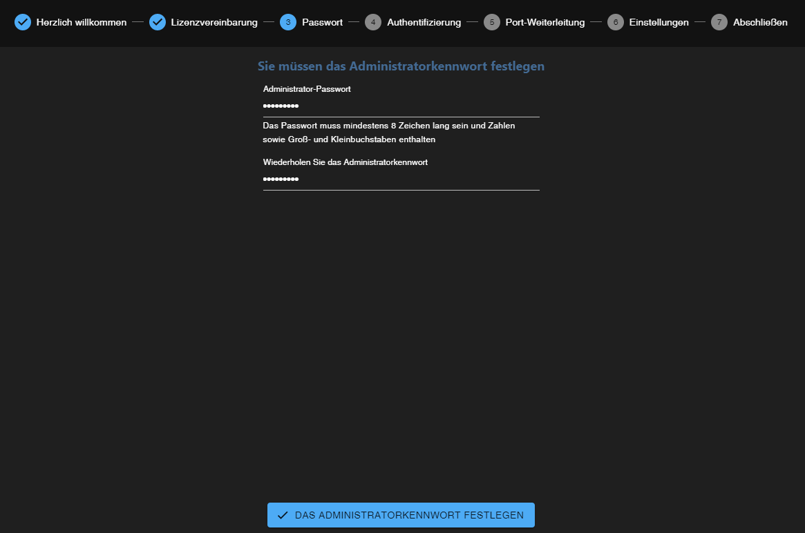

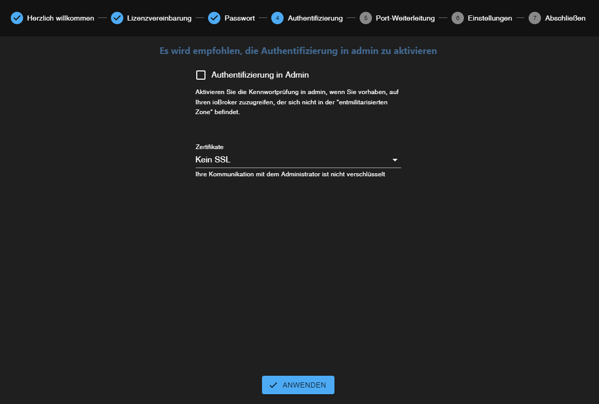

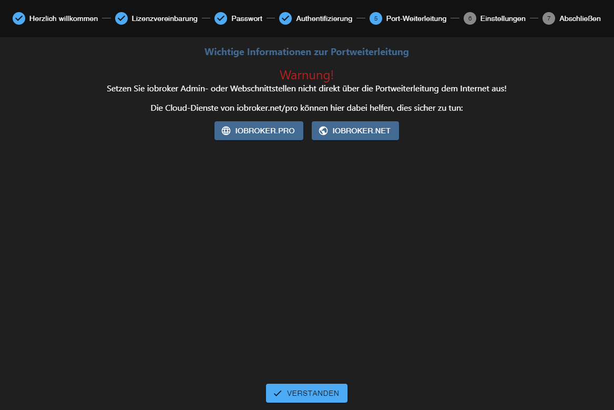

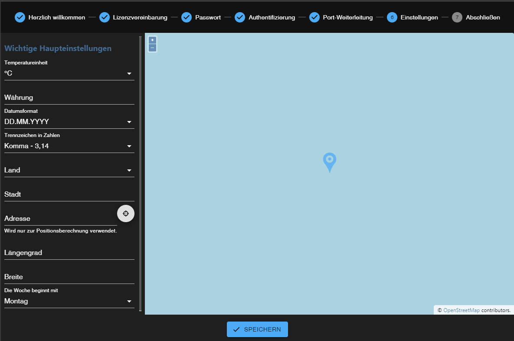


</details>

之后，您可以选择搜索设备和服务。所需的适配器/实例随后可以自动创建。

<details><summary>图片系列 设备/服务搜索</summary>

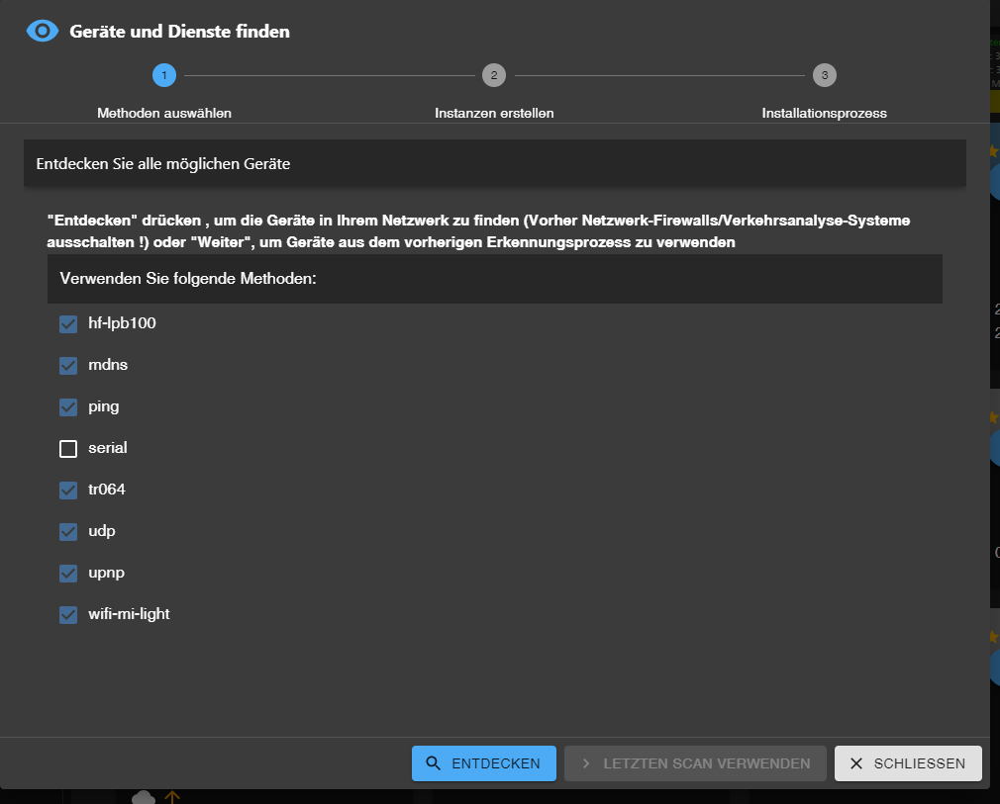

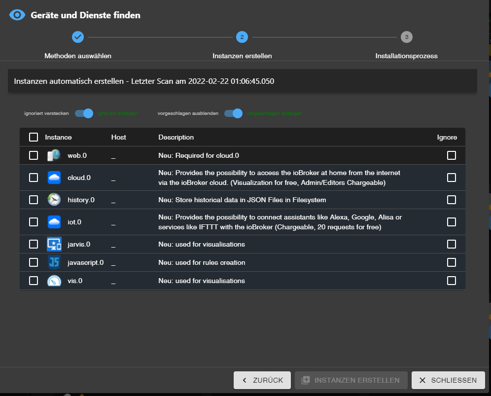

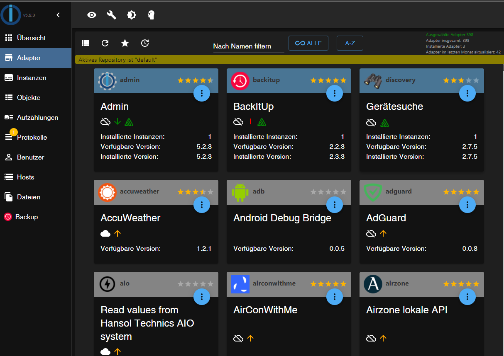

</details>

ioBroker 安装现已完成。您可以根据使用场景和个人喜好随时安装其他适配器。

---

## Proxmox - LXC（Linux 容器）-> 直通 USB 设备
本指南的这一部分将逐步解释如何在 Proxmox 中将 USB 设备（USB 直通）传递给 LXC（Linux 容器）。

使用虚拟机 (VM) 时，可以直接通过 Proxmox Web 界面传递 USB 设备。而对于 Linux 容器，目前需要手动编辑 LXC 配置文件才能实现此功能。

说明书以德州仪器公司 (Texas Instruments Inc.) 的 CC2531 Zigbee 模块为例，描述了如何集成该模块。

注意：CC2531 芯片目前已技术过时，内存容量很小，ioBroker 社区不再推荐在新系统中使用它。建议改用更现代的加密狗（例如基于 CC2652P 的 Sonoff Zigbee 3.0 USB Dongle Plus 或 ConBee 3）。

不过，本指南中所示的直通步骤几乎适用于所有 USB 串口设备（例如智能电表读取器、其他 Zigbee 加密狗）。USB 网络设备（例如蓝牙或 Wi-Fi）除外。

- 本部分说明是使用 Proxmox 9.x 版本编写的。

### 1.) 收集有关 USB 设备的信息
<details>

建立与 Proxmox 的 SSH 连接：

```bash
ssh root@IP-Adresse
```

<span style="color:red">**如果 USB 设备已连接到 Proxmox 主机，请暂时拔下该设备。**</span>

以下命令列出 Proxmox 主机上当前连接的所有 USB 设备：

```bash
lsusb
```

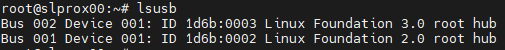

现在，将要集成的 USB 设备插入 Proxmox 主机，并再次执行 lsusb 命令。

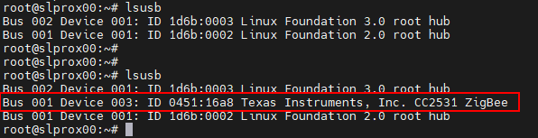

屏幕截图显示，列出了一个新设备，其 USB 总线编号为：**001**，设备编号为：**003**。

需要此信息才能使用以下命令输出设备的**主设备编号**：

```bash
ls -l /dev/bus/usb/001/003
```

重要提示：请使用您的 USB 总线号和设备号作为命令的输出！

**_ls -l /dev/bus/usb/USB-Bus-Number/Device-Number_**

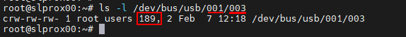

在本例中，USB 设备的主设备号为 **189**。请将您的设备值记录在文本文件中，格式为：#1

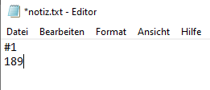

接下来，输出 USB 设备的唯一 ID，并将该值记录在文本文件中，格式为：#2:

```bash
ls /dev/serial/by-id/
```

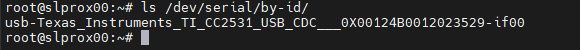

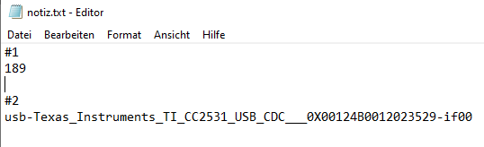

最后一步，输出 ttyACM 的主设备号，并用以下符号记录：#3：

```bash
ls -l /dev/ttyACM*
```

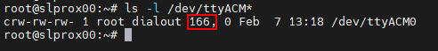

如果没有输出，请使用“ls -l /dev/serial/by-id/”命令检查系统是否已将 USB 设备挂载为 ttyUSB。如果是，请将所有后续引用 **ttyACM…** 的命令替换为 **ttyUSB…**。如果没有输出，则说明它不是 USB CDC 类设备（串行通信），可以忽略所有与从 ttyACM 挂载相关的步骤。

因此，USB 设备的**三个**值是可用的，这是将其集成到 LXC 配置文件中所必需的。

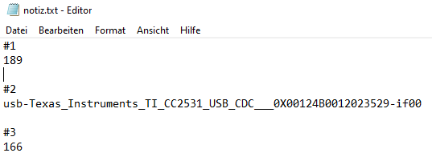

</details>

### 2.) 编辑 LXC 配置文件
<details>

在 Proxmox 主机上，使用以下命令切换到 LXC 配置目录：

```bash
cd /etc/pve/lxc
```

配置文件具有与创建 LXC 文件时分配的 ID 号相同的 ID 号！

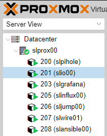

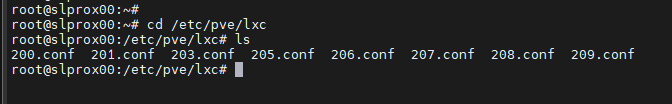

编辑配置文件之前，应先创建备份：

```bash
cp 201.conf 201.conf.backup
```

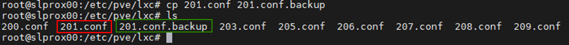

现在可以使用 vi 或 nano 编辑器编辑配置文件：

```bash
nano 201.conf
```

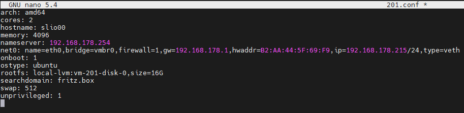

以下内容添加到配置文件末尾：

```
lxc.cgroup2.devices.allow: c 189:* rwm
lxc.mount.entry: usb-Texas_Instruments_TI_CC2531_USB_CDC___0X00124B0012023529-if00 dev/serial/by-id/usb-Texas_Instruments_TI_CC2531_USB_CDC___0X00124B0012023529-if00 none bind,optional,create=file

lxc.cgroup2.devices.allow: c 166:* rwm
lxc.mount.entry: /dev/ttyACM0 dev/ttyACM0 none bind,optional,create=file
```

请将高亮显示的值替换为您笔记中的条目！

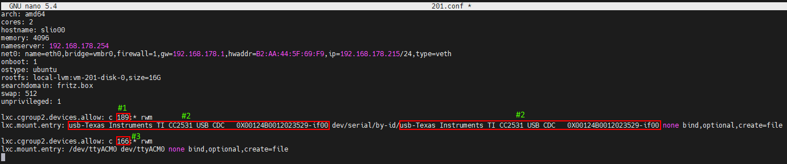

- 第一行指的是主设备编号 **189** 注：#1
- 在第二行中，注释 #2 中的唯一 ID (usb-Texas_Instruments_TI_CC2531_USB_CDC\_\_\_0X00124B0012023529-if00) 被单独指定，并使用绝对路径（不换行）。
- 第三行指定了来自 ttyACM 的主设备号 **166**（见注释 #3）。

保存配置文件（在 Nano 编辑器中，使用键盘快捷键：CTRL + o，然后使用 CTRL + x 退出编辑器）

</br>

<span style="color:orange">**注意！ - 如果您的容器有活动的快照：**</span>

<details>

那么，lxc.cgroup 代码不应该放在配置文件的末尾，而应该放在快照的第一个条目之前。

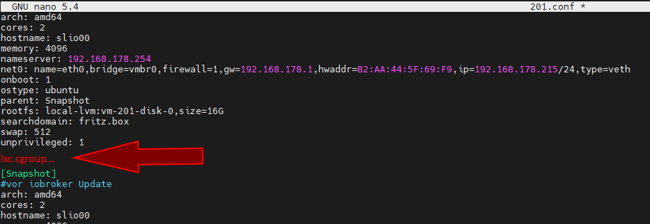

</details>

<span style="color:orange">**注意！ - 7.0 版本之前的 Proxmox 安装：**</span>

<details>

替换以下条目

```
lxc.cgroup2
```

通过

```
lxc.cgroup
```

</details>

最后，执行以下命令来设置 `ttyACM0` 的必要权限：

```bash
chmod o+rw /dev/ttyACM*
```

要将更改应用到 LXC，请使用 **pct stop id / pct start id** 对容器执行冷启动：

```bash
pct stop 201
```

```bash
pct start 201
```

</br>

<span style="color:green">**提示：最好将工作配置文件备份到外部，因为例如 Proxmox 集成的备份服务不会备份您的配置文件内容！**</span>

</br>

</details>

### 3.) 检查 LXC USB 直通和 Zigbee 实例配置
<details>

建立与 LXC 的 SSH 连接：

```bash
ssh Benutzer@IP-Adresse
```

使用以下命令：

```bash
lsusb
```

&

```bash
ls -l /dev
```

系统会检查对配置文件所做的更改是否成功。

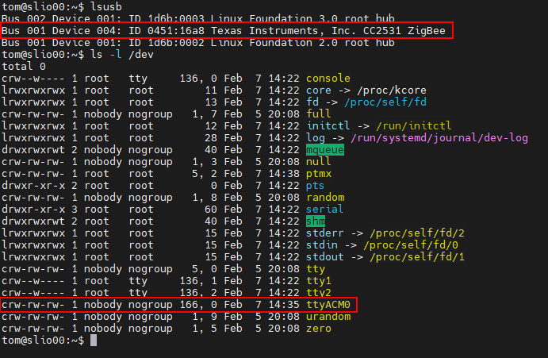

- 从截图中可以看出，容器现在可以访问 USB 设备。

- 务必确保 ttyACM0 的权限与屏幕截图中的权限相同，即 **crw-rw-rw-1 nobody nogroup**

如果您没有检查配置文件中的所有值是否都按所述设置，并且权限仍然不匹配，请跳至第 5 点。

截图还显示 CC2531 的设备编号从 3 变为 4。这是因为 U 盘被拔出后又重新插上。但是，由于配置文件指定的是唯一 ID 而不是总线/设备编号，因此 USB 直通功能仍然有效。

如果按照开头所述将 Zigbee 棒传递到容器中，ioBroker 中的 Zigbee 适配器设置将显示 COM 端口名称。

```
/dev/ttyACM0
```

输入以便正确寻址设备。

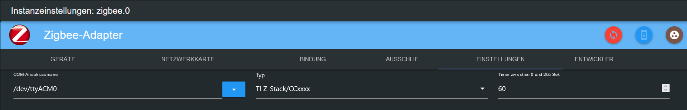

</details>

### 4.) UDEV 永久权限规则：调整 ttyACM0
<details>

在步骤 3 结束时，使用了该命令。

```bash
chmod o+rw /dev/ttyACM*
```

已为 ttyACM0 设置了适当的权限，但当 Proxmox 主机重新启动时，这些权限更改将被重置；需要在 Proxmox 主机上设置 udev 规则才能永久调整。

我们使用 lsusb 命令再次列出当前连接的 USB 设备：

```bash
lsusb
```

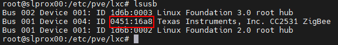

这次我们根据 ID 记录数值，在本例中为 **0451:16a8**

- 第一个值：**_0451_** 代表 **idVendor**，第二个值：**_16a8_** 代表 **idProduct**。

现在，可以使用 vi 或 nano 编辑器在 /etc/udev/rules.d 目录下创建 udev 规则：

```bash
nano /etc/udev/rules.d/50-myusb.rules
```

并插入了以下内容：

```
SUBSYSTEMS=="usb", ATTRS{idVendor}=="0451", ATTRS{idProduct}=="16a8", GROUP="users", MODE="0666"
```

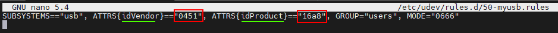

最后，执行以下命令以激活 udev 规则：

```bash
udevadm control –-reload
```

</details>

### 5.) 故障排除
<details>

**错误：** lxc 中的 ttyACM0 权限不正确，或者在短时间内丢失（ConBee II）。

```bash
ls -l /dev/ttyACM0
 c--------- 0 nobody nogroup 166, 0 Feb  7 14:29 ttyACM0
```

</br>

**解决方案：**使用 mknod 为容器创建持久绑定。

为此，需要在路径“/var/lib/lxc/CONTAINERID”下创建文件夹“devices”，并使用 mknod 命令在该文件夹中创建绑定：

```bash
mkdir /var/lib/lxc/201/devices
```

```bash
cd /var/lib/lxc/201/devices
```

```bash
mknod -m 666 ttyACM0 c 166 0
```

- _mknod 在该路径下创建一个名为 ttyACM0 的文件（只要该文件存在，设备就绑定到 lxc）_

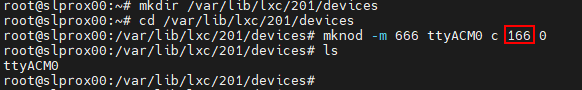

**如有必要，请调整主设备编号和 ttyACM**

接下来，需要调整 lxc 配置文件中的相应条目：

```
lxc.mount.entry: /dev/ttyACM0 dev/ttyACM0 none bind,optional,create=file
```

将被以下内容取代：

```
lxc.mount.entry: /var/lib/lxc/CONTAINERID/devices/ttyACM0 dev/ttyACM0 none bind,optional,create=file
```

</details>

---

设置用于备份的U盘/硬盘
为了允许将未来的备份单独存储，可以选择将 USB 设备（U盘或硬盘）集成到 Proxmox 主机上。

_注意：_ 本指南的早期版本经常推荐使用 **vFAT (FAT32)** 文件系统，因为它在 Linux 和 Windows 下都能正常读取。但现在强烈建议不要这样做！FAT32 文件系统的技术限制是 **每个文件 4 GB**。由于现代 Proxmox 备份（例如，包含整个虚拟机或容器的 `.vma.zst` 文件）通常远远超过这个大小，因此使用 FAT32 进行备份会失败，并出现“文件过大”之类的错误。

因此，常用的、适用的文件系统有：

- **EXT4**（纯 Linux 的标准，强烈推荐用于 Proxmox 备份）
- **NTFS** 或 **exFAT**（如果备份驱动器必须也以原生格式格式化）

（必须阅读 Windows 文档）

如果存储介质尚未分区或您想重新格式化它，您可以在 Windows PC 上执行此操作，也可以直接在 Proxmox 服务器上执行此操作。

存储介质准备就绪后，即可将其挂载到系统中，然后通过 Proxmox GUI 直接添加为存储（目录）。

<span style="color:orange">警告！重新格式化会清除存储设备上的所有现有数据。</span>

以下示例说明指的是直接在 Proxmox 主机上设置 **EXT4**。

**重要提示：** 以下命令需要 `root`。如果在主机上使用单独的用户，则必须使用 `sudo` 执行命令。

### 准备设备
### 1 - 识别设备
首先，使用 [lsblk][] 命令定位设备。建议在插入设备前后各执行一次该命令，这样可以更轻松地识别设备。

```bash
lsblk
```

它看起来大概是这样的（字母会根据连接的设备数量而有所不同）：

```
sdd                    8:48   0 119.2G  0 disk
├─sdd1                 8:49   0 119.2G  0 part
└─sdd9                 8:57   0     8M  0 part
sde                    8:64   0 931.5G  0 disk                    <-- Das ist die Disk /dev/sde
└─sde1                 8:65   0 931.5G  0 part                    <-- Das ist die erste Partition /dev/sde1
sr0                   11:0    1  1024M  0 rom
sr1                   11:1    1  1024M  0 rom
```

### 2 - 分区
使用菜单驱动的 [cfdisk][] 对驱动器进行分区。

```bash
cfdisk /dev/sde
```

### 3 - 创建文件系统
现在需要格式化之前创建的分区。如上所述，我们将使用 **EXT4** 文件系统。

使用 [mkfs][] 命令和相应的参数格式化分区：

```bash
mkfs.ext4 /dev/sde1
```

### 4 - 安装驱动器
要使用已完成的数据载体，必须将其安装到位。

为此，需要创建一个合适的挂载点。为确保存储设备在重启后自动重新挂载，需要在 `/etc/fstab` 文件中添加相应的条目。

为此，必须读取驱动器的唯一**UUID**。

创建挂载点：

```bash
mkdir /media/ext_usb
```

安装数据载体：

```bash
mount /dev/sde1 /media/ext_usb
```

确定 UUID：

```bash
blkid | grep -i sde
```

例如，这将导致：

```
/dev/sde1: LABEL="Backup" UUID="136b058d-f0c8-406d-a82b-2adcc00b72bf" BLOCK_SIZE="4096" TYPE="ext4" PARTUUID="00011a10-01"
```

使用 nano 编辑器编辑 [/etc/fstab][] 文件中的条目：

```bash
nano /etc/fstab
```

现在将添加并保存此条目：

```
UUID="136b058d-f0c8-406d-a82b-2adcc00b72bf" /media/ext_usb ext4 defaults 0 2
```

（注：对于 EXT4 分区，通常在 fstab 行的末尾输入 `0 2` 以进行文件系统检查。）

### 5 - 为 Proxmox 添加存储空间
在“数据中心”>“存储”下，现在可以添加目录。ID 名称可以自由选择，例如 _usb-backup_。

列 _Directory_ 指定路径，在本例中为 `/media/ext\_usb`。

在“内容”下，您只需选择所需的功能（例如，

VZDump 备份文件）。

[VM]: https://pve.proxmox.com/wiki/Qemu/KVM_Virtual_Machines

[LXC Container]: https://pve.proxmox.com/wiki/Linux_Container

[Filesysteme]: https://wiki.ubuntuusers.de/Dateisystem/

[lsblk]: https://wiki.ubuntuusers.de/lsblk/

[cfdisk]: https://wiki.ubuntuusers.de/fdisk/

[mkfs]: https://wiki.ubuntuusers.de/Formatieren/

[gemountet]: https://wiki.ubuntuusers.de/mount/

[/etc/fstab]: https://wiki.ubuntuusers.de/fstab/

[helper-scripts.com]: https://helper-scripts.com

[Installationsmedien vorbereiten]: https://pve.proxmox.com/wiki/Prepare_Installation_Media#_instructions_for_windows

[ISO-Image]: https://www.debian.org/distrib/