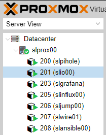

# Proxmox

## Proxmox - 在 VM（虚拟机）中安装 ioBroker
?> ***这是一个占位符***。  帮助 ioBroker 并扩展本文。请注意[ioBroker 风格指南](https://www.iobroker.net/#de/documentation/community/styleguidedoc.md)，以便更容易地采用更改。

</详情>

## Proxmox - 在 LXC（Linux 容器）中安装 ioBroker
?> ***这是一个占位符***。  帮助 ioBroker 并扩展本文。请注意[ioBroker 风格指南](https://www.iobroker.net/#de/documentation/community/styleguidedoc.md)，以便更容易地采用更改。

</详情>

## Proxmox - LXC (Linux Containers) -> 通过 USB 设备
本指南的这一部分逐步解释了如何通过 Proxmox 中的 USB 设备（USB 直通）到 LXC（Linux 容器）。

使用虚拟机，可以直接通过 Proxmox Web 界面传递 USB 设备。使用 Linux 容器，目前需要手动编辑 lxc 的配置文件。

说明描述了如何集成 **Texas Instruments Inc. CC2531** Zigbee 棒，但同样的步骤可以类似地用于其他 Zigbee 棒（ConBee、CC2652P 等）或除 USB 网络设备外的其他 USB 设备（蓝牙/WLAN）可以使用。

* Proxmox 7.1 版用于这部分说明。

### 1.) 收集有关 USB 设备的信息

建立到 Proxmox 的 SSH 连接：

~~~ ssh root@ip地址~~~

**如果 USB 设备已经连接到 Proxmox 主机，请暂时拔下设备。**

以下命令列出 Proxmox 主机上所有当前连接的 USB 设备：

~~~ lsusb ~~~

现在将要集成的USB设备插入Proxmox主机，再次执行lsusb命令

在屏幕截图中，您可以看到 USB 总线编号：**001** 和设备编号：**003** 的新设备已列出。

使用以下命令需要此信息，例如从设备输出**主要设备号**：

~~~ ls -l /dev/bus/usb/001/003 ~~~

在命令中使用 USB 总线号和设备号的输出非常重要！

***ls -l /dev/bus/usb/usb-bus-number/device-number***

此示例中的 USB 设备的主设备号为 **189**，在文本文件中记下您的设备的值，并带有注释：#1

接下来我们输出USB设备的唯一ID，并在文本文件中用注释记下输出值：#2

~~~ ls /dev/serial/by-id/ ~~~

作为最后一步，输出 ttyACM 的主要设备号并用注释注明：#3：

~~~ ls -l /dev/ttyACM* ~~~

>*如果没有输出，用“ls -l /dev/serial/by-id/”检查USB设备是否被系统集成为ttyUSB，如果是则替换下面所有引用**ttyACM的命令。 ..* * 从 **ttyUSB...** 获取，如果没有输出，则它不是 USB CDC 类设备（串行通信），因此可以忽略从 ttyACM 包含的所有点。*

所以我们从USB设备中记下了集成到lxc的配置文件中所需的**三个**值。

</详情>

### 2.) 编辑 LXC 配置文件

使用以下命令切换到 Proxmox 主机上的 LXC 配置目录：

~~~ cd /etc/pve/lxc ~~~

配置文件的 ID 号与创建 lxc 时分配的 ID 号相同！

在编辑配置文件之前，应该创建一个备份副本：

~~~ cp 201.conf 201.conf.backup ~~~

现在使用 vi 或 nano 编辑配置文件：

~~~ 纳米 201.conf ~~~

将以下内容添加到配置文件的末尾：

~~~ lxc.cgroup2.devices.allow: c 189:* rwm lxc.mount.entry: usb-Texas_Instruments_TI_CC2531_USB_CDC___0X00124B0012023529-if00 dev/serial/by-id/usb-Texas_Instruments_TI_CC2531_USB_CDC___0X00124B0012

lxc.cgroup2.devices.allow: c 166:* rwm lxc.mount.entry: /dev/ttyACM0 dev/ttyACM0 none bind,optional,create=file ~~~

用您笔记中的注释条目替换标记的值！

* 第一行是主设备号 **189** 注意：#1
* 在第二行中，来自 Note:#2 的唯一 id (usb-Texas_Instruments_TI_CC2531_USB_CDC___0X00124B0012023529-if00) 是单独给出的，并带有绝对路径，请注意完整的文本写在一行中，没有换行符。
* 在第三行中，给出了来自注：#3 的 ttyACM 的主要设备号 **166**。

保存配置文件（在 nano 编辑器中使用组合键：CTRL + o & CTRL + x 退出编辑器）

 

**危险！ - 如果您的容器有活动快照：**

那么 lxc.cgroup 代码不属于配置文件的末尾，而是在快照的第一个条目之前。

</详情>

**危险！ - Proxmox 7.0 版之前的安装：**

将条目替换为

~~~ lxc.cgroup2 ~~~

通过

~~~ lxc.cgroup ~~~

</详情>

  最后，发出以下命令来设置 ttyACM0 所需的权限：

~~~ chmod o+rw /dev/ttyACM* ~~~

要将调整应用于 lxc，请使用 **pct stop id / pct start id** 从容器执行冷启动：

~~~ pct 停止 201 ~~~

~~~ pct 开始 201 ~~~

 

**提示最好在外部存储工作配置文件的副本，因为例如B. 集成的 Proxmox 备份服务不会备份您的配置内容！**

 

</详情>

### 3.) 检查 LXC USB 直通和 Zigbee 实例配置

建立与 LXC 的 SSH 连接：

~~~ ssh 用户@ip 地址~~~

使用命令：

~~~ lsusb ~~~

&

~~~ ls -l /dev ~~~

检查配置文件的调整是否成功。

* 如屏幕截图所示，容器现在可以访问 USB 设备。

* 重要的是 ttyACM0 在截图中具有相同的权限，即 **crw-rw-rw- 1 nobody nogroup**

>***如果不检查配置文件中的所有值是否都按照描述设置，权限还是不匹配则跳转到第5点***

* 截图还显示cc2531的设备号从3变成了4，这是因为在此期间棒子被拔了又插了。但是，由于在配置文件中指定了唯一 ID 而不是总线/设备编号，因此 USB 直通继续工作。

如果如上所述，将 Zigbee 棒传递到容器，则必须在 iobroker 中的 Zigbee 适配器设置中的 COM 端口名称下输入

~~~ /dev/ttyACM0 ~~~

指定以便适配器寻址正确的设备。

</详情>

### 4.) 永久权限的UDEV规则调整ttyACM0

在第 3 步结束时使用命令

~~~ chmod o+rw /dev/ttyACM* ~~~

为 ttyACM0 设置了相应的权限，但是这些权限更改会在 Proxmox 主机重新启动时重置。需要在 Proxmox 主机上设置 udev 规则才能进行永久调整。

使用 lsusb 我们再次列出当前连接的 USB 设备：

~~~ lsusb ~~~

这次我们记下ID后面的数值，所以本例中**0451:16a8**

* 第一个值：***0451*** 代表 **idVendor**，第二个值：***16a8*** 代表**idProduct**。

现在使用 vi 或 nano 在 /etc/udev/rules.d 下创建 udev 规则：

~~~ 纳米 /etc/udev/rules.d/50-myusb.rules ~~~

并添加了以下内容：

~~~ SUBSYSTEMS=="usb", ATTRS{idVendor}=="0451", ATTRS{idProduct}=="16a8", GROUP="users", MODE="0666" ~~~

最后，运行以下命令激活 udev 规则：

~~~ udevadm control –reload ~~~

</详情>

### 5.) 故障排除

**错误：** lxc 中的 ttyACM0 权限不匹配或在短时间内丢失 (ConBee II)。

~~~ ls -l /dev/ttyACM0 c--------- 0 没有人 nogroup 166, 0 Feb 7 14:29 ttyACM0 ~~~

 

**解决方案：** 使用 mknod 创建与容器的持久绑定。

为此，在路径 **"/var/lib/lxc/CONTAINERID"** 中创建 **devices** 文件夹，并使用 mknod 在此文件夹中创建绑定：

~~~ mkdir /var/lib/lxc/201/devices ~~~

~~~ cd /var/lib/lxc/201/devices ~~~

~~~ mknod -m 666 ttyACM0 c 166 0 ~~~

+ *mknod 在路径中创建一个名为 ttyACM0 的文件（只要文件存在，设备就绑定到 lxc）*

***主要设备号和ttyACM..根据需要调整***

那么lxc配置文件中的条目必须调整：

~~~ lxc.mount.entry: /dev/ttyACM0 dev/ttyACM0 none bind,optional,create=file ~~~

替换为：

~~~ lxc.mount.entry: /var/lib/lxc/CONTAINERID/devices/ttyACM0 dev/ttyACM0 none bind,optional,create=file ~~~

</详情>