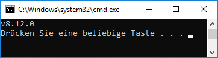

# 在 Windows 上安装 ioBroker
?> *** 本文正在扩充中***。<br><br>帮助 ioBroker。请注意 [ioBroker 风格指南](community/styleguidedoc) 以便可以更轻松地采用更改。

以下说明将指导您逐步完成安装。请不要跳过任何步骤，因为有些命令是相互建立的。

## 检查要求
!> 首先检查系统是否满足所有必要的[安装要求](install/requirements)。

运行 ioBroker 需要 Node.js。下面假设 PC 上没有安装 Node.js 和 ioBroker。如果已经安装了ioBroker，请继续[更新]()部分。

要查看是否安装了 Node.js，组合键<kbd>⊞ Windows</kbd> + <kbd>r</kbd>打开 `Ausführen` 对话框，然后命令

```
cmd.exe /C node -v & pause
```

进入。确认命令后，会出现一个窗口。

 *Node.js 检查*

将显示错误消息或已安装的 Node.js 版本。

如果输出的是Node.js版本号，首先要检查是否还满足【安装要求】()。

如果错误信息为 `Der Befehl "node" ist entweder falsch geschrieben oder konnte nicht gefunden werden.`，则表示未安装 node.js，安装为 [可以马上开始](#nodeinst)。

＃＃ 快速开始
?> 此安装步骤摘要适用于已多次安装 ioBroker 的有经验的 ioBroker 用户。

初学者应遵循 [详细说明](#nodeinst)。

* Node.js 8.x LTS 版本[下载并安装]（安装/nodejs）。
* 以管理员身份打开命令行`cmd.exe`，依次执行以下命令

  执行：

```
npm install --global windows-build-tools
md C:\iobroker
cd /d C:\iobroker
npm install iobroker
npm install --production --no-optional --logevel=error
iobroker status
```

<div id="nodeinst"></div>

## 安装 Node.js 和 npm
Node.js 是根据 [本手册的](install/nodejs) 安装的。

## IoBroker 的安装
?> ioBroker 可以安装在本地硬盘驱动器上您选择的文件夹中。如果安装路径包含空格，则所有命令的完整路径必须用引号引起来。
示例命令：`dir "C:\ioBroker Testsystem"`。

?> ioBroker 的默认安装文件夹是 `C:\iobroker`。

1. 以管理员身份打开命令行窗口。为此，请使用组合键

<kbd>⊞ Windows</kbd> + <kbd>r</kbd>打开 `Ausführen` 对话框和命令

```
cmd
```

   输入。

由于命令行窗口必须以管理员身份打开，请使用 `OK` 填写 **而不是** 而是使用组合键 `Strg` + `Umschalt` + `Eingabetaste` .必须使用 `Ja` 或输入管理员密码来确认安全问题。

!> 现在打开的黑色命令行窗口中的标题行必须以单词 `Administrator:` 开头。

?> 一些ioBroker 适配器包含必须为Windows 编译的组件。因此，在安装ioBroker之前，安装了所谓的`windows-build-tools`。有关 `windows-build-tools` 的更多信息可以在 [在这里找到](https://github.com/felixrieseberg/windows-build-tools) 中找到。

1.使用以下命令安装`windows-build-tools`：

```
npm install --global windows-build-tools
```

1.然后在命令行窗口执行创建安装文件夹的命令

   执行：

```
md C:\iobroker
```

1、现在可以安装实际的ioBroker安装包了：

```
cd /d C:\iobroker
npm install iobroker
```

   结果应如下所示：

```
[...]
╭───────────────────────────────────────────────────────╮
│ The iobroker files have been downloaded successfully. │
│ To complete the installation, you need to run         │
│                                                       │
│   npm i --production --no-optional --logevel=error    │
│                                                       │
╰───────────────────────────────────────────────────────╯

npm notice created a lockfile as package-lock.json. You should commit this file.
npm WARN enoent ENOENT: no such file or directory, open 'C:\iobroker\package.json'
npm WARN iobroker No description
npm WARN iobroker No repository field.
npm WARN iobroker No README data
npm WARN iobroker No license field.

+ iobroker@1.3.0
added 51 packages from 28 contributors and audited 83 packages in 6.937s
found 0 vulnerabilities
```

1、ioBroker安装完成，命令如下：

```
cd /d C:\iobroker
npm install --production --no-optional --logevel=error
```

安装过程可能需要一段时间。运行 npm 时，可能会出现与模块 `unix-dgram` 相关的红色错误消息（gyp！ERR）。可以忽略这些错误消息。

   安装的最后几行应该像这样结束：

```
[...]
Write "iobroker start" to start the ioBroker
npm install node-windows@0.1.14 --production --no-optional --logevel=error --save --prefix "C:/iobroker"
ioBroker service installed. Write "serviceIoBroker start" to start the service and go to http://localhost:8081 to open the admin UI.
To see the outputs do not start the service, but write "node node_modules/iobroker.js-controller/controller"
npm WARN optional SKIPPING OPTIONAL DEPENDENCY: unix-dgram@0.2.3 (node_modules\unix-dgram):
npm WARN optional SKIPPING OPTIONAL DEPENDENCY: unix-dgram@0.2.3 install: `node-gyp rebuild`
npm WARN optional SKIPPING OPTIONAL DEPENDENCY: Exit status 1

added 514 packages from 300 contributors and audited 1808 packages in 61.874s
found 23 vulnerabilities (17 low, 6 high)
run `npm audit fix` to fix them, or `npm audit` for details
```

1. 然后就可以使用命令

```
iobroker status
```

检查 ioBroker 是否作为 Windows 服务自动启动。
答案应该是

```
iobroker is running
```

   或者

```
iobroker is not running
```

   戒指。

   如果ioBroker没有自动启动，请输入以下命令：

```
net start iobroker.exe
iobroker status
```

   答案应该是现在

```
iobroker is running
```

   戒指。

?> 以后每次系统重启都会在后台自动启动ioBroker。

1.最后，可以通过执行命令打开命令行窗口

```
exit
```

   关闭。

?> 在 `Admin` 适配器的帮助下进行进一步的配置。使用网络浏览器和地址 [http://本地主机：8081](http://localhost:8081) 调用它。通过网络 ioBroker 的配置在【配置】一章有详细介绍。

?> 现在建议初学者运行【教程】()。这里逐步介绍管理界面，并进行必要的基本设置。

＃＃ 更新
@@@待定@@@

＃＃ 故障排除
@@@待定@@@