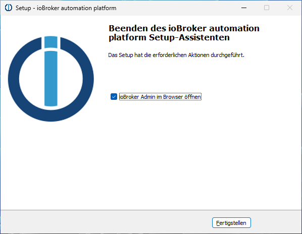

# 检查要求
安装前，请检查系统是否满足所有必要的[安装要求](./requirements.md)。

您可以在论坛中讨论 Windows Installer 的问题：https://forum.iobroker.net/topic/63610/test-iobroker-unter-windows-installieren-2023-edition

# IoBroker Windows 安装程序
使用 ioBroker Windows 安装程序，只需点击几下即可在 Windows PC 上安装 ioBroker。安装程序本身不包含任何软件包。安装过程中会自动下载所需软件。因此，必须连接互联网。

安装 ioBroker 后，安装程序可用于执行以下操作：

1. 将 Node.js 更新到当前推荐的版本
2. 运行 ioBroker Fixer
3. 删除或创建 Windows 防火墙规则，以便 ioBroker 也可以从外部访问
4. 指定 ioBroker 是否在 Windows 启动时自动启动。

安装程序会自动安装，可以在 Windows 开始菜单的“ioBroker 自动化平台”-“ioBroker 安装程序”下找到。

## Windows 上的 ioBroker - 它有意义吗？
ioBroker 在 Windows 系统和 Linux 系统上的运行效果通常一样好。然而，Windows 系统可能存在一些固有的缺点，不适合全天候使用，每个用户都必须自行权衡。
Windows 尤其适合在现有的 Windows PC 上快速试用 ioBroker。

## 安装 ioBroker
首先，您需要下载安装程序。最新版本可在官方下载页面获取：https://www.iobroker.net/#de/download

然后双击启动安装程序。首先，选择要使用的语言：

然后出现欢迎页面：

点击“下一步”后，出现许可证页面：

我们必须接受许可证，然后再次点击“下一步”。在接下来的页面上，我们可以选择ioBroker的安装文件夹：

通常情况下，最好使用默认值“C:\ioBroker”。点击“下一步”后，将执行一些检查：

这可能需要一点时间。验证结果将自动显示：

在此示例中，一切正常，我们可以继续。如果所有必要条件均未满足，我们必须首先明确需要做什么。安装和运行 ioBroker 所需的端口通常不可用。任何遇到这种情况且不确定该怎么做的人都可以在 ioBroker 论坛 (https://forum.iobroker.net/) 寻求帮助。点击“下一步”后，我们可以选择一些详细信息：

首次安装 ioBroker 时，前三个选项是预定义的：

1. 下载并安装ioBroker的运行环境Node.js（推荐版本）
2. ioBroker 本身已安装
3. 无法选择 ioBroker Fixer

接下来的两个选项可以更改，但通常建议保留默认设置。
最后，安装程序提供了采用现有安装配置的选项。这需要完整的“iobroker-data”文件夹，该文件夹位于现有 ioBroker 安装的 ioBroker 文件夹中。该文件夹可以来自 Windows 或 Linux 上的 ioBroker 安装。安装过程中将从此文件夹导入数据；其内容不会更改。
点击“下一步”后，我们将看到计划操作的摘要：

   

点击“安装”开始实际安装：

   

   

   

   

单击“完成”将打开网络浏览器，ioBroker 将指导您完成设置的第一步。

＃＃ 更新
!> 更新通常不会出现任何问题，而且安全可靠。不过，为了安全起见，建议您在更新前备份数据。

- 使用 Windows 安装程序，已安装的 Node.js 版本可以自动更新到推荐级别。

为此，只需从 Windows 开始菜单（“ioBroker 安装”）启动安装程序，然后按照说明操作即可。任何可用的 Node.js 更新都会被自动检测并提供。

- 自 Windows Installer 版本 3.1.0 起，JS 控制器也可以使用 Windows Installer 进行更新。

为此，只需从 Windows“开始”菜单（“ioBroker 安装”）启动安装程序，然后按照说明操作即可。任何可用的 JS 控制器更新都将自动检测并提供。

- 您也可以手动更新 JS 控制器。但我们强烈建议您使用 Windows Installer 进行更新。

如果您仍想手动更新，可以使用以下命令进行更新：

`iob stop`

`iob update`

`iob upgrade self`

`iob start`

## 专家模式
安装程序还提供了专家模式，ioBroker 的普通用户通常不需要使用该模式。您可以在安装程序首页双击 ioBroker 徽标，然后勾选“专家模式”复选框来激活该模式。

专家模式提供以下附加功能：

- 在一台电脑上并行安装和维护多个ioBroker服务器
- 安装 JS 控制器 Alpha 版本

故障排除
**问题：**由于端口 9001 被名为“System”的进程占用，因此无法完成安装。

**可能的解决方案：**已知英特尔® 图形控制中心会阻止端口 9001。
请检查您的电脑上是否有名为“图形控制中心”或类似名称的 Windows 服务。如果有，请停止并禁用此服务。
然后您应该可以安装 ioBroker 了。

**问题：**ioBroker 安装过程中未安装 Git。日志文件包含相应的错误消息：“浏览源时出错：winget 执行命令时发生意外错误：0x8a15000f：缺少源所需的数据”

**可能的解决方案：**在 ioBroker 命令窗口（从“开始”菜单）中输入以下命令，然后重新启动安装程序并选择“修复”。
`powershell -command " Add-AppxPackage -RegisterByFamilyName -MainPackage Microsoft.Winget.Source_8wekyb3d8bbwe"`