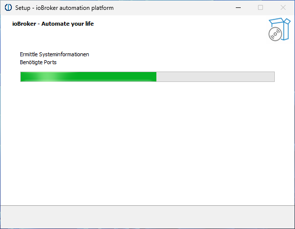
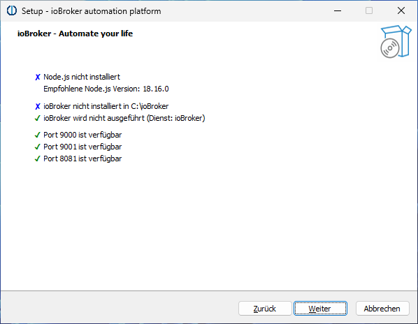
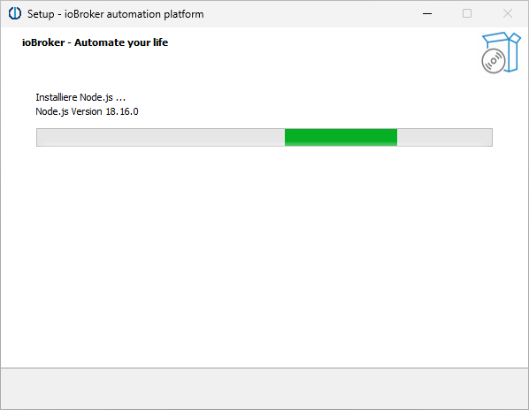

# 检查需求
安装之前，请检查系统是否满足所有必要的[安装要求](./requirements.md)。

Windows Installer 的问题可以在论坛中讨论：https://forum.iobroker.net/topic/63610/test-iobroker-unter-windows-installieren-2023-edition

# IoBroker Windows 安装程序
借助 ioBroker Windows 安装程序，只需单击几下即可将 ioBroker 安装在 Windows PC 上。安装程序本身不附带任何软件包。安装过程中会自动下载所需的软件。因此，必须有互联网连接。

安装 ioBroker 后，安装程序可用于以下操作：

1.更新Node.js到当前推荐版本
2.运行ioBroker修复程序
3.删除或创建Windows防火墙规则，以便外部也可以访问ioBroker
4.确定ioBroker是否在Windows启动时自动启动。

安装程序会自行安装，可以在 Windows 开始菜单的“ioBroker 自动化平台”-“ioBroker 安装”下找到。

## Windows 上的 ioBroker - 这有意义吗？
ioBroker 通常在 Windows 系统上运行得和在 Linux 系统上一样好。然而，用作 24/7 系统的 Windows 系统可能存在与系统相关的缺点，每个人都必须自己权衡。
Windows 特别适合在现有 Windows PC 上快速试用 ioBroker。

## 安装 ioBroker
首先，必须下载安装程序。当前版本始终可以在官方下载页面上找到：https://www.iobroker.net/#de/download

然后双击启动安装程序。首先我们选择要使用的语言：

然后出现欢迎页面：

单击“下一步”后，将出现许可证页面：

我们必须接受许可证，然后再次单击“下一步”。在接下来的页面上，我们现在可以选择 ioBroker 安装的安装文件夹：

通常最好只使用默认值“C:\ioBroker”。单击“下一步”后，将执行一些检查：

这可能需要一些时间。检查结果会自动出现：

在这个例子中一切都很好，我们可以继续。如果没有满足所有必要的要求，您必须首先明确需要做什么。安装和操作 ioBroker 所需的端口通常不可用。如果您遇到这种情况并且不知道该怎么办，您可以在 ioBroker 论坛 https://forum.iobroker.net/ 中找到帮助。单击“下一步”后，我们可以选择一些详细信息：

在 ioBroker 的初始安装过程中，前三个选项是固定的：

1、ioBroker的运行环境Node.js下载并安装，推荐版本
2.ioBroker本身安装
3. ioBroker Fixer无法选择

接下来的两个选项可以更改，但通常建议保留默认设置。
最后，安装程序提供了采用现有安装配置的选项。这需要整个“iobroker-data”文件夹，如果存在 ioBroker 安装，则可以在 ioBroker 文件夹中找到该文件夹。这可以来自 Windows 或 Linux 下的 ioBroker 安装。数据是在安装过程中从此文件夹中获取的；该文件夹的内容不会更改。
单击“下一步”后，我们现在可以看到计划操作的摘要：

   

   单击“安装”现在将开始实际安装：

   

   

   

   

单击“完成”，将打开 Web 浏览器，ioBroker 将引导您完成设置的第一步。

＃＃ 更新
!> 通常更新是完全没有问题且安全的。但为以防万一，在执行之前应进行数据备份。

* 在Windows Installer的帮助下，安装的Node.js版本可以自动更新到推荐的级别。

为此，只需从 Windows 开始菜单（“ioBroker 安装程序”）启动安装程序并按照说明进行操作即可。

* 不幸的是，js-controller 无法使用 Windows Installer 进行更新。这必须使用 ioBroker 命令行来完成。这可以从 Windows 开始菜单中的“ioBroker 自动化平台”-“ioBroker 命令行”启动。

  然后使用以下命令执行更新：

  ``iob stop``

  ``iob update``

  ``iob upgrade self``

  ``iob start``

＃＃ 故障排除
@@@待定@@@