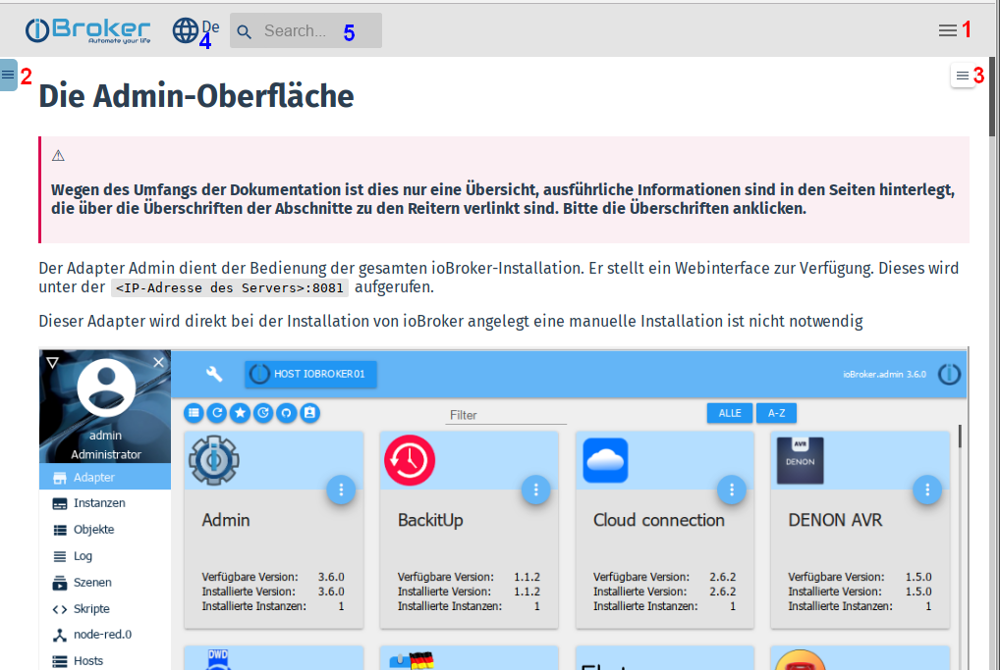
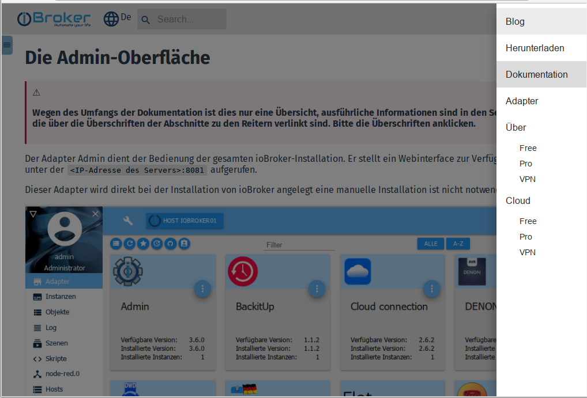
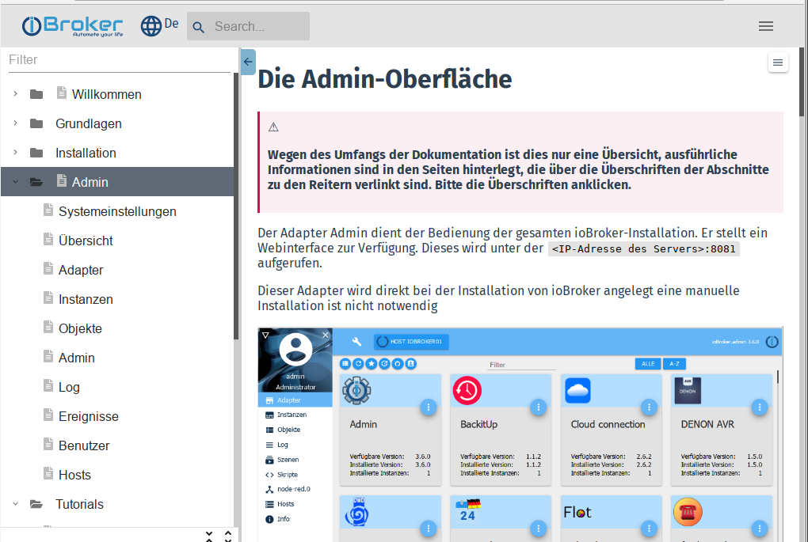
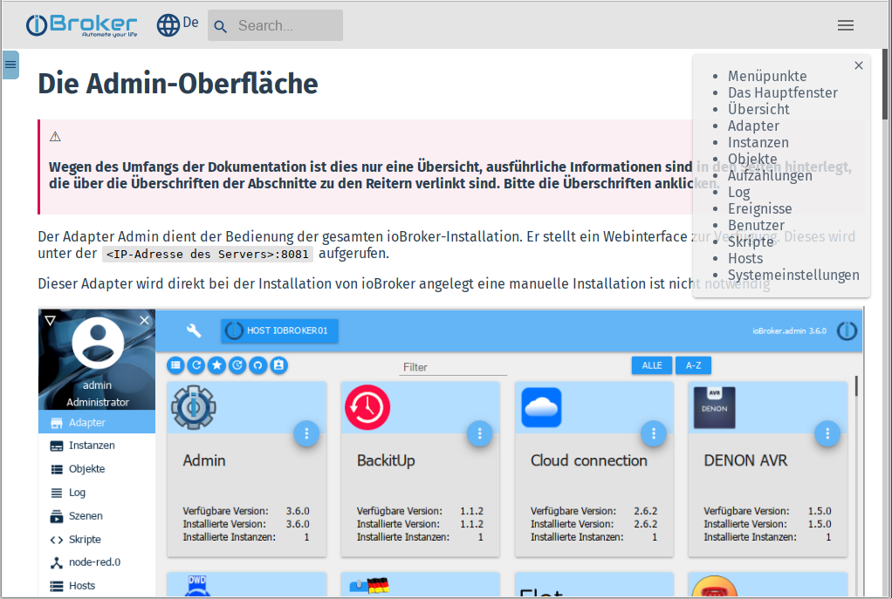
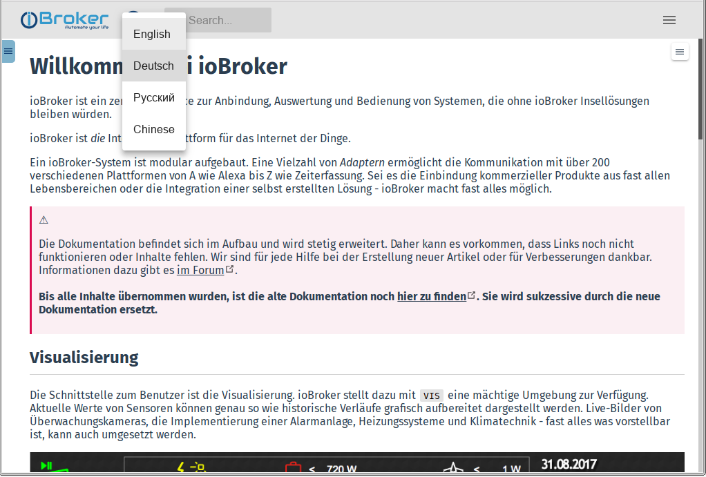

**本文档是所有 ioBroker 用户的核心参考：**

## 页面结构
此页面是采用***响应式设计***创建的。这意味着它的显示方式会根据阅读器显示器（PC/平板电脑/手机）的分辨率而有所不同，以实现最佳的可读性。

在低（有效）分辨率下，一些控件会被隐藏，为主窗口腾出空间。

因此，当前显示可能与屏幕截图不同。

### 各种菜单
为了获得尽可能全面的概览，共有三个不同的菜单：

---

#### 1 - 主菜单
该菜单的要点通常在 PC 上的页面标题栏中可见；在低分辨率下整个菜单被隐藏。
然后必须通过单击汉堡图标将其打开：

单击菜单项后，菜单会自动关闭，为内容腾出更多空间。

---

#### 2 - 文档菜单 此菜单通常在 PC 上可见，但在低分辨率下隐藏。然后必须通过单击汉堡图标将其打开：

最上面一行有一个过滤字段。通过输入一个术语，整个菜单树都会被该术语过滤，并且只显示适当的菜单项。

使用带有箭头的图标，可以再次隐藏菜单，为内容腾出更多空间。

---

#### 3 - 主题菜单
在此菜单中，显示所选文章的主要主题，以便能够更快地导航到您要查找的点。

可以使用带有 **X** 的图标再次隐藏菜单。

### 更多控制
#### 4 - 语言选择
该网站被设计为多语言。更多语言将逐渐添加。有些最初是自动生成的；邀请母语人士来改进文本。

可以使用地球图标选择所需的语言。

如有必要，该语言列表将会扩展。

#### 5 - 搜索
该字段不需要解释。请广泛使用！

---

* 对于初学者，我们建议先阅读有关 ioBroker 的一些基础知识。

有关更多信息，请参阅[基础知识][]一章。

* [下载][]页面上有为各种系统准备的镜像。

那里还提供了一些硬件平台的详细安装说明。

* 有关所有适配器的信息可以在中央的[适配器参考][]中找到。
* 控制规则的创建在[逻辑与自动化][]部分中描述。

我们感谢每一次伸出的援助之手。如果您想为ioBroker的进一步发展做出贡献，您可以在[开发者专区][]中找到信息。

该文档正在不断扩展。如果您认为缺少某些内容或应该更好地描述，[帮助我们][]改进文档！

[Grundlagen]: https://www.iobroker.net/#de/documentation/basics/README.md

[Download]: https://www.iobroker.net/#de/download

[Adapter-Referenz]: https://www.iobroker.net/#de/adapters

[Logik & Automatisierung]: https://www.iobroker.net/#de/documentation/logic/examples.md

[Developer Bereich]: https://www.iobroker.net/#de/documentation/dev/adapterdev.md

[helfen Sie uns dabei]: https://forum.iobroker.net/viewtopic.php?f=8&t=16933