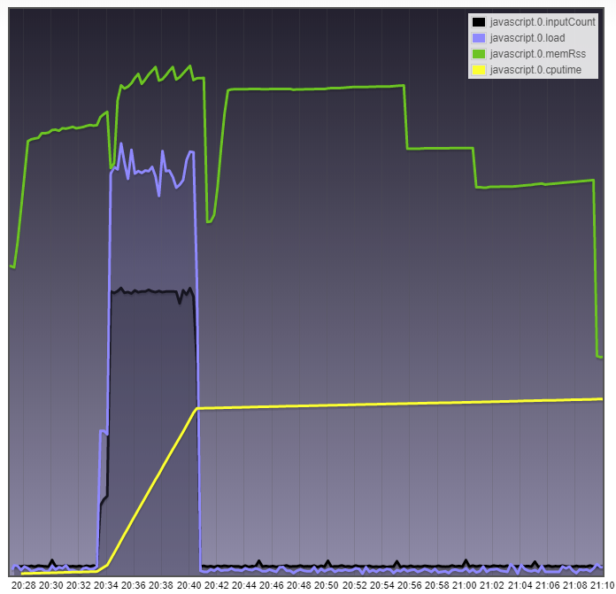

# 性能监控
ioBroker 中性能分析的起点是管理中的对象列表。
此处提供有关主机（ioBroker 具有多主机功能）和各个适配器的系统信息。可以通过将对象列表切换到专家模式来访问此信息：

## 主机的性能值
用 ioBroker 的话说，主机是运行 ioBroker js 控制器进程的机器。
在多主机环境中，也可以通过多台计算机来分配负载。
甚至所使用的操作系统也可能有所不同。
例如，对于 Raspberry Pi 集群堆栈来说，这是一项很好的任务，可以应对 1GB RAM 硬件限制。

ioBrokers js 控制器协调适配器的启动和停止，并在后台执行其他系统管理任务。在管理中，您可以在 ID `system.host.<Name_des_Hostrechners>` 下找到相应主机和 js 控制器的性能值。

以下是各个关键数字及其含义的列表：

|关键人物|数据类型 |单位|描述 |
|----------|----------|---------|--------------|
| **还活着** |逻辑|无 |指示 ioBroker js 控制器在主机上是否处于活动状态 |
| **无盘** |数量 |米布|安装 ioBroker 的逻辑驱动器上的可用空间 *bi = 二进制倍数 (1 MB = 1,000,000 字节) < (1 MiB = 1,048,576 字节 = 1 × 1024 × 1024 字节)* |
| **磁盘大小** |数量 |米布|安装 ioBroker 的逻辑卷的总大小 |
| **磁盘警告** |数量 | % |您可以在此处输入百分比值。如果磁盘上的可用空间低于此值（例如 20），管理器中会显示警告。如果历史适配器处于活动状态，这尤其有用。  |
| **自由记忆** |数量 | MB |主机可用 RAM 系统内存总量 |
| **输入计数** |数量 | /15 秒 |状态值的变化次数。例如，可以通过创建或设置值 | 来触发输入事件。 |
| **加载** |数量 | % | CPU 的总系统负载，平均超过一秒。不要感到惊讶，在 Windows 下该值始终为 0 |
| **模因** |数量 | % |内存使用情况。可用内存与系统总内存之间的比率|
| **memHeapTotal** |数量 | MB | js控制器保留的堆内存大小|
| **内存堆已使用** |数量 | MB | js控制器使用的堆内存大小|
| **memRss** |数量 | MB | Resident Set，RAM中js控制器使用的内存总大小 |
| **输出计数** |数量 | /15 秒 |例如，输出事件包括比较值、将值写入状态 DB、由于订阅而发生的事件或记录适配器以获取有关 .connected|或 .alive 状态的信息等操作。这也是 8 个事件的产生方式，它们通常位于事件输出值的实例列表中。 |
| **正常运行时间** |数量 | s |自上次重新启动以来该主机上 ioBroker 的运行时间 |

下图象征性地显示了堆、代码和堆栈如何影响 Node.js 进程的总内存使用量 **memRss**：

如果主js控制器本身为整个系统提供对象和状态数据库，则可以使用这个关键值来确定300个和3000个ioBroker对象在内存消耗方面的差异。例如，在我的 Windows 系统上，该值在 75 到 128MB 之间波动，有 3500 个对象和 2700 个状态。集成到nodejs 中的垃圾收集发送问候。
但是，如果我使用 Redis 作为状态数据库，js 控制器的内存消耗会下降到 50MB。
（现在 Redis 又需要额外的 25MB = 75MB ；））

如果状态更改的数量超过了相关事件使用者的处理能力（例如带有 on: 触发器的 Javascript），则会在内存数据库中建立一个队列。
这可以从js控制器的内存消耗看出。一旦系统负载再次下降并且事件使用者有足够的时间来处理待处理的值更改，memRss 的值就会返回到原始值：

正如这种环境中经常出现的情况，不可能根据固定值对错误原因做出准确的说明。
然而，通常有用的是观察一个没有错误运行的系统（=参考值），然后在错误条件下比较**相同的系统**。此外，如果您在历史记录中记录一两个数据点，例如记录趋势和异常值，这将非常有用。

## 适配器的性能值
每个适配器都有自己的性能指标。
它们均存储在 ID `system.adapter.<Name_des_Adapters>.<Instanz>` 下，与主机的 ID 略有不同。

|关键人物|数据类型 |单位|描述 |
|----------|----------|---------|--------------|
| **还活着** |逻辑|无 |显示适配器是否已激活 |
| **已连接** |逻辑|无 |提供有关适配器是否在过去 30 秒内响应的信息 |
| **输入计数** |数量 | /15 秒 |状态值的变化次数。例如，可以通过创建或设置值 | 来触发输入事件。 |
| **memHeapTotal** |数量 | MB |适配器保留的堆内存大小 |
| **内存堆已使用** |数量 | MB |适配器使用的堆内存大小 |
| **memRss** |数量 | MB | Resident Set，RAM 中适配器使用的内存总量 |
| **输入计数** |数量 | /15 秒 |状态值的变化次数。例如，可以通过创建或设置值 | 来触发输入事件。 |
| **输出计数** |数量 | /15 秒 |例如，输出事件包括比较值、将值写入状态数据库、基于订阅的事件或记录适配器以获取有关 .connected 或 .alive 状态信息等操作。这也是 8 个事件的产生方式，它们通常位于事件输出值的实例列表中。 |
| **正常运行时间** |数量 | s |自适配器启动以来适配器的运行时间 |

例如，如果 Javascript 适配器在脚本更改后突然从 100 个 **inputCount** 事件跳到几千个，则强烈怀疑您在脚本中构建了触发循环，即环引用。

查看 **memRss** 也很有用，例如通过脚本或适配器检测内存泄漏。通过 **alive** 和 **connected**，您可以轻松地可视化适配器的状态，或者在适配器无法提供新值时抑制显示不正确的数据。

## 展望和问题
我将向您展示一张图片来展望未来（以及我的开发环境）：

对于适配器，我缺少由各个适配器引起的 CPU 负载 **cpu** 的显示。
毕竟，即使无需安装需要大量资源的额外监控适配器，您仍然想知道系统中的罪魁祸首是谁。由于nodejs是单威胁的，所以这里显示的是一个CPU核心。这里不可能超过 100%。

如果适配器持续显示高值，则使用具有多核的 CPU 并无帮助。
在这种情况下，只有更快的 CPU（通常更高的时钟速度）、优化程序代码或将负载分配到多个适配器（如果可能）才有效。

您可以使用 **cputime** 关键值来评估适配器自启动以来所使用的处理器时间总和。
它提供有关程序要求处理器的频率或强度（关键字：计算密集型）的信息。
该总和实际上始终低于适配器的整个运行时间**正常运行时间**，因为适配器很少连续向处理器发送命令，即使在密集使用期间也是如此。

在这里，您可以看到各种指标如何交互，以及 Javascript 适配器对 Flot 中突然出现的请求浪潮的反应如下：

顺便说一句，Javascript 适配器已经非常繁忙，无法再立即接受所有事件。
形成了一个事件队列。

为了让我们能够更多地了解<u>主机</u>上的负载，特别是所有适配器的主人，js 控制器，我还为其提供了一些性能计数器。以下概述显示了主机性能计数器未来可能的外观。

正如我所说，这适用于 Bluefox 的检查，并且最早仅适用于 js 控制器 1.5.x：

总结一下数据点的含义：

|关键人物|数据类型 |单位|数据来源|描述 |
|----------|----------|---------|-------------|--------------|
| **还活着** |逻辑|无 | js 控制器 |指示 ioBroker js 控制器在主机上是否处于活动状态。死亡后25秒自动切换为假 |
| **CPU** |数量 |核心利用率% | js 控制器 |指示运行 js 控制器的核心的利用率。这里不可能超过 100%，因为 Nodejs 是单线程的 |
| **CPU时间** |数量 | s | js 控制器 |处理器时间（CPU时间）是指自上次程序启动以来js控制器实际向处理器发送命令的测量时间（以秒为单位）。该总和实际上总是低于程序的整个运行时间（正常运行时间），因为它很少连续向处理器发送命令，即使在密集使用时也是如此。 |
| **无盘** |数量 |米布|               |安装 ioBroker 的逻辑驱动器上的可用空间 *bi = 二进制倍数 (1 MB = 1,000,000 字节) < (1 MiB = 1,048,576 字节 = 1 × 1024 × 1024 字节)* |
| **磁盘大小** |数量 |米布|               |安装 ioBroker 的逻辑卷的总大小 |
| **磁盘警告** |数量 | % |               |您可以在此处输入百分比。如果磁盘上的可用空间低于此值（例如 20），管理器中会显示警告。如果历史适配器处于活动状态，这尤其有用。  |
| **自由记忆** |数量 | MB |               |主机可用 RAM 系统内存总量 |
| **输入计数** |数量 | /15 秒 | js 控制器 |状态值的变化次数。例如，可以通过创建或设置值 | 来触发输入事件。 |
| **加载** |数量 |       |               |所有 CPU 核心的总系统负载，平均每个核心超过一秒。例如，具有 8 个 CPU 核心的计算机 -> 值 7.9 = 系统几乎过载，0.1 = 没有发生任何情况； 4 核 -> 值 3.9 = 过载 - 如果是永久性的，0.1 = 没有任何反应 |
| **模因** |数量 | % |               |内存使用情况。可用内存与系统总内存之间的比率|
| **memHeapTotal** |数量 | MB | js 控制器 | js-controller 保留的堆内存大小 |
| **内存堆已使用** |数量 | MB | js 控制器 | js-controller 使用的堆内存大小 |
| **memRss** |数量 | MB | js 控制器 | Resident Set，RAM中js控制器使用的内存总大小 |
| **输出计数** |数量 | /15 秒 | js 控制器 |输出事件包括比较值、将值写入状态数据库、由于订阅或日志记录而产生的事件等操作。这也是 10 多个事件的发生方式 |
| **内存可用** |数量 | MB | js 控制器 | （仅在 *nix 系统上）可用于新内存请求的可用内存，而系统无需开始交换已用内存。根据 MemFree、Active(file)、Inactive(file)、SReclaimable 以及 `/proc/zoneinfo` 中的较低阈值计算。 请参阅[https://git.kernel.org](https://git.kernel.org/pub/scm/linux/kernel/git/torvalds/linux.git/commit/?id=34e431b0ae398fc54ea69ff85ec700722c9da773)|
| **内存可用** |数量 | MB | js 控制器 | （仅在 *nix 系统上）可用于新内存请求的可用内存，而系统无需开始交换已用内存。根据 MemFree、Active(file)、Inactive(file)、SReclaimable 和 `/proc/zoneinfo` 的较低阈值计算。 请参阅[https://git.kernel.org](https://git.kernel.org/pub/scm/linux/kernel/git/torvalds/linux.git/commit/?id=34e431b0ae398fc54ea69ff85ec700722c9da773)|