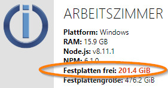
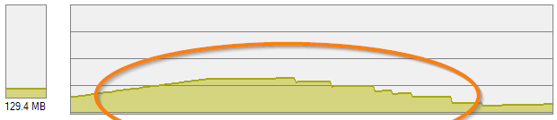
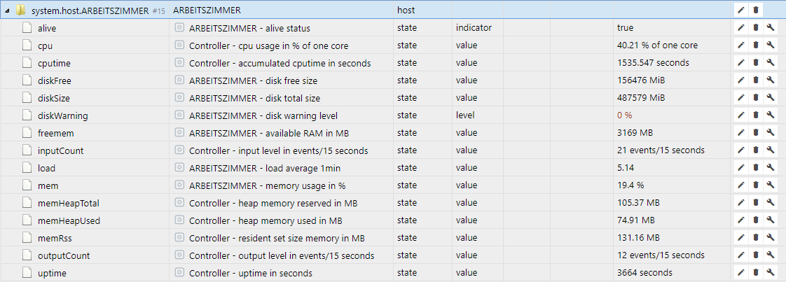

＃ 性能监控
ioBroker 中性能分析的起点是管理中的对象列表。
那里提供有关主机或主机（ioBroker 支持多主机）和各个适配器的系统信息。您可以通过将对象列表切换到专家模式来访问此信息：

## 主机性能值
用 ioBroker 的话来说，主机是一台运行 ioBroker js 控制器进程的机器。
在多主机环境中，这也可以由多台计算机来分配负载。
甚至使用的相应操作系统也可能不同。
一个很好的任务，例如 Raspberry Pi 集群堆栈来应对 1GB RAM 硬件限制。

ioBrokers js 控制器协调适配器的启动和停止，并在后台执行其他系统管理任务。在管理员中，您可以在 ID `system.host.<Name_des_Hostrechners>` 下找到相应主机和 js 控制器的性能值。

以下是各个关键数字及其含义的列表：

|测量 |数据类型 |单位 |说明 |
|----------|----------|---------|--------------|
| **活着** |逻辑 |没有 |指示ioBroker js 控制器是否在主机上处于活动状态 |
| **无磁盘** |号码 | MiB |安装 ioBroker 的逻辑驱动器上的可用空间 *bi = 二进制倍数（1 MB = 1,000,000 字节）<（1 MiB = 1,048,576 字节 = 1 × 1024 × 1024 字节）* |
| **磁盘大小** |号码 | MiB | ioBroker 安装的逻辑磁盘的总大小 |
| **磁盘警告** |号码 | % |您可以在此处输入百分比。如果数据介质上的可用空间低于此值（例如 20），则会在 Admin 中显示警告。这在历史适配器处于活动状态时特别有用。  |
| **免费内存** |号码 | MB |总可用主机 RAM 系统内存 |
| **输入计数** |号码 | /15 秒 |状态值的变化次数。例如，输入事件可以通过创建或设置值来触发 |
| **加载** |号码 | % | CPU 的总系统负载，平均超过一秒。不要惊讶，在 Windows 下这个值总是 0 |
| **模因** |号码 | % |内存使用情况。可用内存与系统总内存的比率 |
| **memHeapTotal** |号码 | MB | js 控制器预留的堆内存大小 |
| **memHeapUsed** |号码 | MB | js 控制器使用的堆大小 |
| **memRss** |号码 | MB |驻留集，内存中js控制器使用的内存总量 |
| **输出计数** |号码 | /15 秒 |输出事件包括比较值、将值写入状态数据库、由于订阅或记录适配器等操作，例如获取有关 .connected|或 .alive 状态的信息。这也是 8 个事件的产生方式，通常在实例列表中的事件输出值中。 |
| **正常运行时间** |号码 |小号 |自上次重启后此主机上 ioBroker 的运行时间 |

下图象征性地显示了堆、代码和堆栈如何影响 nodejs 进程的总内存使用量**memRss**：

如果主js控制器本身提供了整个系统的对象和状态数据库，就可以通过这个关键值来判断300和3000个ioBroker对象在内存消耗方面的区别。例如，在我的 Windows 系统上，这个值在 75 到 128MB 之间波动，有 3500 个对象和 2700 个状态。来自集成在 nodejs 中的垃圾收集的问候。
另一方面，如果我使用 Redis 作为状态数据库，js 控制器的内存消耗下降到 50MB。
（现在 Redis 需要额外的 25MB = 75MB ；））

如果状态更改的数量超过了相关事件消费者的处理能力（例如带有 on: 触发器的 Javascript），则会在内存数据库中建立一个队列。
这可以从js控制器的内存消耗看出来。一旦系统负载再次下降并且事件消费者有足够的时间来处理挂起的值更改，memRss 的值就会恢复到原始值：

在这种环境中经常出现这种情况，不可能根据固定值对错误原因做出准确的陈述。
但是，通常有帮助的是观察无故障系统（= 参考值），然后在故障条件下比较**相同的系统**。此外，如果您在历史记录中记录一个或另一个数据点，例如记录趋势和异常值，这将非常有用。

##适配器的性能值
每个适配器都有自己的性能指标。
它们都存储在 ID `system.adapter.<Name_des_Adapters>.<Instanz>` 下，并且与主机的略有不同。

|测量 |数据类型 |单位 |说明 |
|----------|----------|---------|--------------|
| **活着** |逻辑 |没有 |指示适配器是否处于活动状态 |
| **已连接** |逻辑 |没有 |指示适配器是否在最近 30 秒内报告过 |
| **输入计数** |号码 | /15 秒 |状态值的变化次数。例如，输入事件可以通过创建或设置值来触发 |
| **memHeapTotal** |号码 | MB |适配器保留的堆内存大小 |
| **memHeapUsed** |号码 | MB |适配器使用的堆内存大小 |
| **memRss** |号码 | MB |驻留集，适配器在 RAM 中使用的内存总量 |
| **输入计数** |号码 | /15 秒 |状态值的变化次数。例如，输入事件可以通过创建或设置值来触发 |
| **输出计数** |号码 | /15 秒 |输出事件包括比较值、将值写入状态数据库、订阅事件或记录适配器等操作，例如获取有关 .connected 或 .alive 状态的信息。这也是 8 个事件的产生方式，它们通常在实例列表中的事件输出值中。 |
| **正常运行时间** |号码 |小号 |自适配器启动后的适配器运行时 |

例如，如果 JavaScript 适配器在脚本更改后突然从 100 个 **inputCount** 事件跳到数千个，则强烈怀疑脚本中已经内置了触发循环，即环引用。

查看 **memRss** 也很有意义，例如检测由脚本或适配器引起的内存泄漏。使用 **alive** 和 **connected** 您可以很好地可视化适配器的状态，或者在适配器无法提供任何新值时抑制显示不正确的数据。

## 展望和问题
我将向您展示一张图片，作为对未来（以及我的开发环境）的一瞥：

使用适配器时，缺少由单个适配器引起的 CPU 负载 **cpu** 的显示。
毕竟，您想知道谁是系统中的罪魁祸首，即使没有安装额外的监控适配器占用大量资源。由于 nodejs 是单威胁的，所以这里的显示是指一个 CPU 内核。这里不可能超过 100%。

如果适配器在这里不断显示高值，则使用多核 CPU 无济于事。
在这种情况下，只有更快的 CPU（通常是更高的时钟）、程序代码的优化或在多个适配器上分配负载（如果可能）是有利的。

**cputime** 关键值可让您评估适配器自启动以来已使用的总处理器时间。
它提供有关程序使用处理器的频率或强度（关键字计算密集）的信息。
这个总和实际上总是低于适配器的总运行时间**正常运行时间**，因为适配器几乎不会不间断地向处理器发送命令，即使在密集使用时也是如此。

在这里，您可以看到各种关键数据如何交互以及 Javascript 适配器如何响应 Flot 中突然出现的请求波：

顺便说一句，这里的 JavaScript 适配器已经很忙了，以至于它无法立即接受所有事件。
形成了一个事件队列。

因此，我们还可以更多地了解<u>主机</u>上的负载，特别是关于所有适配器的主控器，js-controller，我还为此提供了一些性能计数器。以下编译显示了主机性能计数器未来可能出现的外观。

正如我所说，这取决于 Bluefox 的检查，最早来自 js-Controller 1.5.x：

总结一下，数据点的含义：

|测量 |数据类型 |单位 |数据源 |说明 |
|----------|----------|---------|-------------|--------------|
| **活着** |逻辑 |没有 | js 控制器 |指示 ioBroker js 控制器是否在主机上处于活动状态。自动切换为 false | 死亡后 25 秒 |
| **中央处理器** |号码 |核心利用率百分比 | js 控制器 |指示运行 js-controller 的核心的利用率。这里不可能超过 100%，因为 nodejs 是单线程的 |
| **计算时间** |号码 |小号 | js 控制器 |处理器时间（英文 CPU time）描述了自上次程序启动以来 js-controller 实际向处理器发送命令的测量时间（以秒为单位）。这个总和实际上总是低于程序的总运行时间（正常运行时间），因为这几乎不会不间断地向处理器发送命令，即使在密集使用时也是如此。 |
| **无磁盘** |号码 | MiB | |安装 ioBroker 的逻辑驱动器上的可用空间 *bi = 二进制倍数（1 MB = 1,000,000 字节）<（1 MiB = 1,048,576 字节 = 1 × 1024 × 1024 字节）* |
| **磁盘大小** |号码 | MiB | | ioBroker 安装的逻辑磁盘的总大小 |
| **磁盘警告** |号码 | % | |您可以在此处输入百分比。如果数据介质上的可用空间低于此值（例如 20），则会在 Admin 中显示警告。这在历史适配器处于活动状态时特别有用。  |
| **免费内存** |号码 | MB | |总可用主机 RAM 系统内存 |
| **输入计数** |号码 | /15 秒 | js 控制器 |状态值的变化次数。例如，输入事件可以通过创建或设置值来触发 |
| **加载** |号码 | | |所有 CPU 内核的总系统负载，每个内核平均超过一秒。例如，具有 8 个 CPU 内核的计算机 -> 值 7.9 = 系统几乎过载，0.1 = 没有任何反应； 4 核 -> 值 3.9 = 过载 - 如果是永久的，0.1 = 没有发生 |
| **模因** |号码 | % | |内存使用情况。可用内存与系统总内存的比率 |
| **memHeapTotal** |号码 | MB | js 控制器 | js-controller 保留的堆内存大小 |
| **memHeapUsed** |号码 | MB | js 控制器 | js-controller 使用的堆大小 |
| **memRss** |号码 | MB | js 控制器 |驻留集，内存中js-controller使用的内存总量|
| **输出计数** |号码 | /15 秒 | js 控制器 |输出事件包括比较值、将值写入状态数据库、订阅或日志记录等操作。这也是 10 多个事件的发生方式 |
| **内存可用** |号码 | MB | js 控制器 | （仅在 *nix 系统上）可用于新内存请求的可用内存，而系统不必开始换出已使用的内存。根据 MemFree、Active(file)、Inactive(file)、SReclaimable 和 `/proc/zoneinfo` 的较低阈值计算。 见[https://git.kernel.org](https://git.kernel.org/pub/scm/linux/kernel/git/torvalds/linux.git/commit/?id=34e431b0ae398fc54ea69ff85ec700722c9da773)|
| **内存可用** |号码 | MB | js 控制器 | （仅在 *nix 系统上）可用于新内存请求的可用内存，而系统不必开始换出已使用的内存。根据 MemFree、Active(file)、Inactive(file)、SReclaimable 和来自 `/proc/zoneinfo` 的下限阈值计算。 请参阅 [https://git.kernel.org](https://git.kernel.org/pub/scm/linux/kernel/git/torvalds/linux.git/commit/?id=34e431b0ae398fc54ea69ff85ec700722c9da773) |