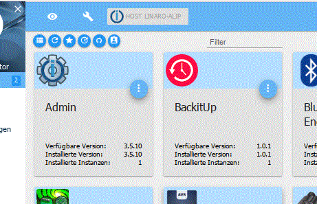
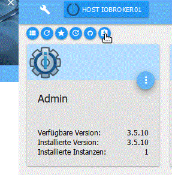

# 使用适配器的基础知识
ioBroker 上适配器和实例的安装分几个阶段进行。

这些术语总是很混乱。本页旨在通过解释 ioBroker 中最重要的管理任务如何执行以及它们背后的内容来阐明该主题。

## 行政任务
### 安装新适配器
实际安装将使用适配器所需的数据从服务器加载到本地主机。该数据在安装时保持“最新”状态，直至更新。

**关于管理员**

此功能无法通过管理员使用；它会在创建实例（实例化）时自动添加前缀。

**关于控制台**

``iobroker install AdapterName``

### 创建适配器实例
为了在 ioBroker 中使用适配器，您需要该适配器的一个（或多个）实例。这些实例是通过“实例”选项卡在管理员中配置的。

**关于管理员**

如果要创建适配器的实例，可以通过单击“管理”选项卡中相应适配器磁贴左下角的 (+) 来完成此操作。

**关于控制台**

``iobroker add AdapterName``

如果主机上还没有适配器所需的文件，将首先自动执行 iobroker install AdapterName。只有这样才会创建实例。

***通过 npm 控制台（仅限专家！）***

``cd /opt/iobroker``

``npm install iobroker.AdapterName``

**仅当所有其他方法因某种原因不起作用时才应使用此版本。**

危险！在较新的安装中，使用 npm install 会直接导致安装后权限问题或失败。推荐使用iobroker命令！！

### 升级适配器
如果有新版本的适配器，可以进行更新。适配器也可能需要另一个适配器的特定版本。因此，始终使所有适配器保持最新状态是有意义的

**关于管理员**

如果适配器已升级，相应磁贴的标题栏将变为绿色。新版本号将以绿色显示在“可用版本”下的图块上，升级图标将出现在其左侧。如果您想升级此适配器，请单击此图标。

然后在后台发生两个过程：适配器文件的实际升级，然后将文件上传到实例。

**关于控制台**

``iobroker upgrade AdapterName``

### 上传适配器文件
仅在特殊情况下才需要此功能。如果使用上述过程，则不需要此功能。

仅当有经验的用户知道自己在做什么，自己更改文件，或者从 Github 加载 beta 版本时，才需要此功能

关于管理员 为此，必须在“管理员”选项卡中激活专家模式。然后，其他图标会出现在磁贴中。向上箭头（右侧第三个图标）执行此上传。

**关于控制台**

``iobroker upload AdapterName``

### 降级适配器
如果新版本出现问题，您可以再次降级适配器。

**关于管理员**

要降级，您首先必须切换到专家模式，然后调出可用版本列表：

此列表显示开发人员为此功能发布的所有版本。

请点击此处所需的版本。

**关于控制台**

``iobroker upgrade AdapterName@ver.si.on``

其中***AdapterName***是根据iobroker更新中的列表所需的适配器的名称，***ver.si.on***是相应格式的版本号。

***通过 npm 控制台（仅限专家！）***

``cd /opt/iobroker``

``npm install iobroker.AdapterName@ver.si.on``

**仅当所有其他方法因某种原因不起作用时才应使用此版本。**

危险！在较新的安装中，使用 npm install 会直接导致安装后权限问题或失败。推荐使用iobroker命令！！

## 其他重要信息
### 管理中的适配器列表
这里实际上只是所选存储库中存在的适配器列表（主要设置）。这里显示的内容还没有在主机上。

该列表每天凌晨 2:00 左右在服务器上更新，并在致电管理员时在线更新。如果由于某种原因没有连接到服务器，则此列表仅包含已安装或根本无法加载的适配器。

### 不同的安装源
总是会出现这样的问题：为什么提到某个版本但不提供更新。这就是为什么这里应该再次解释一下背景：

**适配器发布分为三个级别**

* 存储库稳定，一切稳定并经过测试
* 最新的存储库，尚未完全测试
* Github、开发者版本、部分测试版甚至未完成的版本

版本

如果没有太多改变，这些阶段都可以有相同的版本，但在不同的存储库或 Github 中也可能存在较大的跳跃。

**您希望从中接收适配器版本的存储库**在子页面[主要设置](../admin/settings.md#Haupteinstellungen)的系统设置中指定。

子页面 [存储库](../admin/settings.md#Verwahrungsorte) 上列出了可用于此目的的存储库。

**Github 的开发版或测试版**通过 [章鱼符号](../admin/adapter.md#die-icons-im-einzelnen) #5 安装。

要么简单地在 ***Github*** 下拉菜单中，要么通过在 ***any*** 选项卡下输入 Github 存储库的地址，这对于“外部”适配器开发人员来说尤其常见。

**只有在咨询开发人员后才能安装 GitHub。**

### 安装 Github
（仅供专家参考！ ）

安装 Github 只能由专家来完成。这里只有测试版本，或者更糟糕的是，未完成的版本。安装它们可能会破坏整个 ioBroker 安装！

如果无论如何通过 GitHub（Octocat 图标）执行更新（或由存储库维护者建议通过论坛进行故障排除），则新文件将仅保存在本地，而不会传递到实例。因此，对于1.5以下的js控制器版本，必须手动上传。

为此，必须在“管理”选项卡中激活专家模式。然后，其他图标会出现在磁贴中。向上箭头（右侧第三个图标）执行此上传。