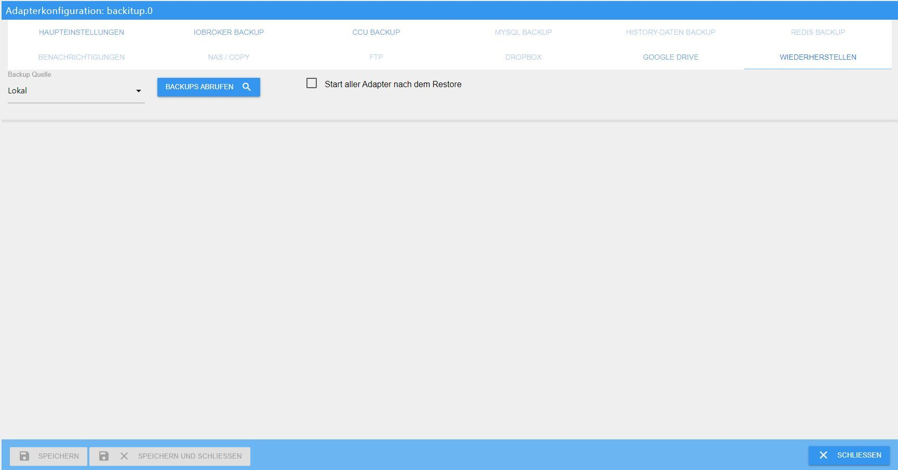
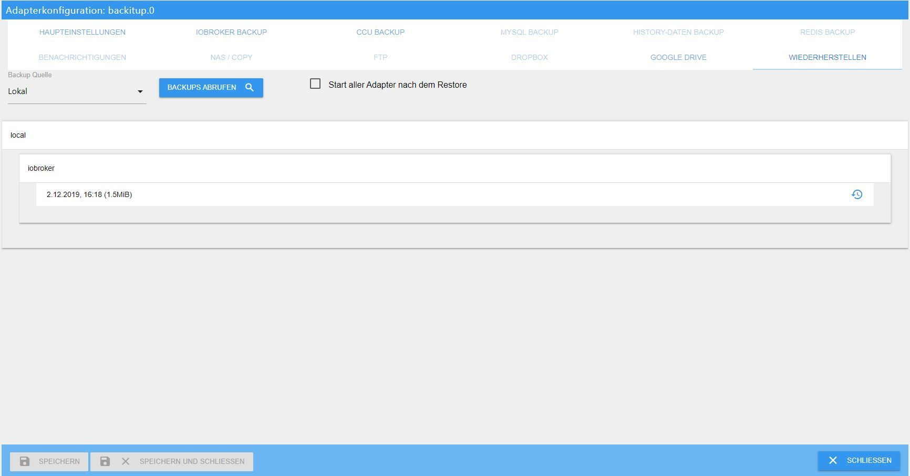
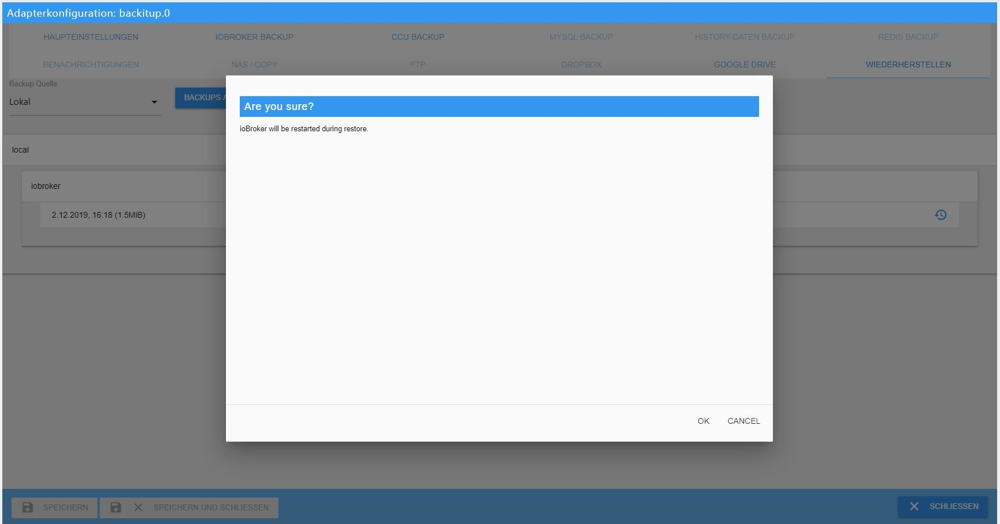
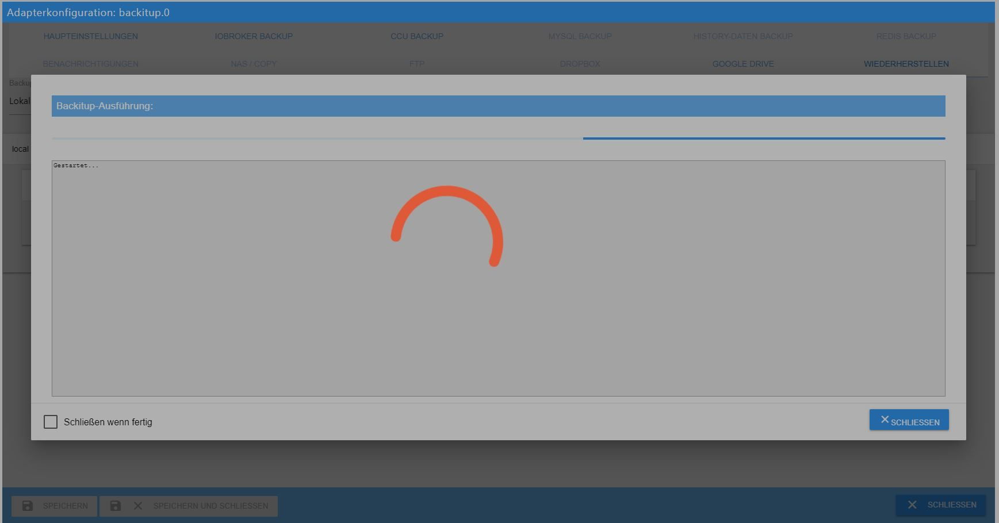
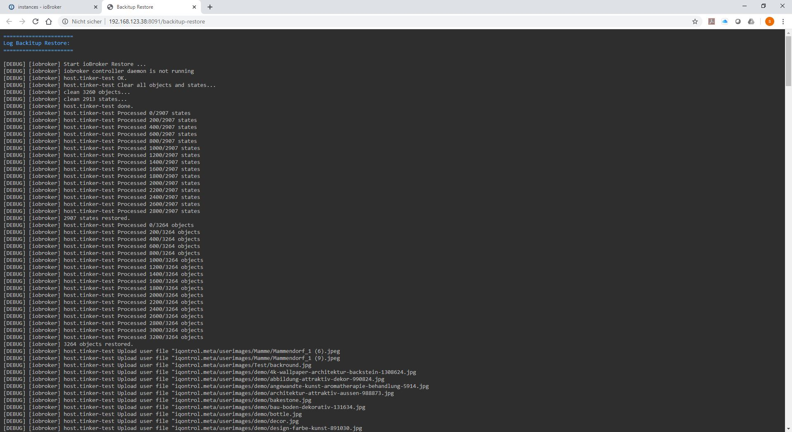
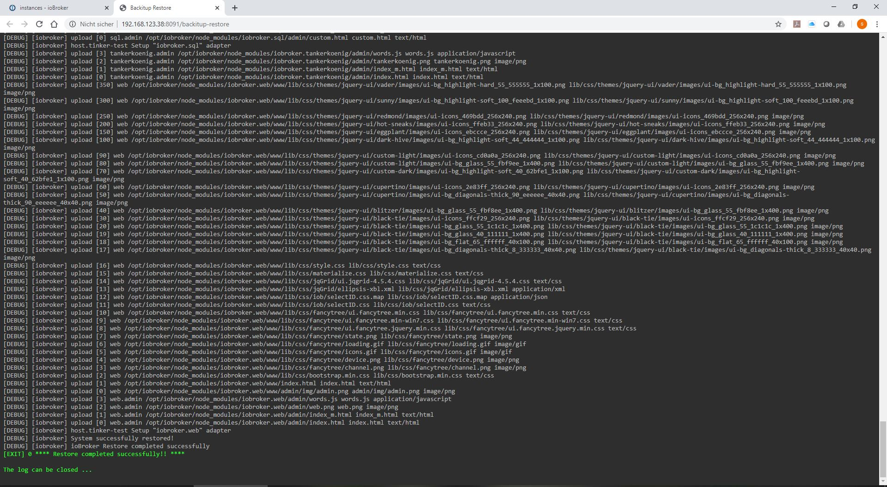
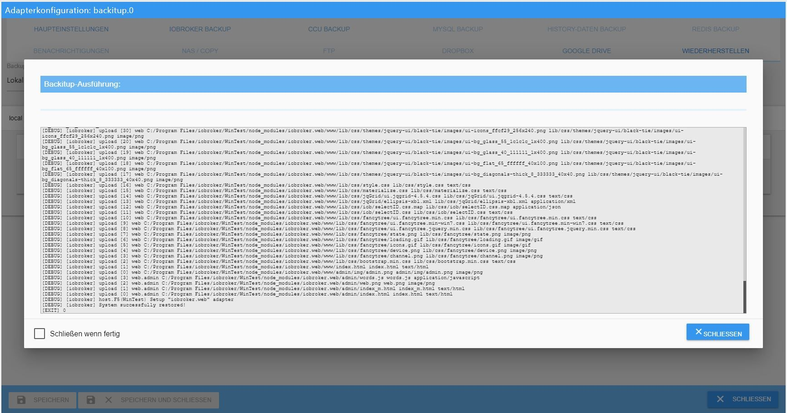
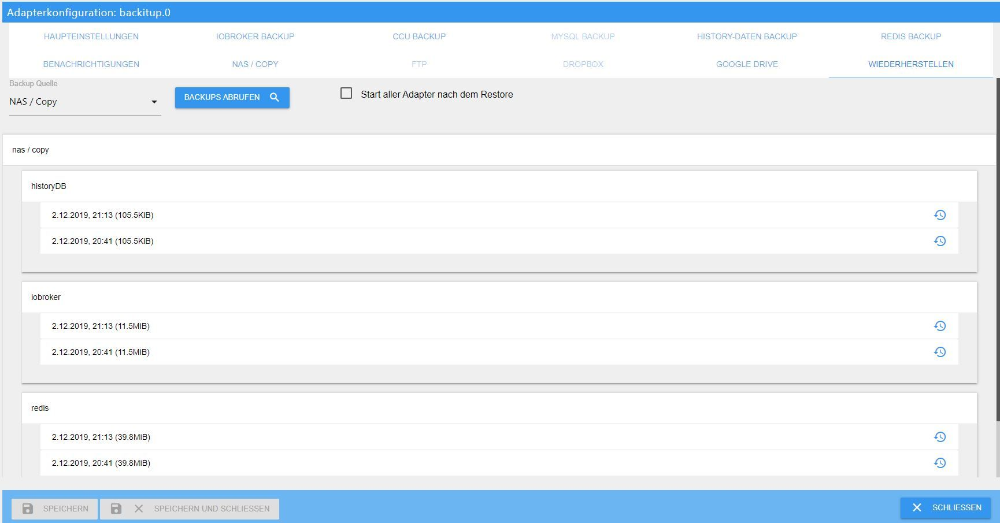

＃ 基本
如何在 Linux 系统上正确执行 ioBroker 安装的还原？

＃＃＃ 前言：
由于一些用户发现恢复非常困难，崩溃后、硬件更改、系统更改或其他操作后的逐步恢复说明应该会有所帮助。

基本上，人们可以提前说一件事：如果执行正确，可以在几分钟内完成恢复，没有人需要害怕。

最后，所有数据都再次可用，并建立了一个新系统。

＃＃＃ 准备：
一个可执行的 ioBroker 安装对于准备工作是必不可少的。

有两种方法可以做到这一点。
从 [下载区](https://www.iobroker.net/#de/download) 获取完成的映像，设置您自己的 Linux 操作系统并根据此 [手动的](https://www.iobroker.net/#de/documentation/install/linux.md) 安装 ioBroker。

＃＃＃ 下一步
如果旧系统在Redis中保存了状态和/或对象，则新系统必须首先配备Redis服务器。

如果您不确定是否使用了Redis并且仍然可以访问旧系统，请使用命令`iobroker status`获取所需信息。“使用Redis时，输出如下所示：

```
iobroker is running on this host.

At least one iobroker host is running.

Objects type: redis
States  type: redis
```

如果“redis”写成Objects类型和/或States类型，则必须在新系统上安装Redis服务器。
如果两种类型都说“文件”，则不需要 Redis 服务器。

如果您不再访问旧系统并且您不知道之前究竟配置了什么，那么您绝对应该提前安装Redis服务器。

#### Redis 安装：
为此，请通过 putty 转到终端并执行以下命令：

```
sudo apt-get update
sudo apt-get install redis-server
sudo usermod -a -G redis iobroker
sudo reboot now
```

如果您没有系统的所有权限，接下来要做的是运行安装程序修复程序。
这一步只是一个建议，并不是绝对必要的。

```
curl -sL https://iobroker.net/fix.sh | bash –
```

使用小工具“htop”，您可以很好地查看所有正在运行的进程，这不仅对恢复很有趣，而且在一般情况下也非常有用。
这是安装如下：

在控制台中运行以下命令：

```
sudo apt-get install htop
```

完成此操作后，即可进行实际还原。

＃＃＃ 恢复：
还有2个选项：

#### **1。自动恢复备份**
由于这里不需要 Linux 知识，并且整个过程都是通过 Iobroker Web 界面完成的，因此首先使用 [把它备份](https://github.com/simatec/ioBroker.backitup/blob/master/README.md) 进行自动恢复的变体。

为此，必须安装适配器备份。
这是通过“适配器”选项卡完成的。在那里搜索 Backitup 并使用 (+) 安装一个实例。

安装完成后，使用sftp程序（例如FileZilla或WinSCP）将旧系统先前创建的“ioBroker备份”保存在路径/ opt / iobroker / backups中的新系统上。

Backitup 也可以从 NAS、Dropbox 或 Google Drive 执行还原，但本地变体出现问题的可能性最小。

如果您已经有安装 NAS 的经验，也可以使用它，特别是因为您可以直接访问旧安装的现有目录。
但是，本教程指的是本地存储的备份。

如果 ioBroker Backup 已成功保存，则现在打开备份并打开“恢复”选项卡。
在那里，将“备份源”设置为本地，然后保存。



如果所有实例要在还原后自动启动，则必须激活选项“还原后启动所有适配器”，然后保存。
如果要在不同的主机上恢复备份，则不应使用此选项，因为在启动各个实例之前可能需要调整 IP 地址。

保存后，可以使用“检索备份”按钮调用本地路径上的现有备份。

刚刚通过 FTP 复制的备份应该出现在“iobroker”下的列表中。
现在选择这个。



选择后有提示iobroker会停止恢复然后重启。



在这里，您开始了实际的恢复过程。



另一个选项卡现在将在您的浏览器中打开，您可以在其中按照备份 WebUI 中的恢复过程进行操作，就像在控制台上一样。



恢复成功完成后，您还将在恢复的 WebUi 中收到消息。



恢复可能需要一些时间，具体取决于系统的性能和旧 ioBroker 安装的大小。
通常，恢复应在大约 10-15 分钟后完成，ioBroker 应再次自动启动。



在极少数情况下，ioBroker 在恢复后不会自动启动。
如果是这种情况，您可以通过控制台使用以下命令手动启动 iobroker。

```
iobroker start
```

现在 ioBroker 应该再次启动，“日志”选项卡显示旧系统上安装的所有适配器当前正在由 npm 重新安装。

在这里你必须要有耐心，让 iobroker 来做。
在实例中，您可以看到逐步安装了哪些适配器。
仍在安装或保留的所有适配器在实例中还没有图标。
请不要重新启动 ioBroker，最多不时使用 F5 更新视图，直到所有实例都提供一个图标。

根据安装的大小以及您的计算机和 Internet 连接的速度，这可能需要 2-3 个小时。

恭喜，新安装的系统现已完成所有设置、脚本、可视化等。

有了Backitup，现在可以恢复更多数据，前提是这些数据也提前备份到了旧系统上。
您可以使用与上述相同的步骤恢复 Redis 数据库、Zigbee 数据库、mySql 数据库和您的历史数据。

在示例中，检索到的备份列表将如下所示。



*****************************************************************************************************************************************

#### **2。使用终端命令手动恢复**
首先，必须通过 Putty 或类似的东西发送一些命令。

首先必须创建一个备份文件夹：

```
sudo mkdir /opt/iobroker/backups
```

在这里，在旧系统上创建的备份以及必要时的 Redis 备份、zigbee 备份等也是使用 sftp 程序（例如 FileZilla 或 WinSCP）执行的。
放在文件夹/opt/iobroker/backups。

如果状态和对象保存在 Redis DB 中，则应首先在此处恢复保存的 Redis 数据库。
如果只有状态在 Redis 下运行，则不一定必须提前。

完成此操作后，您可以按如下方式停止 ioBroker：

```
iobroker stop
```

然后请使用以下命令检查是否一切都已停止：

```
iobroker status
```

如果所有输出都正确并且 iobroker 已停止，则现在可以使用以下命令通过控制台执行恢复：

```
cd /opt/iobroker
iobroker restore <Dateiname eures Backups>
```

!> **使用此方法只能恢复一个 ioBroker 备份非常重要。
Redis 备份、Zigbee 备份、mySql 备份或历史数据无法使用此命令创建**

为此需要 Backitup，因为这些是用 Backitup 专门创建的。

这现在可能需要几分钟，具体取决于您的系统。进度显示在终端中。
恢复完成后，使用以下命令重新启动 ioBroker：

```
iobroker start
```

在这里，所有适配器现在也由 ioBroker 通过 npm 单独重新安装。
这可能需要一段时间，具体取决于您的安装大小、互联网速度和系统性能。
可以在“日志”选项卡中跟踪当前状态。

现在已完成并重新安装系统并恢复所有设置、脚本、可视化等。

＃＃＃ 结论：
基本上，两种变体都会导致相同的结果。
如果您对终端命令的经验很少并且感到不安全，那么使用 Backitup 是安全的。

但是，如果您想确切地查看系统上发生的情况，您应该通过控制台选择手动变体。在这里，您可以在终端中详细查看每个进程。