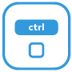
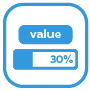
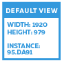
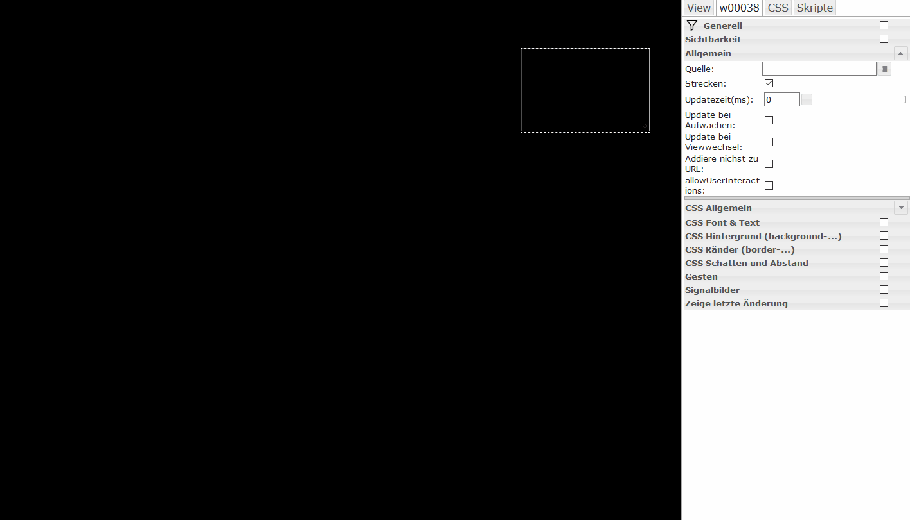

＃基本的
|小部件 |图片 |描述

| [`HTML`](#html-frame)| |此小部件显示任意 HTML 代码。|
| [`SVG形状`](#svg-shape)| |表示形状|
| [`iFrame`](#iframe)| |这个小部件包括一个 iFrame|
| [`图片`](#image)| |此小部件显示图像。|
| [`链接`](#link)| |此小部件对应于“静态 - HTML”小部件，但也是其整个区域的可点击链接。可用于在视图之间导航或用于外部链接。|
| [`边界`](#border)| |表示一个框架，可选择带有标题和标题栏|
| [`iFrame8`](#iframe8)| |在 iFrame 中最多显示 8 个图像|
| [`在小部件中查看`](#view-in-widget)| |这个小部件可以在视图中显示视图。对导航很有用：您可以使用导航元素设置视图，然后将它们集成到任意数量的其他视图中。|
| [`在小部件 8 中查看`](#view-in-widget-8)] | |根据状态显示 8 个视图之一。|
| `Image 8`| |根据状态显示 8 个图像之一。|
| [`HTML 导航`](#html-navigation)| |此小部件用于创建视图之间的导航。对应于“静态链接”小部件，但只能用于视图之间的导航，并且还提供了在更改视图时使用动画效果的选项。|
| [`过滤器-下拉`](#filter-dropdown)| ||
| [`数字`](#number)| |这个小部件代表一个数值|
| [`字符串`](#string)| |这个小部件代表一个字符串类型的数据点。|
| [`字符串（未转义）`](#string--unescpaped-)| |此小部件表示字符串类型的数据点。与“hm_val - 字符串”小部件相比，没有“转义”特殊字符 - 即变量也可以包含 HTML 代码，然后显示.|
| [`字符串img src`](#string-img-src)| |可以将字符串类型的变量分配给此小部件，然后将其中包含的 URL 显示为图像|
| `Timestamp`| ||
| [`最后更改时间戳`](#last-change-timestamp)| ||
| [`ValueListText`](#valuelist-text)| |此小部件表示类型值列表的变量。|
| [`ValueListHTML`](#valuelist-html)| |这个widget代表一个valuelist类型的变量。对应widget“hm_val - ValueList Text，但不是“转义”，即可以在valuelist中输入HTML代码。|
| [`ValueList HTML 样式`](#valuelist-html-8)| |此小部件表示值列表类型的变量。对应小部件“hm_val - ValueList HTML，但提供了使用 8 种不同值（0-7）和 8 种不同 CSS 规范的选项。|
| [`布尔HTML`](#bool-html)| |此小部件显示布尔值。|
| `AckFlag HTML`| ||
| [`布尔复选框`](#bool-checkbox)| |这个小部件将布尔值显示为一个简单的复选框，还允许切换值。|
| [`布尔选择`](#bool-select)| |此小部件将布尔值显示为下拉列表，还允许切换值。|
| [`布尔 HTML 控件`](#bool-html-control)| |此小部件显示布尔值，还允许在小部件区域内切换值以单击。|
| [`布尔 SVG`](#bool-svg)| |该小部件在小部件区域内单击时设置一个值。|
| [`HTML 状态`](#html-state)| |当相关数据点的值为 0 或 false 时，此小部件会消失。聪明的例如用于显示服务消息|
| [`红色数字`](#hide-on-0-false)| |以 iOS 通知图标的样式显示数值。在值为 0 时消失。|
| [`灯泡开/关`](#bulb-on-off)| |此小部件将值表示为黑色背景上关闭或点亮的灯泡。可用于布尔值和浮点值（调光器）。|
| [`灯泡开/关控制`](#bulb-on-off-control)| |此小部件将值表示为黑色背景上关闭或点亮的灯泡。可用于布尔值和浮点值（调光器）。|
| [`酒吧`](#bar-horizontal)| |此小部件将 0-100 的值显示为水平条。|
| `Note`| ||
| `json Table`| ||
| `HTML logout`| ||
| `Gesture indicator`| ||
| `Speech to text`| ||
| `Full Screen`| ||
| `Screen Resolution`| ||
| `屏幕分辨率` | ||

### HTML 框架
这个小部件可以渲染任何 HTML 代码，也可以在小部件内部使用 Javascript。

|属性|描述|
|-----|----|
| `ObjectId`|要显示的包含 HTML 的对象的 ID|
|前缀 html|要在对象之前呈现的 HTML 代码|
|追加 Html|要在对象之后呈现的 HTML 代码|

**示例：** 

### SVG 形状
这个小部件简单地呈现一个几何形状，其中包含一些预定义的形状。

|属性|描述|
|-----|----|
|类型|几何形状|
|线条颜色|形状边框颜色|
|填充颜色|填充颜色|
|线宽||
|旋转|从初始位置旋转的角度，以度为单位|
|宽度缩放|在 0 和 100% 之间缩放宽度|
|海拔刻度|在 0 到 100% 之间缩放海拔|

**示例：** 

### IFrame
表示一个 iFrame

|属性|描述|
|-----|----|
|来源|来源路径（网站、图片）；这可以在本地或通过 URL| 定义 |
|没有沙箱|:建设:|
|更新时间|:施工:|
|唤醒更新|：构造：|
|在视图更改时更新|：构造：|
|不要添加到 URL|:construction:|
|滚动 X|：建筑：|
|滚动 Y|：建筑：|
|无框|:构造:|

**示例：** 

＃＃＃ 图片
此小部件显示图像。

|属性|描述|
|-----|----|
|源|本地文件系统中源的路径|
|拉伸|使图像适合框架尺寸|
|更新时间|:施工:|
|唤醒更新|：构造：|
|在视图更改时更新|：构造：|
|不要添加到 URL|:construction:|
|允许用户交互|:构造:|

**示例：** 

＃＃＃ 关联
此小部件对应于“HTML 框架”小部件，但也是其整个区域的可点击链接。可用于在视图之间导航或用于外部链接。

|属性|描述|
|-----|----|

| `html`|不言自明 ;) ...在此处插入 HTML 代码以格式化文本显示。
| `link`|链接网址。要使用指向另一个视图的链接，只需输入视图名称，前面带有井号 (#) | `target`|链接的目标。留空以留在同一浏览器窗口中；如果要打开一个新窗口，请输入 _blank。更多选项：_self（相同选项卡）、_parent()、_top()

**示例：** 

###边框
这个小部件只代表一个框架——没有其他功能，只有文本和颜色。这可用于对小部件进行分组。

|属性|描述|
|-----|----|

|标题|不言自明|标题字体|标题字体|顶部标题颜色|标题颜色 |标题背景|标题文本背景颜色 | Title-Top-Distance|标题到上边缘的距离| Title-Left-Spacing|标题与左边距的间距|头部高度|从顶部开始的条形高度|头部颜色|条形颜色

**示例：** 

### 在小部件 8 中查看
根据状态显示 8 个视图之一。

|属性|描述|
|-----|----|

| `persistent`|已经渲染过一次的视图不再从 DOM 中移除

### IFrame 8
根据状态显示 8 个 iFrame 之一。

### HTML 导航
此小部件用于在视图之间构建导航。对应于“静态-链接”小部件，但只能用于在视图之间导航，并且还提供在更改视图时使用动画效果的选项。

|属性|描述|
|-----|----|

| `html`|不言自明 ;) ...在此处插入 HTML 代码 | `nav_view`|要在此处输入导航的视图名称 | `hide_effect`|这里可以输入一个jQueryUI效果的名字，在离开视图时使用。可用的效果有：盲、弹跳、剪辑、掉落、爆炸、淡入淡出、折叠、高光、粉扑、脉动、缩放、摇动、大小、滑动和转移。
| `hide_duration`|效果的持续时间（毫秒）| `show_effect`|见上文，相同 - 但这次是为了显示新视图 | `show_duration`|见上文，显示新视图的时间以毫秒为单位

### 过滤器 - 下拉
＃＃＃ 数字
此小部件表示一个数值（可用于整数和浮点数）

|属性|描述|
|-----|----|

| `html_prepend`|显示在数值前面的文本或 HTML 代码 | `html_append`|数值后面显示的文本或 HTML 代码 | `digits`|显示的小数位数 | `factor`|数值乘以的因子

＃＃＃细绳
这个小部件代表一个字符串类型的数据点。

|属性|描述|
|-----|----|

| `html_prepend`|在字符串之前显示的文本或 HTML 代码。
| `html_append`|字符串后显示的文本或 HTML 代码。

### 字符串（未转义）
这个小部件表示字符串类型的数据点。与“hm_val - String”小部件相比，没有“转义”特殊字符 - 即变量也可以包含 HTML 代码，然后显示。

|属性|描述|
|-----|----|

| html_prepend|要在字符串之前显示的文本或 HTML 代码。
| html_append|要在字符串之后显示的文本或 HTML 代码。

### 字符串 img src
可以将字符串类型的变量分配给这个小部件，然后将其中包含的 URL 显示为图像。

|属性|描述|
|-----|----|

| `html_prepend`|显示在图像前面的文本或 HTML 代码。
| `html_append`|图像后面显示的文本或 HTML 代码。

### 上次更改时间戳
显示连接状态的最后一个时间戳。

### 值列表文本
这个小部件代表一个值列表类型变量。

|属性|描述|
|-----|----|

| `valuelist`|分号分隔的各个值的文本列表。
| `html_prepend`|显示在图像前面的文本或 HTML 代码。
| `html_append`|图像后面显示的文本或 HTML 代码。

### 值列表 HTML
这个widget代表一个valuelist类型的变量，对应widget“hm_val - ValueList Text，但不是“转义”，即valuelist中可以输入HTML代码。

|属性|描述|
|-----|----|

| `valuelist`|分号分隔的 HTML 代码列表，用于各个值。
| `html_prepend`|显示在图像前面的文本或 HTML 代码。
| `html_append`|图像后面显示的文本或 HTML 代码。

### 值列表 HTML 8
这个小部件表示一个值列表类型的变量，对应“ValueList HTML”小部件，但提供了使用8种不同的值（0-7）和8种不同的CSS规范的选项。

|属性|描述|
|-----|----|

| `html_append`|图片后面显示的文本或 HTML 代码|

| `html_append`|要在图像后面显示的文本或 HTML 代码|
| value0 to value7|值0到7的文本或HTML代码| style0 to style7|值0到7的CSS规范 |

### 布尔 HTML
此小部件表示布尔值。

|属性|描述|
|-----|----|

| `html_prepend`|显示在图像前面的文本或 HTML 代码。
| `html_append`|图像后面显示的文本或 HTML 代码。
| `html_true`|如果为真则显示的文本或 HTML 代码。
| `html_false`|在 False 的情况下显示的文本或 HTML 代码。

### 布尔复选框
这个小部件将布尔值显示为一个简单的复选框，还允许切换值。

|属性|描述|
|-----|----|

| `html_prepend`|复选框前面显示的文本或 HTML 代码。
| `html_append`|复选框后面显示的文本或 HTML 代码。

### 布尔选择
此小部件将布尔值显示为下拉列表，还允许切换值。

|属性|描述|
|-----|----|

| `html_prepend`|显示在图像前面的文本或 HTML 代码。
| `html_append`|图像后面显示的文本或 HTML 代码。
| `text_true`|真实案例的文字 | `text_false`|错误案例的文字

### 布尔 HTML 控件
此小部件显示布尔值，还允许在小部件区域内单击时切换值。

|属性|描述|
|-----|----|

| `html_prepend`|显示在图像前面的文本或 HTML 代码。
| `html_append`|图像后面显示的文本或 HTML 代码。
| `text_true`|真实案例的文字 | `text_false`|错误案例的文字

### 布尔值 SVG
###HTML 状态
当在小部件区域内单击时，此小部件会设置一个值。

|属性|描述|
|-----|----|

| `html`|显示的文本或 HTML 代码 | `value`|要设置的值

### 隐藏 0/false
当关联数据点的值为 0 或 false 时，此小部件会消失。巧妙地显示服务消息，例如

### 红色号码
以 iOS 通知图标的样式显示数值。在值为 0 时消失。

### 灯泡开/关
此小部件将值表示为黑色背景上关闭或点亮的灯泡。可用于布尔值和浮点值（调光器）。

### 灯泡开/关
此小部件将值表示为黑色背景上的关闭或点亮的灯泡。单击小部件可切换该值。

###扭握
这个小部件代表带有原始 Homematic 图标的扭握传感器。

### TFK
这个小部件代表与原始 Homematic 图标的门/窗接触。

### 横条
此小部件将 0-100 的值显示为水平条。

|属性|描述|
|-----|----|

| `factor`|值乘以的因子。示例：必须为调光器输入 100（从 0.00 到 1.00）。
| `color`|栏的 CSS 属性 background-color | `border`|栏的 CSS 属性边框 | `shadow`|栏的 CSS 属性 box-shadow | `reverse`|如果在此处输入 true，则条形图从右到左而不是从左到右显示。

### 条形垂直
对应于小部件“hm_val - 条形水平，但垂直而不是水平。

|属性|描述|
|-----|----|

| `factor`|值乘以的因子。示例：必须为调光器输入 100（从 0.00 到 1.00）。
| `color`|栏的 CSS 属性 background-color | `border`|栏的 CSS 属性边框 | `shadow`|栏的 CSS 属性 box-shadow | `reverse`|如果在此处输入 true，则条形图从下到上显示，而不是从上到下显示