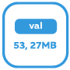
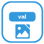
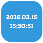
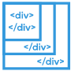

＃基本的
|小部件 |图片|描述

| [`HTML`](#html-frame) | |此小部件显示任意 HTML 代码。|
| [`Svg 形状`](#svg-shape) | |代表形状|
| [`iFrame`](#iframe) | |此小部件集成了 iFrame|
| [`图像`](#image) | |此小部件显示图像。|
| [`链接`](#link) | |此小部件对应于“静态 - HTML”小部件，但也是其整个区域的可点击链接。可用于视图之间的导航或外部链接。|
| [`边界`](#border) | |表示一个框架，可以选择带有标题和标题栏|
| [`iFrame8`](#iframe8) | |在 iframe 中最多显示 8 个图像|
| [`在小部件中查看`](#view-in-widget) | |此小部件可以在视图中显示视图，例如对于导航很有用：您可以使用导航元素构建一个视图，然后将它们集成到任意数量的其他视图中。 |
| [`在小部件 8 中查看`](#view-in-widget-8)] | |根据状态显示 8 个视图之一。|
| `Image 8` | |根据条件显示 8 个图像之一。|
| [`HTML 导航`](#html-navigation) | |此小部件用于设置视图之间的导航。对应于“静态链接”小部件，但只能用于视图之间的导航，并且还提供在更改视图时使用动画效果的选项。 |
| [`过滤器 - 下拉菜单`](#filter-dropdown) | ||
| [`数量`](#number) | |此小部件代表一个数值|
| [`字符串`](#string) | |此小部件代表字符串类型的数据点。|
| [`字符串（未转义）`](#string--unescpaped-) | |此小部件表示字符串类型的数据点，与小部件“hm_val - String”相比，没有特殊字符被“转义” - 即变量也可以包含 HTML 代码，然后显示。 .|
| [`字符串 img src`](#string-img-src) | |可以将字符串类型的变量分配给该小部件；然后将其中包含的URL显示为图像|
| `Timestamp` | ||
| [`最后更改时间戳`](#last-change-timestamp) | ||
| [`值列表文本`](#valuelist-text) | |此小部件代表值列表类型的变量。|
| [`值列表 HTML`](#valuelist-html) | |此小部件表示值列表类型的变量，对应于小部件“hm_val - ValueList Text”，但不“转义”，即可以在 valuelist 中输入 HTML 代码。 |
| [`值列表 HTML 样式`](#valuelist-html-8) | |此小部件表示值列表类型的变量，对应于小部件“hm_val - ValueList HTML，但提供了对 8 个不同值（0-7）使用 8 个不同 CSS 信息的可能性。|
| [`布尔 HTML`](#bool-html) | |此小部件显示布尔值。|
| `AckFlag HTML` | ||
| [`布尔复选框`](#bool-checkbox) | |此小部件将布尔值显示为简单的复选框，并且还允许切换值。|
| [`布尔选择`](#bool-select) | |此小部件将布尔值显示为下拉列表，并且还允许您切换值。|
| [`布尔 HTML 控件`](#bool-html-control) | |此小部件显示布尔值，并且还允许在小部件区域内单击时切换该值。|
| [`布尔 SVG`](#bool-svg) | |在小部件区域内单击时，此小部件会设置一个值。|
| [`HTML 状态`](#html-state) | |如果分配的数据点的值为 0 或 false，则该小部件消失。例如，非常适合显示服务消息 |
| [‘红色数字’](#hide-on-0-false) | |以 iOS 通知图标的样式显示数值。在值为 0 时消失。|
| [`灯泡开/关`](#bulb-on-off) | |此小部件在黑色背景上将值显示为关闭或点亮的灯泡，可用于布尔值和浮点值（调光器）。 |
| [`灯泡开/关控制`](#bulb-on-off-control)| |此小部件在黑色背景上将值显示为关闭或点亮的灯泡，可用于布尔值和浮点值（调光器）。 |
| [`酒吧`](#bar-horizontal) | |此小部件将 0-100 之间的值显示为水平条。|
| `Note` | ||
| `json Table` | ||
| `HTML logout` | ||
| `Gesture indicator` | ||
| `Speech to text` | ||
| `Full Screen` | ||
| `Screen Resolution` | ||
| `屏幕分辨率` | ||

### HTML 框架
该小部件显示任意 HTML 代码，也可以在小部件内使用 Javascript。

|属性|描述|
|-----|----|
| `ObjectId`|要显示的包含 HTML 的对象的 ID|
|前缀 html|要在对象之前显示的 HTML 代码   |
|附加 Html|要在对象后显示的 HTML 代码|

**示例：** 

### SVG 形状
该小部件仅代表几何形状，并预定义了一些形状。

|属性|描述|
|-----|----|
|类型|几何形状|
|线条颜色|形状边框颜色|
|填充颜色|填充颜色|
|线宽||
|旋转|从初始位置开始的旋转角度（以度为单位）|
|宽度缩放|在 0 到 100% 之间缩放宽度|
|高度比例|在 0 到 100% 之间缩放高度|

**示例：** 

### IFrame
代表一个 iFrame

|属性|描述|
|-----|----|
|来源|来源路径（网站、图像）；这可以在本地定义或通过 URL| 定义   |
|无沙箱|:建设:|
|更新时间|:施工:|
|更新唤醒|:建设:|
|更改视图时更新|:构造:|
|不要添加到 URL|:construction:|
|滚动 X|:构造:|
|滚动 Y|:构造:|
|无框架|:结构:|

**示例：** 

＃＃＃图像
该小部件显示图像。

|属性|描述|
|-----|----|
|源|本地文件系统中源的路径|
|拉伸|调整图像至框架尺寸|
|更新时间|:施工:|
|更新唤醒|:建设:|
|更改视图时更新|:构造:|
|不要添加到 URL|:construction:|
|允许用户交互|:构造:|

**示例：** 

＃＃＃ 关联
该小部件对应于“HTML 框架”小部件，但也是其整个区域上的可点击链接。可用于视图之间的导航或外部链接。

|属性|描述|
|-----|----|

| `html`|不言自明;) ...在此处插入 HTML 代码以格式化文本显示。
| `link`|链接 URL。要使用到另一个视图的链接，只需输入前面带有井号 (#) 的视图名称。 `target`|链接的目的地。留空以保留在同一浏览器窗口中；如果要打开新窗口，请输入_blank。  其他选项：_self（同一选项卡）、_parent()、_top()

**示例：** 

＃＃＃ 边界
该小部件仅显示一个框架 - 没有其他功能，只有文本和颜色。这可用于对小部件进行分组。

|属性|描述|
|-----|----|

|标题|不言自明|顶部标题字体|标题字体|顶部标签颜色|标题颜色|标题背景|标题文字背景色|标题顶部距离|标题距顶部边缘的距离|标题左距离|标题距左边缘的距离|头高|条形从顶部边缘到 | 的高度标题颜色|栏颜色

**示例：** 

### 在小部件 8 中查看
根据状态显示 8 个视图之一。

|属性|描述|
|-----|----|

| `persistent`|已渲染一次的视图无法再从 DOM 中删除

### IFrame 8
根据状态显示 8 个 iframe 之一。

### HTML 导航
该小部件用于在视图之间创建导航。对应于“静态链接”小部件，但只能用于视图之间的导航，并且还提供在更改视图时使用动画效果的选项。

|属性|描述|
|-----|----|

| `html`|不言自明;) ...在此处插入 HTML 代码 | `nav_view`|必须在此处输入您要导航到的视图的名称 | `hide_effect`|离开视图时使用的 jQueryUI 效果的名称可以在此处输入。可用的效果有：盲、弹跳、剪辑、掉落、爆炸、淡入淡出、折叠、高亮、蓬松、脉动、缩放、摇动、大小、滑动和转移。
| `hide_duration`|效果持续时间（以毫秒为单位）| `show_effect`|见上文，相同 - 但这次是为了显示新视图 | `show_duration`|参见上文，显示新视图的时间（以毫秒为单位）

### 过滤器 - 下拉菜单
＃＃＃数字
该小部件代表一个数值（可用于整数和浮点数）

|属性|描述|
|-----|----|

| `html_prepend`|在数值之前显示的文本或 HTML 代码 | `html_append`|显示在数值后面的文本或 HTML 代码 | `digits`|显示的小数位数 | `factor`|数值相乘的因子

＃＃＃细绳
这个小部件代表一个字符串类型的数据点。

|属性|描述|
|-----|----|

| `html_prepend`|显示在字符串之前的文本或 HTML 代码。
| `html_append`|显示在字符串后面的文本或 HTML 代码。

### 字符串（未转义）
该小部件表示字符串类型的数据点，与“hm_val - String”小部件相比，没有特殊字符被“转义” - 即变量也可以包含 HTML 代码，然后显示。

|属性|描述|
|-----|----|

| html_prepend|将在字符串之前显示的文本或 HTML 代码。
| html_append|显示在字符串后面的文本或 HTML 代码。

### 字符串 img src
可以将字符串类型的变量分配给该小部件；然后将其中包含的 URL 显示为图像。

|属性|描述|
|-----|----|

| `html_prepend`|显示在图像前面的文本或 HTML 代码。
| `html_append`|显示在图像后面的文本或 HTML 代码。

### 最后更改时间戳
显示连接状态的最后时间戳。

### 值列表文本
该小部件代表一个值列表类型变量。

|属性|描述|
|-----|----|

| `valuelist`|以分号分隔的各个值的文本列表。
| `html_prepend`|显示在图像前面的文本或 HTML 代码。
| `html_append`|显示在图像后面的文本或 HTML 代码。

### 值列表 HTML
该小部件表示值列表类型的变量，对应于小部件“hm_val - ValueList Text”，但不是“转义”的，即可以在值列表中输入 HTML 代码。

|属性|描述|
|-----|----|

| `valuelist`|以分号分隔的各个值的 HTML 代码列表。
| `html_prepend`|显示在图像前面的文本或 HTML 代码。
| `html_append`|显示在图像后面的文本或 HTML 代码。

### 值列表 HTML 8
该小部件代表值列表类型的变量，对应于“ValueList HTML”小部件，但提供了针对 8 个不同值（0-7）使用 8 个不同 CSS 信息的选项。

|属性|描述|
|-----|----|

| `html_append`|图像后面显示的文本或 HTML 代码|

| `html_append`|出现在图像后面的文本或 HTML 代码|
| value0 到 value7|值 0 到 7 的文本或 HTML 代码 | style0 到 style7|值 0 到 7 的 CSS 信息 |

### 布尔 HTML
该小部件显示布尔值。

|属性|描述|
|-----|----|

| `html_prepend`|显示在图像前面的文本或 HTML 代码。
| `html_append`|显示在图像后面的文本或 HTML 代码。
| `html_true`|True 情况下显示的文本或 HTML 代码。
| `html_false`|False 情况下显示的文本或 HTML 代码。

### 布尔复选框
该小部件将布尔值显示为简单的复选框，并且还允许您切换该值。

|属性|描述|
|-----|----|

| `html_prepend`|显示在复选框前面的文本或 HTML 代码。
| `html_append`|复选框后面显示的文本或 HTML 代码。

### 布尔选择
该小部件将布尔值显示为下拉列表，并且还允许您切换值。

|属性|描述|
|-----|----|

| `html_prepend`|显示在图像前面的文本或 HTML 代码。
| `html_append`|显示在图像后面的文本或 HTML 代码。
| `text_true`|真实案例文本| `text_false`|错误案例的文本

### 布尔 HTML 控件
该小部件显示布尔值，并且还允许在小部件区域内单击时切换该值。

|属性|描述|
|-----|----|

| `html_prepend`|显示在图像前面的文本或 HTML 代码。
| `html_append`|显示在图像后面的文本或 HTML 代码。
| `text_true`|真实案例文本| `text_false`|错误案例的文本

###布尔 SVG
### HTML 状态
当在小部件区域内单击时，此小部件会设置一个值。

|属性|描述|
|-----|----|

| `html`|显示的文本或 HTML 代码 | `value`|要设置的值

### 0/false 时隐藏
如果分配的数据点的值为 0 或 false，则该小部件消失。例如，非常适合显示服务消息

### 红色数字
以 iOS 通知图标的样式显示数值。在值为 0 时消失。

### 灯泡开/关
该小部件在黑色背景上将值显示为关闭或点亮的灯泡，可用于布尔值和浮点值（调光器）。

### 灯泡开/关
该小部件将值显示为黑色背景上关闭或点亮的灯泡。单击小部件可切换该值。

### 旋转手柄
该小部件代表带有原始 Homematic 图标的扭握传感器。

### TFK
该小部件代表与原始 Homematic 图标的门/窗接触。

### 水平条
该小部件将 0-100 之间的值显示为水平条。

|属性|描述|
|-----|----|

| `factor`|值相乘的因子。示例：对于调光器（从 0.00 到 1.00）必须输入 100。
| `color`|CSS 属性栏的背景颜色 | `border`|栏的 CSS 属性边框 | `shadow`|CSS 属性框阴影栏 | `reverse`|如果此处输入 true，则该栏将从右到左显示，而不是从左到右显示。

### 垂直条
对应于小部件“hm_val - Bar Horizontal”，但垂直而不是水平。

|属性|描述|
|-----|----|

| `factor`|值相乘的因子。示例：对于调光器（从 0.00 到 1.00）必须输入 100。
| `color`|CSS 属性栏的背景颜色 | `border`|栏的 CSS 属性边框 | `shadow`|CSS 属性框阴影栏 | `reverse`|如果此处输入true，则该栏将从下到上显示，而不是从上到下显示