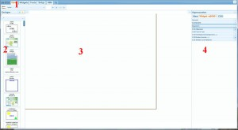
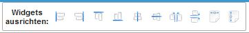
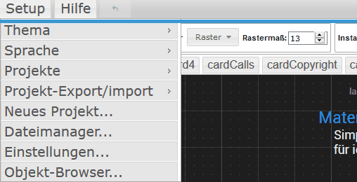
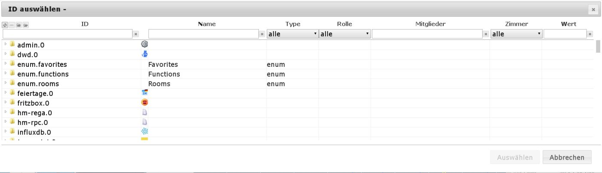
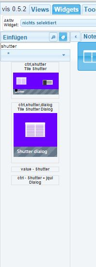

# 使用 VIS 进行可视化
＃＃ 作为基本规则
@@@ VIS 是一个强大的应用程序，值得详细的指南和教程。尚未确定本手册将以何种形式以及在何处提供。
@@@

## 
＃＃ 配置
不需要配置适配器。只能有一个 VIS 实例。

* * *

## 操作
通过`<IPdesServers>:8082/vis/index.html`调用适配器并显示可视化。
一个项目中有几个视图。
每个视图上可以自由放置几个widget，用于显示或操作。
要创建和配置可视化，您必须加载 **Editor**。
通过 `<IPdesServers>:8082/vis/edit.html` 或通过管理适配器的 Instances 选项卡中的超链接调用编辑器。
使用关闭窗口图标（右上角的 (x)）关闭编辑器后，最后编辑的视图将显示在功能视图中。
这可以随时通过`<IPdesServers>:8082/vis/index.html#ViewName`调用。编辑器分为不同的区域。

* * *

##页眉区域的选项卡（一）
### 观看次数
如果选择此选项卡，您可以从下面的下拉菜单中的现有视图中选择要编辑的视图。
 右侧的四个图标是不言自明的，指的是视图。
单击工作区后，Properties 侧栏中的视图将更改为右侧的 Views 选项卡，并显示视图的设置。

### 小部件
如果小部件选项卡被激活，则底层工具栏会发生变化。 显示用于编辑小部件的工具。

＃＃＃＃ 下拉菜单
您可以在此处选择要编辑的小部件，或在此处显示选定的小部件。

#### 图标栏
选择小部件时，删除、复制和信息的三个图标变为活动状态。

#### 对齐小部件
 如果您在按下鼠标按钮（或按住 Ctrl 单击）的情况下选择多个小部件，则可以使用这些图标来对齐组（左对齐、右对齐、上对齐、下对齐、居中，在中间垂直对齐）。
您还可以以相同的距离（水平和垂直）定位多个小部件，并使用最后两个图标调整几个小部件的大小。
如果您选择一个小部件，右侧属性侧栏中的视图将更改为小部件选项卡并显示此小部件的设置。
通过可能的多项选择，您可以通过右侧边栏同时更改多个小部件的属性。

#### 所有小部件
这两个小部件用于更轻松地编辑视图。
第一个确保小部件的值不被更新，第二个防止小部件被移动。

#### 导出小部件
如果小部件被激活，您可以使用此按钮导出小部件的 CSS 代码。

#### 导入小部件
相反，例如，您可以在此处导入不包含在 vis 范围内的小部件。
单击小部件后，属性侧栏中的视图将更改为右侧的小部件选项卡并显示所选小部件的设置。

＃＃＃工具
如果激活了“工具”选项卡，则底层工具栏会更改

＃＃＃＃ 解析度
此处显示了来自移动设备的许多预设屏幕分辨率，但“用户定义”项目还提供了进行自己设置的选项。
如果您在此处选择某些内容，则会在与所选屏幕分辨率相对应的工作区上绘制一个框架。

＃＃＃＃默认
如果选中_default_，则活动的[意见](http://www.iobroker.net/?page_id=1193&lang=de)将成为默认视图并在 VIS 视图（参见[项目](http://www.iobroker.net/?page_id=188&lang=de&preview_id=188&preview_nonce=d845a20ee2&preview=true#Projekt)）以上面设置的分辨率加载时加载。
**示例：** _iPad Portrait_ 显示被选中，_Default_ 框在_Start_ 视图中被选中。
假设从 iPad 上的项目加载了名为 _Weather_ 的横向格式视图。
如果 iPad 现在旋转为纵向格式，则会自动显示先前设置为此分辨率（纵向格式）的标准 (_default_) 的 _Start_ 视图。
使用相应的移动设备，可以通过移动进行控制（例如“返回主菜单”或_up_显示与_across_不同的视图）。

＃＃＃＃ 网格
这里有 _inactive_、_elements_ 和 _grid_ 选项。如果您选择元素，当您用鼠标移动它们时，小部件会捕捉到相邻的元素。使用网格，您可以指定小部件随后捕捉的网格大小（以 px 为单位）。

#### 实例 ID
此处显示一个唯一 ID，例如，可以使用 VIS [控制命令](https://github.com/iobroker/ioBroker.vis/blob/master/README.md#control-interface) 的脚本对其进行寻址。

#### 浏览器ID
单击此按钮会在前一个字段中创建一个新 ID。这意味着可以在每个终端设备上单独识别每个浏览器。

出口 ＃＃＃＃
在这里您可以导出您的视图，例如在另一个安装中使用它。单击该按钮时，将打开一个窗口，其中以文本形式提供视图。您可以使用 Ctrl-C 将此数据放在剪贴板上，然后将其加载到编辑器中，然后保存

＃＃＃＃ 进口
单击后，将打开一个空白窗口。您可以在此处复制通过 _export_ 函数接收到的文本文件。然后在左下角输入视图的名称并单击_import_ 按钮。从那时起，新视图可用。此功能对于从论坛导入示例很有用。

＃＃＃ 设置

＃＃＃＃ 主题
在这里，您可以为编辑器选择配色方案。

＃＃＃＃ 语言
可以指定编辑器的操作语言

####项目
项目是[看法](http://www.iobroker.net/?page_id=1193&lang=de)的集合。
项目_main_是默认创建的，通过`<IPdesServers>:8082/vis/index.html#ViewName`调用。
项目文件位于 ioBroker 安装的 `_ioBroker-Ordner_/iobroker-data/files/vis.0/main` 文件夹中。

#### 项目导出/导入
项目可以作为一个整体导出（例如与其他用户共享）：创建一个 zip 文件，其中包含使用的图像、样式表 vis-user.css 和实际定义 vis-views.json。
还可以选择匿名导出项目。 :construction: 要导入其他项目，只需将上述导出的 zip 文件拖到窗口上并输入新项目的名称：

＃＃＃＃ 新项目...
可以在这里创建一个新项目。
将打开一个窗口并提示您输入项目名称。
确认后，编辑器将新项目加载到这个地址：`<IPdesServers>:8082/vis/_projektname_/index.html#ViewName.`新项目的文件位于`_ioBroker-Ordner_/iobroker-data/files/vis.0/projektname`下的ioBroker安装中。
**提示**：您可以复制项目文件夹并在 VIS 编辑器`<IPdesServers>:8082/vis/_projektname_duplikat_/index.html`中编辑副本。

＃＃＃＃ 应用
加载项目时，此 [项目] :construction: (http://www.iobroker.net/? page_id =188&lang=de&preview_id=188&preview_nonce=d845a20ee2&preview=true#project) 也被加载。
有时这没有意义，并且会减慢系统速度。
因此，属于一起的视图可以组合在不同的项目中。
例如，根据具有不同屏幕分辨率的终端设备进行区分是有意义的。
您可以创建一个 _Smartphone_ 项目并在其中创建针对触摸操作和垂直对齐进行了优化的视图。
通过故意减少小部件的数量，该项目的数据量仍然很小，因此可以在旅途中快速加载（例如通过 VPN 和移动通信）。
另一个项目_Wandtablet_，它只显示在墙上的平板电脑上，不需要从_Smartphone_项目加载任何视图。
用于显示所有数据的主项目_main_ 通常只在桌面 PC 上显示和编辑。
数据量和计算速度通常在这里不起作用。
如果要在多个项目中使用视图，可以使用 [出口](http://www.iobroker.net/?page_id=188&lang=de&preview_id=188&preview_nonce=d845a20ee2&preview=true#exportieren) :construction:/ [进口](http://www.iobroker.net/?page_id=188&lang=de&preview_id=188&preview_nonce=d845a20ee2&preview=true#importieren) :construction: 命令复制它们。
无法通过导航小部件从一个项目链接到另一个项目。
**提示**：在试验 CSS 命令时创建一个测试项目也很有用。

#### 文件管理器... (6)
选择此菜单项后，无需其他程序即可方便地将文件复制到 ioBroker 文件系统中或从中复制出来。
文件管理器打开： [caption id="attachment_6007" align="aligncenter" width="799"] *图像只是示例图像，版权归各自公司所有。 [ /标题]

该行为类似于任何文件管理器。
使用蓝色按钮“向左箭头”，您可以通过单击文件夹进入更高的层级。
可以使用“文件夹+”图标创建一个新文件夹。
如果您已到达所需目录，则选择一个文件，您可以使用蓝色箭头将其下载到计算机，如果单击绿色箭头，“Dropbox”将打开。
文件可以简单地通过拖放存储在这里，然后通过点击_**上传**_按钮上传到ioBroker服务器。
或者，您可以单击该区域中的任意位置，然后将打开一个文件选择。
文件列表为空，如果不再上传文件，您可以通过 **_Close_** 按钮退出 Dropbox。

#### 设置... (7)

* _**如果没有连接超过：**_ 活动视图完全重新加载，则重新加载，

如果前端（平板电脑）和服务器之间的连接中断超过预设时间。
为了防止这种情况，这个时间也可以设置为_**never**_。

* _**重新连接间隔：**_前端应该尝试的时间

到达服务器。

* _**黑暗的重新连接屏幕：**_ 通常在尝试重新加载视图时页面是白色的。

为了不打扰黑暗的房间，可以使用此复选框将屏幕切换为黑暗。

* _**从 RAM 中删除非活动视图：**_ 释放前端宝贵的工作内存，

通常只有 1GB，尤其是在便宜的平板电脑上，可以从 RAM 中删除长时间不需要的视图。
但是，如果再次加载相应的视图，这将花费更长的时间。
此选项设置未使用的视图保存在 RAM 中的时间。

#### 对象浏览器... (8)
您可以在此处搜索对象。
单击 _**Select**_ 按钮后，它被放置在剪贴板上。
列标题上方的过滤器字段可用于更快地找到它们。

### 帮助 (5)
_快捷方式_下有关键命令的概述，_关于项目_下有简要信息。

### 撤消按钮 (6)
使用此按钮，您可以逐步撤消上一个操作。

* * *

## 小部件侧边栏 (2)
它用于选择小部件。
小部件显示为图标，可以拖放到工作区，或使用 _Insert_ 按钮定位在工作区的位置 0,0。
 _Insert_ 按钮下方的字段是过滤字段。
在这里，您可以输入一个术语来搜索它的图标。
显示包含该术语的所有图标。
如果您删除最后一个过滤器（或 \*），您将获得一个包含可能搜索词的下拉列表。
下面是小部件集的选择框。
星号 (*) 代表所有小部件集。
按术语过滤时，会自动搜索所有小部件集。
但是，除此之外，下拉菜单还提供各种小部件集作为过滤器。

* * *

## 工作台面 (3)
视图的小部件位于此处。这可以通过鼠标或箭头键来完成。
如果小部件选项卡处于活动状态，则还可以使用一些对齐辅助工具。

* * *

##设置侧边栏（4）
在这里，视图和小部件的所有设置都是通过相应的选项卡输入的。
此外，CSS 选项卡为高级用户提供了集成他们自己的开发的机会。

* 数据点映射
* 小部件大小
* 字体大小和颜色
*   背景
* 边框、线条颜色、类型、粗细
* css参数

为了能够显示数据点或执行操作，必须将数据点分配给小部件。
此条目可在_General_ 部分中找到。