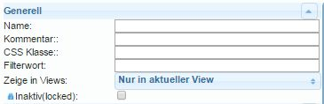
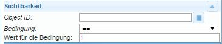
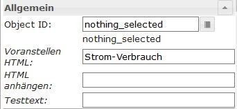
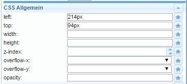
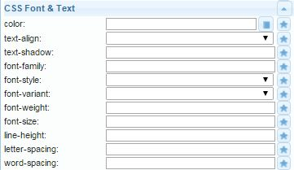
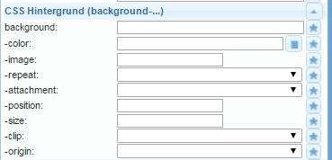
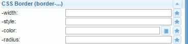
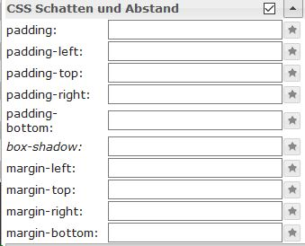

# 小部件
＃＃ 作为基本规则
在这种情况下，小部件（“设备、事物”）是以各种方式显示数字、文本、图像或图表并提供交互机会的显示元素。

## IoBroker.vis 小部件
ioBroker 中有不同的小部件集可用于使用 vis 进行可视化。

-------------------------------------------------------------------------------
-------------------------------------------------------------------------------

###小部件的基本设置
＃＃＃＃ 作为基本规则

|属性 | 描述 |
|-----|----|

|名称 | 可以在此处输入此小部件的唯一名称 |评论 | 可在此处输入简短说明 | CSS 类 |: 构造: |过滤词|：结构：|在视图中显示 | 您可以在此处选择此小部件是仅出现在当前视图中还是出现在多个视图中。
|非活动（锁定）|：构造：

#### **可见性**
小部件的可见性可以取决于数据点的状态。

|属性 | 描述 |
|----|----|

| `Object ID` | 输入用于控制所选小部件可见性的数据点的 ID。可以使用按钮搜索数据点。
|条件 | 如果在此处为上述数据点输入条件，则小部件可见...
|条件 | ... 的值对应于此处输入的值。

＃＃＃＃ **一般来说**
“常规”部分特定于每个小部件，并针对各个小部件进行了更详细的描述。
在此部分中，所需的数据点被分配给对象 ID 字段中的小部件。

*** 小部件的 **CSS 设置** 可在以下菜单项中找到，并可根据您自己的要求进行调整：

#### **一般的 CSS**

|属性 | 描述 |
|-----|----|

| `left` | 与视图左边缘的距离 | `top` | 与视图顶部的距离 | `width` | 小部件的宽度 | `height` | 小部件的高度 | `z-index` | 指定widget所在的层级（0=在背景上，正值=值越高，越靠前）| `overflow-y` |

| `溢出-y` |
| `opacity` | 透明度（0 = 不透明 -> 图像不可见 .. 1 = 透明 -> 图像可见） |

#### CSS 字体和文本

|属性 | 描述 |
|-----|----|

| `color` | 字体颜色（通过选择对话框或通过颜色代码）| `text-align` | 文本对齐（左、右、居中）| `text-shadow` | 文字阴影的颜色 | `font-family` | 字体 | `font-style` | 字符集类型（正常、斜体、斜体、首字母、继承）| `font-variant` | 字符集变体（正常、小型大写字母、...）| `font-weight` | 字符集强度 | `font-size` | 字体大小 | `line-height` | 行距 | `letter-spacing` | 字符间距 | `word-spacing` | 字间距

#### **CSS 背景**

|属性 |说明 |
|-----|-----|

| `background` | 可以在此处一起指定以下几个属性 | `-color` | 背景颜色 | `-image` | 背景图片 | `-repeat` | 指定背景是否在元素的整个宽度和/或高度上重复。
| `-attachement` | 指定背景图像是固定的还是滚动时移动的 | `-position` | 背景图像的对齐 (https://www.w3schools.com/cssref/pr_background-position.asp) | `-size` | 背景图片的大小 | `-clip` | 控制与边框的重叠 | `-origin` | 图像坐标的坐标系原点

#### **CSS 边框**

| 属性 | 描述 |
|----|----|
| `-width` | 边框的厚度 | |
| `-color` | 边框颜色 |
| `-radius` | 边界的角半径；最多可以是小部件较短距离的一半|
| `-radius` | 边框的角半径；最多可以是小部件较短距离的一半|

|属性 | 描述 |
|-----|----|

| `-width` | 边框的厚度 | `-style` | 边框线型 | `-color` | 边框颜色 | `-radius` | 边界的角半径；最多可以是小部件较短距离的一半

#### CSS 阴影和空间

| 属性 | 描述 |
|----|----|
| `padding` | 小部件框边缘的偏移量 |
| `padding-top` | 上侧偏移 |
| `padding-right` | 右侧偏移 |
| `padding-bottom` | 下侧偏移 |
| `box-shadow` | 小部件框阴影的颜色 |
| `margin-top` | 小部件周围的上边距（auto、%、px、pt、cm）|
| `margin-right` | 小部件周围的右边框 |
| `margin-bottom` | 小部件周围的下边框 |
| `margin-left` | 小部件周围的左边距 |
| `margin-left` | 小部件周围的左边距 |

|属性 | 描述 |
|-----|----|

| `padding` | 小部件框边缘的偏移量 | `padding-left` | 左侧偏移 | `padding-top` | 上侧偏移 | `padding-right` | 右侧偏移 | `padding-bottom` | 下侧偏移 | `box-shadow` | 小部件框阴影的颜色 | `margin-top` | 小部件周围的上边距（自动、%、px、pt、cm）| `margin-right` | 小部件周围的右边框 | `margin-bottom` | 小部件周围的下边框 | `margin-left` | 小部件周围的左边距